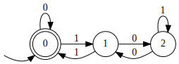
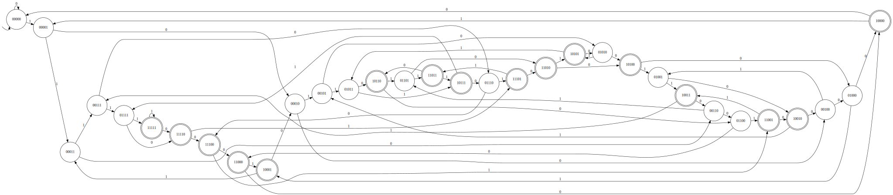
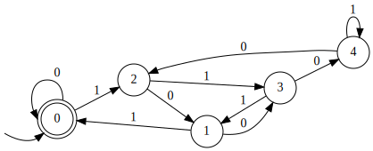
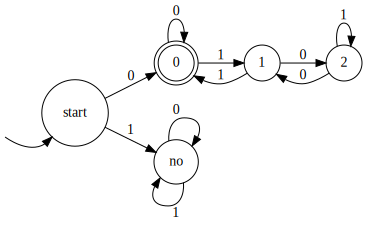

# Задания 101-120

### 101. Запишите регулярное выражения для слов над бинарным алфавитом, содержащих два нуля подряд.

$(0|1)^*00(0|1)^*$

### 102. Запишите регулярное выражения для слов над бинарным алфавитом, содержащих не более одного места, где встречаются два нуля подряд.

$(01|1)^*(\epsilon | 00)(10|1)^*$

### 103. Запишите регулярное выражения для слов над бинарным алфавитом, не содержащих два нуля подряд.

$(01|1)^*$

### 104. Запишите регулярное выражения для слов над алфавитом $\{a, b, c\}$, содержащих нечетное число букв $a$.

$L:=(b|c)^*a(b|c)^* \quad L(LL)^*$

### 105. Запишите регулярное выражения для слов над бинарным алфавитом, задающих целое число в двоичной системе, не меньшее 8.

$0^*1(0|1)(0|1)(0|1)(0|1)^*$

### 106. Запишите регулярное выражения для слов над бинарным алфавитом, задающих целое число в двоичной системе, не меньшее 51.

$0^*1(11(0|1)^3|101(0|1)^2|10011|(0|1)^6) (0|1)^*$

### 107. Запишите регулярное выражения для слов над алфавитом $\{a, b, c\}$, содержащих хотя бы одну букву $a$ и хотя бы одну букву $b$.

$(c^*a(a|c)^*b(a|b|c)^*) | (c^*b(b|c)^*a(a|b|c)^*)$

### 108. Запишите регулярное выражения для слов над алфавитом $\{a, b, c\}$, содержащих хотя бы две буквы $a$ и хотя бы одну букву $b$.

$((c^*ac^*a(a|c)^*b) | (c^*ac^*b(b|c)^*a) | (c^*b(b|c)^*a(b|c)^*a))(a|b|c)^*$

### 109. Запишите регулярное выражения для слов над бинарным алфавитом, которые представляют собой двоичную запись числа, кратного трем.

$0^*((1(01^*0)^*1)^*0^*)^*$

### 110. Постройте детерминированный конечный автомат для языка слов над бинарным алфавитом, в которых пятый символ с конца - единица.

Возьмем $2^5$ вершин, каждой сопоставлена двоичная строка длины $5$. $q_0=00000,$ $\delta(s, bit)=(s << 1).set(5, bit)$ $F=\{x : x_1 = 1\}$

### 111. Докажите, что любой детерминированный автомат для языка слов над бинарным алфавитом, в которых $k$-й символ с конца равен 0, содержит $\Omega(2^k)$ состояний.

Докажем нижнюю оценку. $a_1,a_2\ldots a_k, b_1, b_2\ldots b_k : q=\delta(\delta(\delta(s, a_1), a_2)\ldots a_n)=\delta(\delta(\delta(s, b_1), b_2)\ldots b_n)$. Они существуют, иначе все строки длины $k$ мапятся в разные вершины $\Rightarrow$ вершин $\geq 2^k$. $a_i\not=b_i$ по построению. $i\not=1$, т.к. иначе $q$ должно быть и принимающим, и нет. $] a_i=1, b_i=0$. Допишем $i-1$ нулей к строкам $a$ и $b$. Т.к. состояние было одинаковое, то состояние от новых строк тоже одинаковое. Но одно из них должно быть не принимающим, мы поели говна.

### 112. Можно ли обобщить два предыдущих задания для любого размера алфавита $c$ следующим образом: построить семейство языков, для которых будут существовать НКА, содержащий $k$ состояний, но любые ДКА будут содержать $\Omega(c^k)$ состояний?

Для $c>2$ нет, т.к. по алгоритму Томпсона можно построить ДКА по НКА с $2^k$ состояний. Для $c=2$ верно (см. 111), для $c=1$ тоже верно.

### 113. Постройте конечный автомат для языка слов над бинарным алфавитом, которые представляют собой развернутую двоичную запись чисел кратных 5 (сначала на вход подаются младшие разряды).

Реверснем ДКА из 96. Еще надо поменять местами входную ноду и принимающие, но они совпадают.

[решение](https://answers.yahoo.com/question/index?qid=20121004095101AAUJFUe)

### 114. Постройте конечный автомат для языка слов над бинарным алфавитом, которые представляют собой развернутую двоичную запись чисел кратных 6 (сначала на вход подаются младшие разряды).

`if` на то, что первый символ 0, дальше реверснутый ДКА на делимость на 3.

### 115. Предложите для заданного ДКА размера $n$ алгоритм подсчета количества слов длины $d$ которые он допускает, за $\mathcal O(dn)$.

Наивный ДП.

### 116. Предложите для заданного ДКА размера $n$ алгоритм подсчета количества слов длины $d$ которые он допускает, за $\mathcal O(\log{(d)} \cdot poly(n))$ для некоторого полинома $poly$.

Матрица перехода $M$, $M^l[i, j]$ - число способов выйдя из $i$ прийти в $j$ за $l$ шагов, поэтому искомое = $\sum\limits_{i\in F} M^l[q_0, i]$.

$M^l$ считается фастстепенью за $\mathcal O(\log{(d)} \cdot poly(n))$

Пример: делимость на $3$:
$$M=\begin{bmatrix}
    1 & 1 & 0 \\
    1 & 0 & 1 \\
    0 & 1 & 1
\end{bmatrix} \quad M^2=\begin{bmatrix}
    2 & 1 & 1 \\
    1 & 2 & 1 \\
    1 & 1 & 2 \\
\end{bmatrix} \quad M^3=\begin{bmatrix}
    3 & 3 & 2 \\
    3 & 2 & 3 \\
    2 & 3 & 3 \\
\end{bmatrix}$$

Длина $1 : s=0,\ \ 2 : s=\{00, 11\},\ \ 3 : s=\{000, 011, 110\}$

### 117. Предложите для заданного ДКА размера $n$ алгоритм подсчета количества слов длины не больше $d$ которые он допускает, за $O(\log{(d)} \cdot poly(n))$ для некоторого полинома $poly$.

Добавим новое начальное состояние, из которого пути во все вершины, в которые есть пути из $q_0$. 

Пример: делимость на $3$:

$$M=\begin{bmatrix}
    1 & 1 & 1 & 0 \\
    0 & 1 & 1 & 0 \\
    0 & 1 & 0 & 1 \\
    0 & 0 & 1 & 1 \\
\end{bmatrix} \quad M^2=\begin{bmatrix}
    1 & 3 & 2 & 1 \\
    0 & 2 & 1 & 1 \\
    0 & 1 & 2 & 1 \\
    0 & 1 & 1 & 2 \\
\end{bmatrix} \quad M^3=\begin{bmatrix}
    1 & 6 & 5 & 3 \\
    0 & 3 & 3 & 2 \\
    0 & 3 & 2 & 3 \\
    0 & 2 & 3 & 3 \\
\end{bmatrix} \quad M^4=\begin{bmatrix}
    1 & 12 & 10 & 8 \\
    0 & 6  & 5  & 5 \\
    0 & 5  & 6  & 5 \\
    0 & 5  & 5  & 6 \\
\end{bmatrix}$$

$s_1=\{0\}, s_2=\{0, 00, 11\}, s_3=\{0, 00, 11, 000, 011, 110\}, s_4=\{0, 00, 11, 000, 011, 110, 0000, 0011, 0110, 1001, 1100, 1110\}$

### 118. Петя строит автомат для конкатенации языков $L_1$ и $L_2$ из автоматов для этих языков. Оказалось, что автомат для $L_1$ содержит только одно терминальное состояние и Петя просто объединил в одно это состояние и начальное состояние автомата для $L_2$. Всегда ли у Пети получится то, что нужно?

Нет, потому что можно пойти $A_1\to A_2\to A_1$, что не то, что надо.

### 119. Петя строит автомат для объединения языков $L_1$ и $L_2$ из автоматов для этих языков. Решив сэкономить, Петя просто объединил в одно начальные состояния автоматов для $L_1$ и $L_2$. Всегда ли у Пети получится то, что нужно?

Нет, потому что можно пойти $q_0\to A_1\to q_0\to A_2$

### 120. Петя строит автомат для замыкания Клини языка $L$. Решив сэкономить, Петя просто провёл $\varepsilon$-переход из каждого терминального состояния в начальное состояние, и сделал начальное состояние также терминальным. Всегда ли у Пети получится то, что нужно?

Нет, потому что можно пойти $q_0\to q_0$, не заходя в начальное терминальное состояние. Тогда для языка $0$ в замыкание подойдет $1$.
