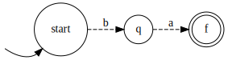
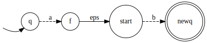
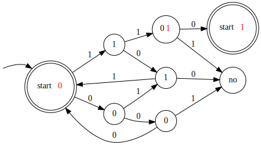

# Задания 121-140

### 121. Докажите нерегулярность языка палиндромов, если алфавит содержит хотя бы два символа. Что если алфавит унарный?

Достаточно доказать, что $\forall n\in\N \ \ \exists w\in P: |w| \geq n \ \ \forall x,y,z:\begin{cases}
    w=xyz \\
    y\not=\varepsilon \\
    |xy| \leq n
\end{cases} \exists k : xy^kz\not\in P$

$$] a,b\in \Sigma, w:=a^n b a^n, |w|=2n+1, y=a^i, x=a^j, i>0, j\geq 0$$

$$] k=2 \quad y^2=a^{2i} \quad xy^2z=a^ja^{2i} a^{n-i-j} b a^n=a^{n+i}ba^n$$
$a^{n+i}ba^n$ - не палиндром $\forall i>0$.

Если алфавит унарный, то язык палиндромов - язык всех слов над этим языком $=a^*$ - регулярен.

### 122. Докажите нерегулярность языка тандемных повторов $L = \{ ww | w \in \Sigma^* \}$, если алфавит содержит хотя бы два символа. Что если алфавит унарный?

$$] a,b\in\Sigma, w:=ba^{n-1}ba^{n-1}, |w|=2n$$

i. $x=\varepsilon, y=ba^i, i\geq0, z=a^{n-i-1}ba^{n-1}$

$] k=2 \quad y^2=ba^iba^i \quad xy^2z=ba^iba^ia^{n-i-1}ba^{n-1}=ba^iba^{n-1}ba^{n-1}\not\in L$

ii. $y=a^i, x=ba^j, z=a^{n-1-i-j}ba^{n-1}, i>0$

$] k=2 \quad y^2=a^{2i}, xy^2z=ba^ja^{2i}a^{n-1-i-j}ba^{n-1}=ba^{n-1+i}ba^{n-1}\not\in L$

Если алфавит унарный, то язык тандемных повторов - язык всех слов над этим языком $=a^*$ - регулярен.

### 123. Докажите нерегулярность языка $0^n1^m$, $n \le m$.

$$|w|=n+m, y=0^i, x=0^j, z=0^{n-i-j}1^m, i>0, j\geq 0, i+j\leq n$$

$$] k = m+1, y^{m+1}=0^{(m+1)i}, xy^{m+1}z=0^j0^{(m+1)i}0^{n-i-j}1^m=0^{n+mi}1^m, i>0 \Rightarrow 0^{n+mi}1^m\not\in L$$

### 124. Докажите нерегулярность языка $0^n1^m$, $n \ne m$

$$w=0^{n!}1^{2n!}, y=0^i, x=0^j, z=0^{n!-i-j}1^{2n!}, i>0, j\geq 0, i+j\leq n$$

$$] k = \frac{n!}{i}+1, y^k=0^{i(\frac{n!}{i}+1)}=0^{n!+i}, xy^kz=0^j0^{n!+i}0^{n!-i-j}1^{2n!}=0^{2n!}1^{2n!} \not\in L$$

### 125. Докажите нерегулярность языка $0^{n^2}$

$$x=0^j, y=0^i, i>0, j\geq0$$
$$]k=2, xy^2z=0^j0^{2i}0^{n^2-j-i}=0^{n^2+i} \quad n^2+i\leq n^2+n < n^2+2n+1=(n+1)^2=\text{следующий квадрат}$$

### 126. Докажите нерегулярность языка $0^p$, $p$ — простое

$$x=0^j, y=0^i, i>0, j\geq0$$
$$] k = p+1, xy^{p+1}z=0^{(p+1)i}0^{p-i}=0^{p+pi} \quad p+pi\text{ не простое}$$

### 127. Докажите нерегулярность языка двоичных записей простых чисел.

Докажем по лемме о разрастании в общем виде. Хотим доказать, что $\forall n\in\N \ \ \exists uwv\in P : |w|\geq n \ \ \forall x,y,z:\begin{cases}
    w=xyz \\
    y\not=\varepsilon \\
    |xy| \leq n
\end{cases} \exists k : uxy^kzv\not\in P$

Нам дали $n$. Тогда $\exists m_k\to\infty : p=\underbrace{\ldots\ldots\ldots}_{m_k \text{ в двоичной}}\underbrace{0\ldots0}_{n}1$ - простое по теореме Дирихле, т.к. $p=2^{n+1}m_k+1$ и НОД$(2^{n+1}, 1)=1$. Возьмём произвольное $m\in \{m_k\}$.

$$w:=0^n, u = \underbrace{\ldots\ldots\ldots}_{m \text{ в двоичной}}, v = 1$$
$$x=0^j, y=0^i, i>0, j\geq 0, z=0^{n-i-j}$$
$$q:=uxy^kzw=\underbrace{\ldots\ldots\ldots}_{m \text{ в двоичной}}\underbrace{00\ldots00}_{n+(k-1)i}1=2^{n+(k-1)i+1}m+1=2^{(k-1)i}2^{n+1}m+1=(p-1)2^{(k-1)i}+1$$
$$q=p2^{(k-1)i}+1-2^{(k-1)i}$$
По малой теореме Ферма $2^p\equiv 2\pmod p \Rightarrow 2^{p-1}\equiv 1\pmod p$
$$1 \equiv 2^{p-1}\equiv 2^{2(p-1)}\equiv 2^{i(p-1)} \pmod p$$
$$0 \equiv 2^{i(p-1)}-1 \pmod p \Rightarrow 2^{i(p-1)}-1 \mid p$$
$2^{i(p-1)}-1$ делится на $p \Rightarrow p$ не простое, если $p\not=2^{i(p-1)}-1$. Корни $p=3, p\approx-0.69^{\quad \tiny nice}$

Т.к. $\exist$ сколь угодно большой $m$, не будем брать такой, что $p=3$.
$$k:=p \Rightarrow 1-2^{i(p-1)} \mid p \Rightarrow (p2^{(k-1)i}+1-2^{(k-1)i}) \mid p \Rightarrow q\not\in P$$

### 128. Докажите нерегулярность языка $0^n1^m$, $gcd(n, m) = 1$

Рассмотрим множество $S=\{0^n\ |\ n \text{ простое}\}$. Все элементы этого множества лежат в разных классах эквивалентности Майхилла—Нероуда по $L$, т.к. для $x=0^n, y=0^m$ есть различающий суффикс $z=0^n, xz\not\in L, yz\in L$. Но $S$ бесконечное $\Rightarrow$ бесконечное число классов Майхилла—Нероуда $\Rightarrow L$ не регулярный.

### 129. Приведите пример нерегулярного языка, для которого выполнена лемма о разрастании

Нерк.

### 130. Обозначим как $\min L$ множество слов $w \in L$, таких что никакой собственный префикс $w$ не является словом языка $L$. Докажите, что если $L$ регулярный, то и $\min L$ регулярный.

Заметим, что регулярность языка $\Leftrightarrow$ его распознаваемости НКА $\stackrel{\text{Томпсон}}\Leftrightarrow$ распознаваемости ДКА. Построим ДКА для $\min L$ по ДКА для $L$.

Создадим терминальное состояние $q_{-1}\not\in\mathcal F$, такое что: $\forall q\in \mathcal F, s\in\Sigma \ \ \delta(q, s)=q_{-1}, \delta(q_{-1}, s)=q_{-1}$. Все остальные переходы не трогаем. Этот ДКА распознает $\min L$.

### 131. Обозначим как $\max L$ множество слов $w \in L$, таких что $w$ не является собственным префиксом никакого словом языка $L$. Докажите, что если $L$ регулярный, то и $\max L$ регулярный.

$$w\in\max L \Leftrightarrow \begin{cases}
    w\in L \\
    \not\exists v\not=\varepsilon : wv\in L
\end{cases}$$

Сделаем непринимающими все состояния $q\in \mathcal F$ такие, что $q\rightsquigarrow \overline q\in \mathcal F$, получим искомый ДКА.

### 132. Обозначим как $\text{pref}\,L$ множество префиксов слов языка $L$. Докажите, что если $L$ регулярный, то и $\text{pref}\,L$ регулярный.

$$w\in\text{pref}\,L \Leftrightarrow \exists v : wv\in L$$

Сделаем принимающими все состояния $q$ такие, что $q\rightsquigarrow \overline q\in \mathcal F$, получим искомый ДКА.

### 133. Обозначим как $\text{suf}\,L$ множество суффиксов слов языка $L$. Докажите, что если $L$ регулярный, то и $\text{suf}\,L$ регулярный.

Из 132 мы знаем, что $\text{pref}\,L$ регулярный. Тогда докажем, что если $L$ регулярный, то $\text{reverse}\,L$ регулярный. Возьмём ДКА для $L$, поменяем направления всех ребер и заменим принимающие состояния на входные, входное состояние на принимающее. Получился НКА, принимающий $\text{reverse}\,L \Rightarrow \text{reverse}\,L$ регулярный

$$\text{suf}\,L=\text{reverse}\,(\text{pref}\,(\text{reverse}\,L))$$

### 134. Пусть $a$ и $b$ - слова равной длины $n$. Обозначим как $\text{alt}(a, b)$ слово $a_1b_2a_2b_2\ldots a_nb_n$. Для языков $R$ и $S$ обозначим как $\text{alt}(R, S)$ множество всех слов, которые получаются как $\text{alt}(a, b)$ где $a \in R$, $b \in S$. Докажите, что если $R$ и $S$ регулярные, то $\text{alt}(R, S)$ регулярный.

$$\mathfrak R:\Sigma^*\times \Sigma^*\to \Sigma^*, (a,b)\mapsto a$$
$$\mathfrak S:\Sigma^*\times \Sigma^*\to \Sigma^*, (a,b)\mapsto b$$
Это гомоморфизмы.
$$\mathfrak R^{-1}(R)=\{(r, w)\ |\ r\in R, w\in \Sigma^*\}$$
$$\mathfrak S^{-1}(S)=\{(w, s)\ |\ s\in S, w\in \Sigma^*\}$$
Т.к. множество регулярных языков замкнуто по обратным гомоморфизмам, $\mathfrak R^{-1}(R)$ и $\mathfrak S^{-1}(S)$ регулярны
$$\mathfrak R^{-1}(R) \cap \mathfrak S^{-1}(S)=\{(r, s)\ |\ r\in R, s\in S\}$$
Этот язык регулярен по замкнутости регулярных языков по пересечению.
$$\mathfrak P:\Sigma^*\times \Sigma^*\to \Sigma^*, (a,b)\mapsto a_1b_1a_2b_2\ldots$$
$$\mathfrak P(\mathfrak R^{-1}(R) \cap \mathfrak S^{-1}(S))=\text{alt}(R, S)$$
Этот язык регулярен по замкнутости регулярных языков по гомоморфизму.

### 135. Пусть $a$ и $b$ - слова. Обозначим как $\text{shuffle}(a, b)$ множество слов, которые можно составить, вставив в слово $a$ все буквы слова $b$ в том порядке, в котором они идут в $b$. Например, $\text{shuffle}(01, 23)=\{0123, 0213, 0231, 2013, 2031, 2301\}$. Для языков $R$ и $S$ обозначим как $\text{shuffle}(R, S)$ объединение всех множеств $\text{shuffle}(a, b)$ где $a \in R$, $b \in S$. Докажите, что если $R$ и $S$ регулярные, то $\text{shuffle}(R, S)$ регулярный.

Создадим НКА, в котором каждое состояние - пара состояний из $A'$ из $B'$. На каждом шаге мы недетерминированно продвигаемся либо по $A'$, либо по $B'$. Состояние является принимающим, если оба его порождающих состояния - принимающие.

### 136. Обозначим как $\text{cycle}\,L$ множество циклических сдвигов слов языка $L$. Докажите, что если $L$ регулярный, то и $\text{cycle}\,L$ регулярный.

Идея: иметь автомат для каждого возможного сдвига. Это невозможно, зато можно иметь автомат для каждого состояния. Тогда если $ab\in\text{cycle}\,L, ba\in L$, то в ДКА для $L$ ($A$) по слову $b$ приходим в некоторую вершину $q$, откуда по $a$ приходим в $f\in\mathcal F$:

У нас сначала приходит $a$, потом $b$, поэтому просто начнем с $q$:

Для каждого состояния $q\in Q$ создадим такой "свдинутый" автомат, "or" от всех автоматов - искомый.

### 137. Обозначим как $\text{half}\,L$ множество таких слов $a$, что существует слово $b$ такой же длины, как и $a$, что $ab \in L$. Докажите, что если $L$ регулярный, то и $\text{half}\,L$ регулярный.

Meet-in-the-middle по $a$ с начального состояния и недетерминированно идем со всех принимающих состояний назад.

### 138. Рассмотрим язык $\{x_0 y_0 z_0 x_1 y_1 z_1 \dots x_{n-1} y_{n-1} z_{n-1} \mid x_i, y_i, z_i \in \{0, 1\}\}$, где $X = x_{n-1}x_{n-2}\dots x_0$ и аналогично представляется $Y$ и $Z$, причем $X + Y = Z$. Докажите, что этот язык регулярный.

Построим ДКА

Для переноса 1 аналогичная штука.

### 139. То же, что и предыдущее, только $\{x_{n-1} y_{n-1} z_{n-1} \dots x_1 y_1 z_1 x_0 y_0 z_0 \mid \dots \}$

Докажем регулярность $\{z_0 y_0 x_0 z_1 y_1 x_1 \dots z_{n-1} y_{n-1} x_{n-1} \mid x_i, y_i, z_i \in \{0, 1\}\}$, тогда искомый язык $=L^R$.

Т.к. $Z-Y=X$, ДКА аналогичный 138, но для вычитания решает эту задачу.

### 140. Рассмотрим язык $\{x_0 y_0 z_0 x_1 y_1 z_1 \dots x_{n-1} y_{n-1} z_{n-1} \mid x_i, y_i, z_i \in \{0, 1\}\}$, где $X = x_{n-1}x_{n-2}\dots x_0$ и аналогично представляется $Y$ и $Z$, причем $X \times Y = Z$. Докажите, что этот язык не является регулярным.

Докажем, что классов эквивалентности бесконечно.

$$s_n:=111(110)^{n-1}$$
$$s_n\leftrightarrow X=1^n, Y=1^n, Z=10^{n-1}$$
$$X\times Y=\left(\sum_{i=0}^{n-1}2^i\right)^2=(2^n-1)^2=2^{2n}-2^{n+1}+1 \leftrightarrow \underbrace{1\ldots1}_{n}\underbrace{0\ldots0}_{n}1\leftrightarrow 10^n1^n$$
$$s_n(000)(001)^{n+1}\in L \quad \forall m>n \quad s_n(000)(001)^{m+1}\not\in L$$
Докажем, что $\forall m\not=n \quad s_m\not\equiv_L s_n$
$$] m < n \quad s_m(000)(001)^{n+1}\not\in L, s_n(000)(001)^{n+1}\in L$$
$\forall s_n, s_m\in S$ - бесконечного $s_n\not\equiv_L s_m \Rightarrow$ число классов эквивалентности бесконечно $\Rightarrow \not\exists$ ДКА.

### 141. Из алгоритма построения множества различимых состояний следует, что $u$ и $v$ автомата различимы, то $u$ и $v$ различимы строкой длины $O(n^2)$. Докажите, что если состояния $u$ и $v$ автомата различимы, то $u$ и $v$ различимы строкой длины $O(n)$.

Запустим $\tiny \sout{гуся}$ алгоритм Мура. Он строит классы $k$-эквивалентности, т.е. множества вершин, различимых строкой длины $\le k$. Если при переходе $k\to k+1$ классы не изменились, то алгоритм заканчивает работу, поэтому шагов $\le n-1$. Так как алгоритм верный, то и разбиение на классы эквивалентности верно, поэтому различимость строкой длины $\le i$, где $i$ - число шагов алгоритма $\Leftrightarrow$ различимости произвольной строкой.
