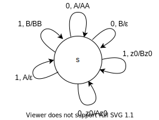
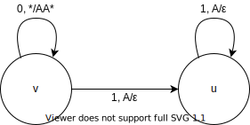
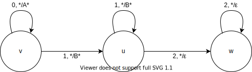
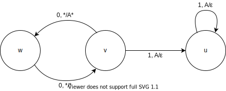
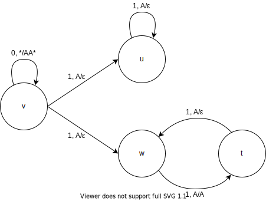
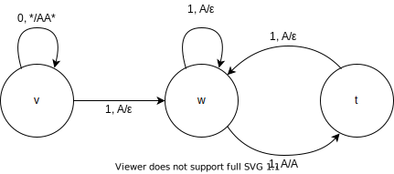
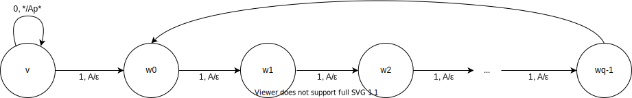
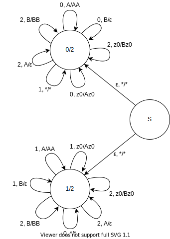
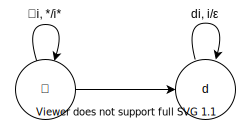

# Задания 187-203

### 187. Постройте МП-автомат для языка слов, где число нулей равно числу единиц.



### 188. Постройте МП-автомат для языка $0^n1^{2n}$



### 189. Постройте МП-автомат для языка $0^n1^m2^{n+m}$



### 190. Постройте МП-автомат для языка $0^{2n}1^{n}$



### 191. Постройте МП-автомат для языка $0^{n}1^{2n}\cup 0^{n}1^{n}$



### 192. Постройте МП-автомат для языка $0^{n}1^{m}, m\in[n, 2n]$



### 193. Докажите, что для любых $p$ и $q$ существует МП-автомат для языка слов $0^n1^m$, где $n/m=p/q$



$T=\{w_0\}, s=v$

### 194. Постройте автомат с магазинной памятью для языка слов над алфавитом $\{0,1,2\}$, которые содержат равное число двоек и равное число единиц, или равное число двоек и равное число нулей.



### 195. Рассмотрим список слов $A = \{\alpha_1, \alpha_2, \ldots, \alpha_n\}$ над алфавитом $\Sigma$. Введем $n$ новых различных символов $d_1, d_2, \ldots, d_n$. Рассмотрим алфавит $\Sigma' = \Sigma \cup \{d_1, d_2, \ldots, d_n\}$. Рассмотрим язык списка $A$, обозначаемый как $L_A$, в который входят все слова вида $\alpha_{i_1}\alpha_{i_2}\ldots\alpha_{i_k}d_{i_k}d_{i_{k-1}}\ldots d_{i_1}$. Докажите, что для любого списка $A$ язык $L_A$ является контекстно-свободным.



### 196. Докажите, что дополнение к языку списка $L_A$ является контекстно-свободным для любого списка $A$.


$T=\{t\}$

### 197. Можно неправильно определить язык списка $A = \{\alpha_1, \alpha_2, \ldots, \alpha_n\}$ из предыдущего задания, составив его из слов вида $\alpha_{i_1}\alpha_{i_2}\ldots\alpha_{i_k}d_{i_1}d_{i_2}\ldots d_{i_k}$. Докажите или опровергните, что при таком неправильном определении язык списка все еще будет конткстно-свободным для любого списка $A$.

$\sphericalangle A = \{0,1,2\}, d_1=3, d_2=4, d_3=5$

$0^n12^n3^n45^n\in L_A$

Докажем не КС по лемме о разрастании.

- Если раскачивается только одна сторона, то очевидно $\not\in L_A$
- Если раскачиваются обе стороны, то $\#_3\not=\#_0$.

### 198. Предложите алгоритм проверки, что МП-автомат допускает заданное слово.

Умножим состояния на $\{1\ldots n\}$, оставим только те, которые переходят по искомому слову, получим МПА $P'$, $L(P')=P'\cap\{w\}$, проверим непустоту языка через достижимость принимающего состояния, см. 199.

Эмулируем автомат, обход недетерминированности - ДФС.

Проблема: эпсилон-циклы дают бесконечный цикл. Решение: не ходить по переходам, по которым уже прошли ровно в таком же состоянии стека.

Проблема: цикл $\varepsilon, *\to A*$ дает бесконечное множество различных состояний. Решение: если путь до вершины, то есть путь с переходами $$

На нерке есть алгоритм получения КСГ из МП-автомата, КЯК определяет для КСГ.

### 199. Назовем состояние МП-автомата бесполезным, если автомат не может перейти в него ни при каком входном слове. Предложите алгоритм проверки состояния МП-автомата на бесполезность.

Построим НКА достижимости по МПА (с допуском по пустому стеку):

$\langle \Sigma, \Gamma, Q, q_0\in Q, \delta\rangle\xrightarrow[построение]{}\langle Q, \Gamma, \delta_n, q_0\rangle$

В этом НКА достижимость состояния $q$ по слову $\alpha \Leftrightarrow$ достижимость $q$ в МПА, имея при достижении стек $\alpha$. Тогда ответом на запрос будет достижимость $q$ в НКА, что мы умеем делать.

Сконвертим переходы МПА в переходы вида $(q, \varepsilon)\to (q', a)$ или $(q, a)\to (q', \varepsilon)$, т.е. при каждом переходе либо добавляется символ в стек, либо удаляется.

Будем поддерживать $\delta_n^*$

$\forall (q, \varepsilon)\to (q', a)\in\delta : (q, a)\to q'$ кладется в $\delta_n$


```c
for (q, ε) -> (q′, a) : δ
    δₙ.insert((q, a) -> q′)
while flag:
    flag = false
    for (q, a) -> (q′, ε) : δ
        for (q′′, a) -> q : δ⃰ₙ
            δₙ.insert((q′′, ε) -> q′)
            flag = true
```

#### Объяснение

Переходы с добавлением в стек (первый `for`) очевидны.

`while`: делаем пока есть что делать

Если мы можем прийти в $q$ из $q''$ таким образом, что на стеке сверху будет $a$ и есть переход в МПА $q\to q'$, удаляющий $a$, то есть переход $q''\to q'$ без изменения стека.

### 200. Предложите алгоритм проверки, что МП-автомат допускает хотя бы одно слово, содержащее заданное в качестве подстроки.

Сконвертим в КСГ. Запустим CYK, получим множество нетерминалов, из которых можно получить $w$. Проверим достижимость из $S$ всех таких нетерминалов, если хотя бы один достижим, да.

```c
algo(PDA, w):
    CFG = PDA.toCFG()
    dp = CYK(CFG, w)
    for A ∈ Q:
        if dp[A][1][n] and CFG.reachable(A):
            return true
    return false
```

### 201. Предложите алгоритм проверки, что МП-автомат допускает бесконечное число слов.

Конверт в КСГ, проверка в ней.

<!-- Для этого необходимо и достаточно, чтобы существовал достижимый цикл, по которому можно ходить произвольное число раз и из которого можно прийти в принимающее состояние.

Пройдем дфсом по всему графу, игнорируя стак, запомним циклы. Проверим достижимость циклов (тривиально, 199) и можно ли ходить бесконечно по циклу: -->

<!-- Заметим, что за 1 проход по циклу стак может увеличиться только на $\sum |\alpha_i|$, где $\alpha_i$ -  -->


### 202. Замкнутость КС по изморофизму.

Возьмем МПА к $L$, вместо перехода по $c_i$ сделаем $|f(c_i)|$ переходов, которые идут по этой строке.

### 203. Замкнутость КС по обратному изморофизму.

Состояния $Q\times S, S=\{suffix(f(a))\ |\ \forall a\in\Sigma\}$. Будем хранить во втором элементе состояния как в буффере какой-то необработанный суффикс $f(a)$, который скармливается МПА для $L$.

- Восполнение: $(q, \varepsilon), w, X \to (q, f(w)), X$
- Кормление: $q, a, X \to q', Y \Rightarrow (q, ab), \varepsilon, X \to (q', b), Y$

Очевидно эквивалентны следующие вещи:
- $(q, \varepsilon), w, \alpha \xRightarrow{M_1}^* (q', \varepsilon), \varepsilon, \beta$
- $q, f(w), \alpha \xRightarrow{M_2}^* q', \varepsilon, \beta$