# Весна 2020, задания 85-100

### 85. Пусть $L$ - формальный язык. Докажите, что $(L^*)^*=L^*$

Докажем, что $(L^*)^*\subset L^*$ и $(L^*)^*\supset L^*$.

$$L^*=(L^*)^1\subset \bigcup (L^*)^i \quad \square$$

$$\sphericalangle w\in (S^*)^* \xRightarrow{def} w=w_1w_2\ldots w_n, n\geq 0, w_j\in S^* \xRightarrow{def}$$
$$\xRightarrow{def}w_j=w_{j1}w_{j2}\ldots w_{jm_j}, m_j\geq 0, w_{ji}\in S$$
Итого
$$w=(w_{11}w_{12}\ldots w_{1m_1})(w_{21}w_{22}\ldots w_{2m_2})\ldots (w_{n1}w_{n2}\ldots w_{nm_n})$$
Заметим, что это не более чем счётная конкатенация строк $\in S \Rightarrow w\in S^*$. Тогда $w\in (S^*)^*\Rightarrow w\in S^*$, поэтому $(L^*)^*\subset L^*$

### 86. Пусть $R$ и $S$ - языки. Докажите или опровергните дистрибутивность замыкния Клини по объединению: $(R \cup S)^* \stackrel{?}= R^* \cup S^*$

Опровергнем.
$$R:=\{a\} \quad S:=\{b\} \quad R\cup S = \{a, b\}$$
$$R^*=\{\varepsilon, a, aa, aaa\ldots \} \quad S^*=\{\varepsilon, b, bb, bbb\ldots\} \quad (R \cup S)^*=\{\varepsilon, a, b, aa, ab, bb, aaa, aab \ldots\}$$
$$ab\not\in (R^* \cup S^*) \Rightarrow \text{опровержение}$$

### 87. Пусть $R$ и $S$ - языки. Докажите или опровергните дистрибутивность замыкния Клини по пересечению: $(R \cap S)^* = R^* \cap S^*$

Опровергнем.
$$R:=\{a\} \quad S:=\{aa\} \quad R\cap S = \{\}$$
$$R^*=\{\varepsilon, a, aa, aaa\ldots \} \quad S^*=\{\varepsilon, aa, aaaa, aaaaaa\ldots\} \quad (R \cap S)^*=\{\varepsilon\}$$
$$R^* \cap S^*=\{\varepsilon, aa, aaaa, aaaaaa\ldots\}\not=\{\varepsilon\}$$

### 88. Пусть $R$ и $S$ - языки. Докажите или опровергните, что $(R \cup S)^* = (R^*S^*)^*$

$$\sphericalangle w\in (R \cup S)^* \xRightarrow{def}w=w_1w_2\ldots w_n, n\geq 0, w_j\in R \cup S \Leftrightarrow w_j\in R \text{ или } w_j\in S$$
Заметим, что $R=R^1S^0\subset R^*S^* \quad S=R^0S^1 \subset R^*S^*$, поэтому $w_j\in (R^*S^*) \Rightarrow w\in (R^*S^*)^*$

$$\sphericalangle w\in (R^*S^*)^* \xRightarrow{def} w=w_1w_2\ldots w_n, n\geq 0, w_j\in R^*S^*\Rightarrow$$
$$\Rightarrow w_j=rs, r\in R^*, s\in S^* \Rightarrow$$
$$\Rightarrow w_j=r_{j1}r_{j2}\ldots r_{jm_j}s_{j1}s_{j_2}\ldots s_{jk_j}$$ 
Итого $w=(r_{11}r_{12}\ldots r_{1m_1}s_{11}s_{12}\ldots s_{1k_1})(r_{21}r_{22}\ldots r_{2m_2}s_{21}s_{22}\ldots s_{2k_2})\ldots(r_{n1}r_{n2}\ldots r_{nm_1}s_{n1}s_{n2}\ldots s_{nk_n})$ - не более чем счётная конкатенация строк из $R$ и $S \Rightarrow w\in (R \cup S)^*$

### 89. Пусть $R$ и $S$ - языки. Обозначим как $RS$ язык слов, представимых в виде конкатенации слова из $R$ и слова из $S$ (в этом порядке). Докажите или опровергните, что $(R\cup S)T=RT \cup  ST$, $(R\cap S)T=RT \cap ST$
$(R\cup S)T=RT \cup  ST$
$$\sphericalangle w\in (R\cup S)T \Leftrightarrow w=at, a\in R\cup S \Leftrightarrow w=\begin{cases}
    rt \\
    st
\end{cases} , r\in R, s\in S, t\in T$$
$$\sphericalangle w\in RT \cup ST \Leftrightarrow w=\begin{cases}
    rt \\
    st
\end{cases} , r\in R, s\in S, t\in T$$
$$\Rightarrow(R\cup S)T=RT \cup  ST $$
$(R\cap S)T=RT \cap ST$
$$\sphericalangle w\in (R\cap S)T \Leftrightarrow w=at, a\in R\cap S \Leftrightarrow a\in R \text{ и } a\in S \Leftrightarrow w=rt \text{ и }w=st$$
$$\sphericalangle w\in RT \cap ST \Leftrightarrow w\in RT \text{ и } w\in ST \Leftrightarrow w = rt \text{ и } w = st$$
$$\Rightarrow (R\cap S)T=RT \cap ST$$

### 90. Пусть $L$ - язык. Обозначим как $Lc$ язык, который получается из $L$ дописыванием в конец каждому слову символа $c$. Обозначим как $Lc^{-1}$ язык, который получается из $L$ откидыванием всех слов, которые не заканчиваются на $c$, а затем у оставшихся слов откидыванием конечного символа $c$. Докажите или опровергните, что $(Lc)c^{-1}=L$, $(Lc^{-1})c=L$

$$\forall w\in Lc \quad w=lc, l\in L$$
$$(lc) c^{-1}=l$$
Поэтому да.

Контрпример ко второму: $L=\{a\}, \quad \{a\}c^{-1}=\{\} \quad \{\}c=\{c\}$

### 91. Постройте конечный автомат для языка слов над бинарным алфавитом, в которых четность числа $0$ равна четности числа $1$.

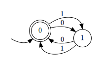

### 92. Постройте конечный автомат для языка слов над бинарным алфавитом, в которых число нулей кратно 3.

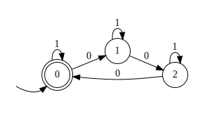

### 93. Постройте конечный автомат для языка слов над бинарным алфавитом, в которых число нулей не кратно 3. Сделайте вывод из последних двух заданий.

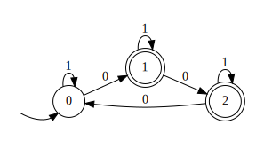

Вывод: они в объединении - $\{0, 1\}^*$. Более общее утверждение: $A, B$ - ДКА над алфавитом $\Sigma$, $A$ построен для бинарного выражения $f$, $B$ для $\neg f$, $L(A)\cup L(B) = \Sigma^*$

### 94. Постройте конечный автомат для языка слов над бинарным алфавитом, в которых нет трех нулей подряд.

На паре было

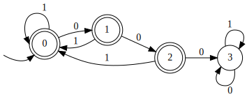

### 95. Постройте конечный автомат для языка слов над бинарным алфавитом, в которых есть три нуля подряд.

На паре было

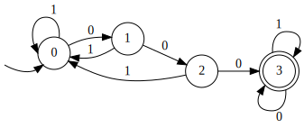

### 96. Постройте конечный автомат для языка слов над бинарным алфавитом, которые представляют собой двоичную запись чисел, кратных 5

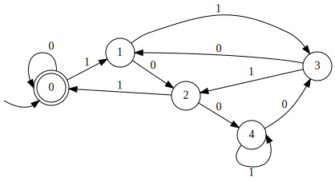

### 97. Постройте конечный автомат для языка слов над бинарным алфавитом, в которых число нулей кратно 3 и которые представляют собой двоичную запись чисел кратных 5.

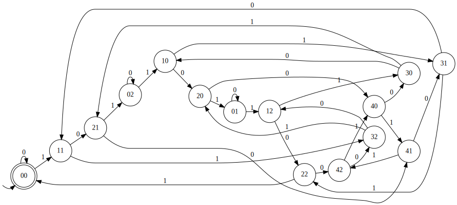
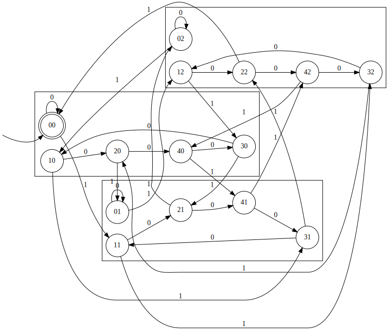

### 98. Постройте конечный автомат для языка слов над бинарным алфавитом, в которых число нулей кратно 3 или которые представляют собой двоичную запись чисел кратных 5. Сделайте вывод из последних двух заданий.

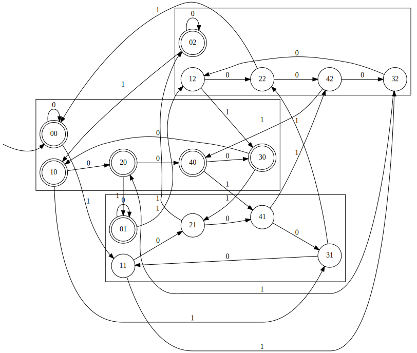

Вывод: В 97 было прямое произведение ДКА, в 98 - объединение ДКА.
$$A\times B \leftrightarrow L(A)\cap L(B) \quad A\cup B \leftrightarrow L(A)\cup L(B)$$

### 99. Постройте конечный автомат для языка слов над бинарным алфавитом, в которых число единиц кратно 3. Сделайте вывод.

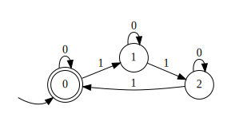

Это 92 номер с точностью до наоборот по алфавиту.

### 100. Постройте детерминированный конечный автомат для языка слов над бинарным алфавитом, в которых второй символ с конца равен последнему символу.

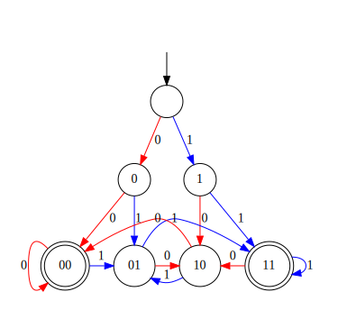