## Задания 107-126

### 107. $k$-факторизацией графа называется разбиение множество ребер графа на его $k$-факторы. Докажите, что $K_4$ имеет единственную 1-факторизацию.

Очев.

Единственные 1-факторы $K_4$ это:

```
1-2  1 2  1 2
     | |   x
3-4  3 4  3 4
```

Единственный способ построить $K_4$ - объединить их всех.

### 108. Найдите число $1$-факторизаций графа $K_6$.

6, рисуется

### 109. Найдите число $1$-факторизаций графа $K_{3,3}$.

2, рисуется

### 110. Найдите число $1$-факторов графа $K_{2n}$.

$a_n = (2n - 1)a_{n-1}$

База - очев, $a_1=3$

Переход - возьмём ребро $a_1a_i$ ($2n-1$ вариантов) и удалим $a_1$ и $a_i$. Дальше остается $a_{n-1}$ вариантов.

### 111. Докажите, что граф $K_{6n-2}$ имеет 3-факторизацию.

<!-- База: $K_4$ - 3-фактор себя

Переход: построим на 6 вершинах 3-регулярный граф и вырежем его -->

### 112. Докажите, что граф $K_{4n+1}$ имеет 4-факторизацию.

<!-- База: $K_5$ и $K_9$.

$K_5$ - 4-фактор себя.

$K_9$ - рисуется.

Переход: построим на 8 вершинах 4-регулярный граф и вырежем его -->

### 113. Докажите, что граф $K_9$ представим в виде объединения 4 гамильтоновых циклов.

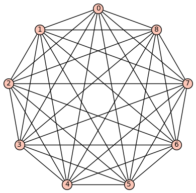
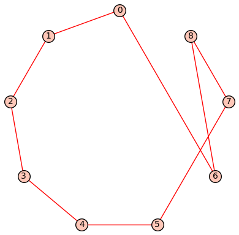
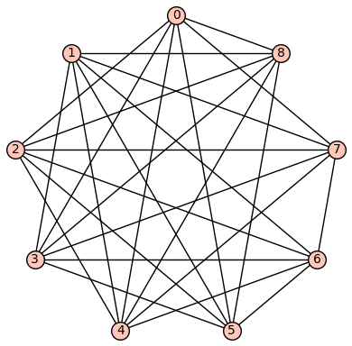
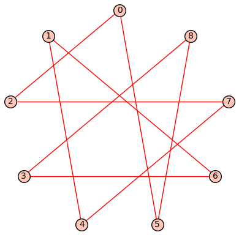
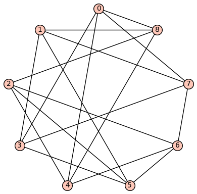
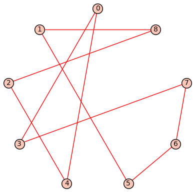
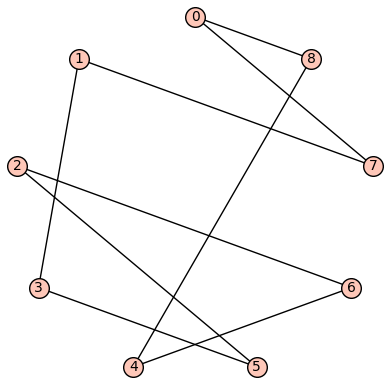
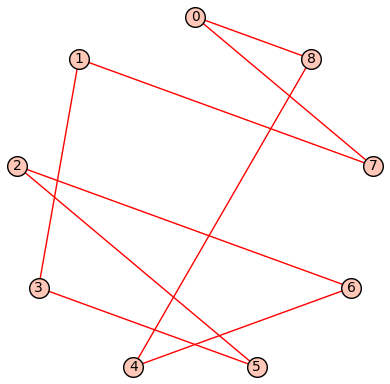
<!--  -->

### 114. Пусть $G$ - регулярный граф степени $k$ с четным числом вершин, причем $\lambda(G) \ge k-1$. Пусть $G'$ получен из $G$ удалением не более чем $k - 1$ ребер. Тогда $G'$ содержит совершенное паросочетание. Указание: используйте теорему Татта.

Докажем от противного, пусть $\exists \mathcal E : G-\mathcal E$ не содержит совершенное паросочетание.

По т. Татта $\exists S : |\text{odd}(G')|=n>|S|$

Пусть $o(G') = \{G_i\}_{i=1}^n$

Из $G_i$ (в $G$) выходят ребра - либо в $S$, либо не в $S$.

Пусть количество ребер первого типа - $a_i$, второго - $b_i$. Очевидно $a_i + b_i \ge \lambda(G) \ge k-1$, т.к. иначе можно в $G$ вырезать ребра обоих типов для $G_i$ и получить несвязный граф за $<\lambda$ удалений.

Посчитаем все ребра в $G_i$, не выходящие из $G_i$:

$$\sum_{v\in G_i} \deg_{G_i} v = k|G_i| - a_i - b_i \le k|G_i| - k + 1 = k(|G_i| - 1) + 1 \equiv 1\mod 2$$

С другой стороны, по лемме о рукопожатиях:
$$\sum_{v\in G_i} \deg_{G_i} v = 2|E(G_i)| \equiv 0\mod 2$$

Таким образом, в длинном равенстве мы сделали переход $a_i + b_i \ge k-1$ и поменяли чётность $\Rightarrow a_i+b_i\ge k$.

Посчитаем все ребра, выходящие из $S$ в $G_i$. В сумме их $\sum_{i} a_i$. Очевидно
$$\sum_i a_i \le \sum_{v\in S} \deg v = k|S|$$
Т.к. для $b_i$ считаются только ребра, которые были удалены при переходе $G\to G'$ и они могут быть посчитаны не более, чем два раза:
$$\sum_i b_i \le 2(k-1)$$
$$a_i+b_i\ge k$$
$$\sum_i a_i+b_i\ge \sum_i k$$
$$\sum_i a_i+b_i\ge nk$$
$$k|S|+2(k-1)\ge nk$$
$$k(|S|-n+2) - 2\ge 0$$

Мы знаем, что $|S|<n$, осталось показать, что $|S|<n-1$, тогда получится противоречие.

Если $|S|$ чётно, то $|V|-|S|=\sum_{i=1}^n |G_i| + \sum_j |F_j|$, где все $|G_i|$ нечётны, $|F_j|$ чётны $\Rightarrow n$ чётно

Аналогично для нечётного $|S|$.

$|S|$ и $n$ одинаковой четности, поэтому $|S|\not=n-1$, $\square$.

### 115. Пусть $G$ - регулярный граф степени $k$ с четным числом вершин, причем $\lambda(G) \ge k-1$. Тогда для любого ребра $uv$ существует совершенное паросочетание, содержащее $uv$.

Удалим все ребра, инцидентные $u$, кроме $uv$. По 114 искомое выполняется.

### 116. Докажите, что если $G$ - $k$-регулярный граф четной степени, то у него есть 2-фактор.

Будем рассматривать связные графы без потери общности.

В регулярном графе чётной степени есть эйлеров цикл $C$. Заведем **не симметричное** отношение $v_i \sim v_j \Leftrightarrow \exists v_iv_j\in C$.

Построим граф $G'$ : для каждого $v_i$ создадим вершины $u_i$ и $w_i$, ребра $u_iw_j \Leftrightarrow u_i\sim w_j$. Получившийся граф очевидно $k$-регулярен и двудолен, в обеих долях одинаковое количество вершин.

В $G'$ есть 1-фактор, поэтому при схлопывании назад мы получаем 2-фактор.

<!-- 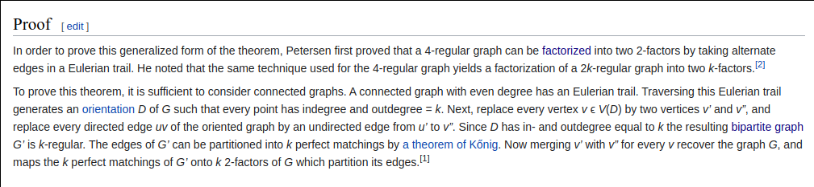
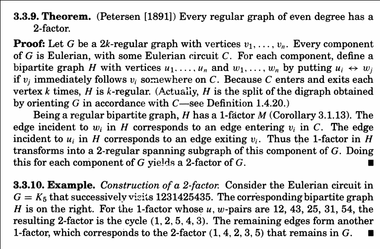 -->


### 117. Пусть $r<k$ и хотя бы одно из них нечетно. Докажите, что существует $G$ - регулярный граф степени $k$, у которого нет $r$-фактора.

### 118. Множество $S\subset V$, для которого $odd(G\setminus S)-|S|=def(G)$, называется барьером. $A(G)$ является барьером графа. Приведите пример графа, в котором $A(G)$ не является максимальным по включению барьером.

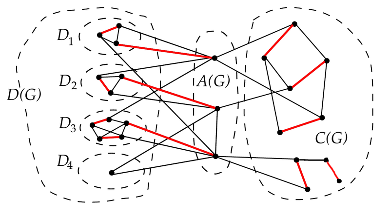

### 119. Приведите пример графа, в котором $A(G)$ не является минимальным по включению барьером.

Расположим $P_3$ и $P_4$ рядом. $A(G) =$ центр $P_3^2$, $A(G)\cap P_4^2$ - тоже барьер

<!-- 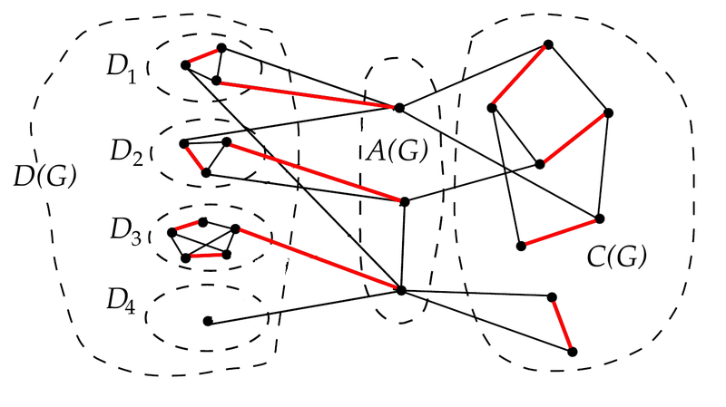 -->

<!-- Можно вырезать нижнюю вершину $A$, получится 2 нечетных КС - $D_3$ и $D_4$. $2 - 1 = 1 = \text{def}(G)$ -->

### 120. Докажите, что пересечение двух максимальных по включению барьеров также является барьером.

Пусть максимальные по включению барьеры - $X$ и $Y$.

Пусть $(G-X) = \{G_i\}_{i=1}^k$ - компоненты

Пусть $(G-Y) = \{H_i\}_{i=1}^m$

<!-- В силу максимальности $X, Y$ все эти компоненты нечётны по размеру. -->

$k=|X| + \text{def} G \quad m = |Y| + \text{def} G$

Пусть $X_i = X\cap H_i, Y_i = Y\cap G_i$. Переименуем и перенумеруем, так что все непустые $X_i, Y_i$ идут в начале, пусть таковых $\overline m$ и $\overline k$ соответственно и пусть $\overline m\le \overline k$.

$\forall i > \overline k \ \ G_i$ - КС в $G - X$ и $G_i\cap Y = \text{\O}$, поэтому $G_i$ - КС в $G - X - Y$, а значит $G_i\subset$ некоторой КС в $G-Y$.

Аналогичное верно для $H_i$.

Если $G_i\subset H_j$, $i > \overline k, j>\overline m$ и $H_j\subset G_j$, то $H_j=G_i$, т.к. $G_i\cap Y=\text{\O}, H_j\cap X=\text{\O}$ и они оба КС в $G-X-Y$, но очевидно подмножество КС может быть КС, только если они равны.

$G_i$ - КС в $G - X - Y = G - (X \cup Y) \Rightarrow G$ - КС в $G - (X \cap Y)$.

По формуле Бержа $\text{def} G \ge \text{odd}(G-(X \cap Y))-|X \cap Y|$, поэтому число $G_i \le |X \cap Y| + \text{def} G$

Перейдем к $G_i : G_i \subset H_j, \overline m\ge j$. В $H_j - X_j$ нет вершин, инцидентных $G_i \Rightarrow$ $G_i$ - КС в $H_j - X_j$.

Заметим, что если $\text{odd}(H_j - X_j) > |X_j|$, то $Y\cup X_j$ - барьер, что невозможно по максимальности. Тогда
$$\text{odd}(H_j - X_j) \le |X_j|$$

Пусть $|X_j|\equiv0\mod2$. Тогда $|H_j-X_j|=|H_j|-|X_j|\equiv1\mod2$. Чтобы набрать нечётное число вершин нечётными компонентами _(чётные КС не меняют четность)_, надо $\text{odd}(H_j - X_j)\equiv1\mod2$

Пусть $|X_j|\equiv1\mod2$. Тогда $|H_j-X_j|=|H_j|-|X_j|\equiv0\mod2$. Чтобы набрать чётное число вершин нечётными компонентами _(чётные КС не меняют четность)_, надо $\text{odd}(H_j - X_j)\equiv0\mod2$

Итого
$$|X_j|\not\equiv\text{odd}(H_j-X_j)\mod2 \Rightarrow \text{odd}(H_j - X_j) \le |X_j| - 1$$

В частности, в $H_j$ $\le |X_j| - 1$ компонент $G_i$, и для этих компонент очевидно $i > \overline k$. Посчитаем количество компонент $G_i, i>\overline k$. Их меньше, либо равно, чем:

$$|X \cap Y| + \text{def}G + \sum_{j=1}^{\overline m}(|X_j| - 1)$$
Это сумма для $G_i \subset H_j$, где $j > \overline m$ и где $j<\overline m$. Очевидно не может быть $G_i\not\subset H_j$, т.к. оно не пересекается с $X$ по построению и все вершины $G - X\in \{H_j\}$.

$$\begin{aligned}
    |X \cap Y| + \text{def}G + \sum_{j=1}^{\overline m}(|X_j| - 1)
     & = |X \cap Y| + \text{def}G + \sum_{j=1}^{\overline m} |X_j| - \overline m \\
     & = |X \cap Y| + \text{def}G + \sum_{j=1}^{\overline m} |X\cap H_j| - \overline m \\
     & = |X \cap Y| + \text{def}G + |X\cap \bigcup_{j=1}^{\overline m} H_j| - \overline m \\
     & = |X \cap Y| + \text{def}G + |X\cap \bigcup_{j=1}^{m} H_j| - \overline m \\
     & = |X \cap Y| + \text{def}G + |X\cap (G-Y)| - \overline m \\
     & = |X \cap Y| + \text{def}G + |X\cap G- X\cap Y| - \overline m \\
     & = |X \cap Y| + \text{def}G + |X- X\cap Y| - \overline m \\
     & = |X| + \text{def}G - \overline m \\
     & = k - \overline m \\
     & \le k - \overline k \\
\end{aligned}$$

Но очевидно, что число $G_i, i>\overline k$ это $k-\overline k \Rightarrow$ выполнилось равенство $\Rightarrow$ во всех предыдущих неравенствах тоже выполнилось равенство. В частности, в строке "По формуле Бержа..." число $G_i = |X\cap Y| + \text{def}G \Rightarrow X\cap Y$ - барьер. $\square$

### 121. Пусть $x\in A(G)\cup C(G)$, $G'=G\setminus x$, $B'$ - барьер графа $G'$. Докажите, что $B=B'\cup x$ - барьер графа $G$. Следствие: любая вершина из $A(G) \cup C(G)$ входит в барьер графа $G$.

$$x\not\in D(G) \Rightarrow \forall M\ x \in G(M) \Rightarrow M' = E(G(M) - x) \Rightarrow \alpha'(G') = \alpha'(G) - 1$$
$$\text{def}(G') = |G'| - 2\alpha'(G') = n - 1 - 2\alpha'(G) + 2 = n - 2\alpha'(G) + 1 = \text{def}(G) + 1$$
$$\text{odd}(G'-B') = \text{odd}(G'-(B'\cup\{x\})) = \text{odd}(G'\cup\{x\}-B) = \text{odd}(G-B)$$
$$\text{odd}(G-B) = \text{odd}(G'-B') = |B'| + \text{def}(G') = |B| + \text{def}(G)$$

<!-- Случай, если $x\in C(G)$:

$\sphericalangle x\in C(G)$.

$\text{def} G'= \text{def} G+1$

$$\text{odd}(G-B') - |B'| = \text{def} G'$$
$$\text{odd}(G - B)=\text{odd}(G-B') = |B'| + \text{def} G' = |B| - 1 + \text{def} G + 1 = |B| + \text{def} G$$ -->

<!-- 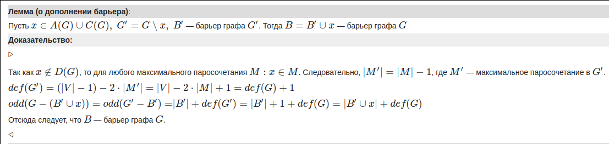 -->

### 122. Пусть $B$ - барьер графа $G$, тогда $B\cap D(G)$ пусто и все компоненты $D(G)$ являются подмножествами нечетных компонент связности графа $G\setminus B$.

Покажем, что $B\cap D(G)$ пусто.

### 123. Пусть $B$ - барьер графа $G$, причем $x \in B$. Тогда $B' = B \setminus x$ - барьер графа $G' = G \setminus x$.

#### Лемма

$\text{def}(G-X) \le \text{def}G+|X|$

#### Доказательство

$M$ - максимальное паросочетание

$$\begin{aligned}
    \alpha'(G)
     & = |M| \\
     & = |E(M) \cap E(G-X)| + |E(M) \cap (E(G) \setminus E(G-X))| \\
     & \le \alpha'(G-X) + |X|
\end{aligned}$$
$$\begin{aligned}
    \text{def} G
     & = n - 2\alpha'(G) \\
     & \ge n - 2(\alpha'(G-X) + |X|) \\
     & = |G-X| - 2\alpha'(G-x) - |X| \\
     & = \text{def}(G-X) - |X|\quad \square
\end{aligned}$$

Заметим, что $x\not\in o(G-B)$, поэтому $\text{odd}(G-B)\le \text{odd}(G-x-B) = \text{odd}(G'-B')$

$$\begin{aligned}
    \text{def}(G')
     & \le \text{def}G+1 \\
     & = \text{odd}(G-B) - |B| + 1 \\
     & = \text{odd}(G-B) - |B'| \\
     & \le \text{odd}(G'-B') - |B'| \\
\end{aligned}$$

Но по формуле Бержа $\text{def}(G') \ge \text{odd}(G'-B') - |B'| \Rightarrow \text{def}(G') = \text{odd}(G'-B') - |B'|$

### 124. Докажите, что пересечение всех максимальных по включению барьеров $G$ равно $A(G)$.

Пусть $X$ - максимальный по включению барьер. В силу его максимальности $A(G-X)=\text{\O}$, т.к. иначе $X\cup A(G-X)$ - тоже барьер.

По лемме Галаи о стабильности $A(G-X) = A(G) \setminus X$, тогда $A(G)\subset X$

В другую сторону:

Докажем, что $\forall x\not\in A(G) \exists X : x\not\in X$

Если $x\in D(G)$, то $\exists X$ по 122.

Пусть $x\in C(G)$. Построим максимальное паросочетание $M$, пусть $xy\in M$.

$A(G)\cup \{y\}$ — барьер графа $G$, т.к. если удалить $y$, то $C_i \to \overline C_i$ - объединение нескольких (возможно 1) КС, при этом $|\overline C_i|\equiv1\mod2$.

Тогда пусть $X$ - какой-либо максимальный по включению барьер, содержащий $A(G)\cup \{y\}$. Очевидно $X$ не может содержать в себе ребра из максимального паросочетания, поэтому $x\not\in X$, $\square$.
<!-- Пусть $B'$ — максимальный барьер графа $G$, содержащий $B$.
В максимальном паросочетании $M$ графа $G$ все вершины барьера $B'$ должны быть соединены рёбрами с вершинами различных нечётных компонент связности графа $G - B'$, следовательно, $x\notin B'$ -->
<!-- 
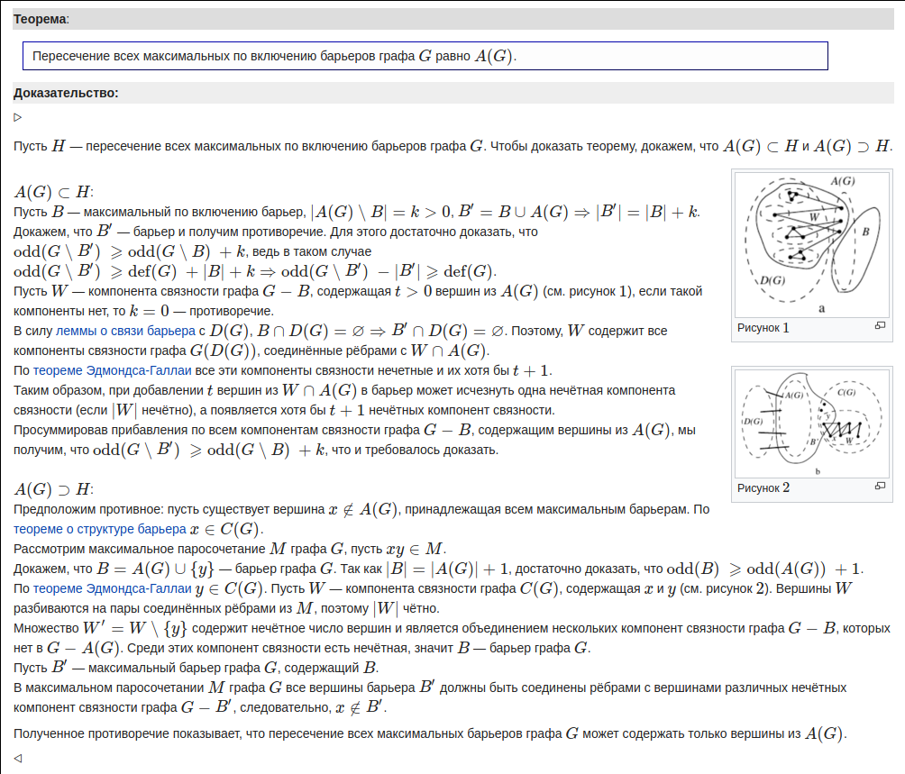

Также есть в Matching Theory. -->

### 125. Лапой называется индуцированный подграф $K_{1, 3}$ - вершина (центр лапы) и три её соседа, не связанные между собой. Докажите, что если $B$ - минимальный по включению барьер $G$, то каждая вершина $B$ - центр лапы в $G$.

Пуcть $x\in B$ - не центр лапы. Покажем, что $B-x$ - барьер.

Пусть $G-B=\{G_i\}$ - КС. $x$ инцидентно _(и связно)_ не более, чем двумя КС в $G-B$. Тогда $\text{odd}(G-(B-x))\ge \text{odd}(G-B)-1$, т.к. $x$ либо объединяет $2$ КС, либо ничего не объединяет.

$$\text{odd}(G-(B-x)) \ge \text{odd}(G-B)-1 = \text{def}G + |G-B| - 1 = \text{def}G + |G-(B-1)|$$

### 126. Докажите, что если связный граф $G$ содержит четное число вершин и не содержит лапы, то он содержит совершенное паросочетание (Теорема Сумнера-Лас Вергнаса).

По 125 минимальный барьер $\text{\O}$, тогда $\text{odd}(G-B)=\text{odd}(G)=0 \Rightarrow \text{def}G=0 \Rightarrow \exists$ сов. парсоч.
