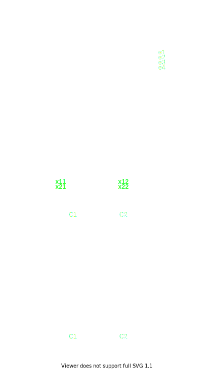
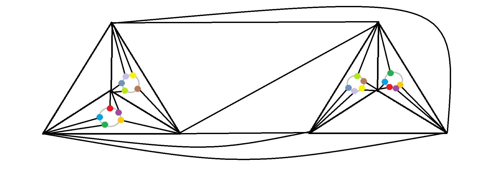

- [Задания 57-72](#задания-57-72)
  - [57. Обозначим как $\lambda(G)$ минимальное число ребер, которое нужно удалить в графе, чтобы он потерял связность, $\kappa(G)$ - минимальное число вершин, которое нужно удалить в графе, чтобы он потерял связность (для полного графа полагаем $\kappa(G)=n-1$). Докажите, что $\kappa(G) \le \lambda(G) \le \delta(G)$.](#57-обозначим-как-lambdag-минимальное-число-ребер-которое-нужно-удалить-в-графе-чтобы-он-потерял-связность-kappag---минимальное-число-вершин-которое-нужно-удалить-в-графе-чтобы-он-потерял-связность-для-полного-графа-полагаем-kappagn-1-докажите-что-kappag-le-lambdag-le-deltag)
  - [58. Докажите. что для любых $1 \le \kappa(G) \le \lambda(G) \le \delta(G)$ существует граф $G$ с такими параметрами.](#58-докажите-что-для-любых-1-le-kappag-le-lambdag-le-deltag-существует-граф-g-с-такими-параметрами)
  - [59. Докажите, что не существует графов с $\kappa(G) = 3$ и $7$ ребрами.](#59-докажите-что-не-существует-графов-с-kappag--3-и-7-ребрами)
  - [60. Пусть $G$ - полный двудольный граф, за исключением $K_{2,2}$. Докажите $\lambda(G)=\delta(G)$, причем единственный способ удалить $\lambda(G)$ ребер, чтобы граф потерял связность - удалить все ребра, инцидентные одной из вершин.](#60-пусть-g---полный-двудольный-граф-за-исключением-k_22-докажите-lambdagdeltag-причем-единственный-способ-удалить-lambdag-ребер-чтобы-граф-потерял-связность---удалить-все-ребра-инцидентные-одной-из-вершин)
    - [Первое утверждение](#первое-утверждение)
      - [База](#база)
      - [Переход](#переход)
      - [$n \le m$](#n-le-m)
      - [$n > m$](#n--m)
    - [Второе утверждение](#второе-утверждение)
      - [$\exists w$](#exists-w)
      - [$\not\exists w$](#notexists-w)
  - [61. Графы $G_1$, содержащий $n_1$ вершин и $m_1$ ребер, и $G_2$, содержащий $n_2$ вершин и $m_2$ ребер, гомеоморфны. Докажите, что $n_1+m_2 = n_2+m_1$.](#61-графы-g_1-содержащий-n_1-вершин-и-m_1-ребер-и-g_2-содержащий-n_2-вершин-и-m_2-ребер-гомеоморфны-докажите-что-n_1m_2--n_2m_1)
  - [62. Рассмотрим параметрически заданную замкнутую кривую $\phi(t)$, будем говорить, что она имеет самопересечение, если есть точка на кривой, которая порождается двумя различными значениями параметра $t_1$ и $t_2$, причем в окрестности этой точки фрагменты кривой в окрестности параметра $t_2$ лежат по разную сторону от кривой в окрестности параметра $t_1$. Докажите, что планарный эйлеров граф содержит эйлеров цикл, не имеющий самопересечений.](#62-рассмотрим-параметрически-заданную-замкнутую-кривую-phit-будем-говорить-что-она-имеет-самопересечение-если-есть-точка-на-кривой-которая-порождается-двумя-различными-значениями-параметра-t_1-и-t_2-причем-в-окрестности-этой-точки-фрагменты-кривой-в-окрестности-параметра-t_2-лежат-по-разную-сторону-от-кривой-в-окрестности-параметра-t_1-докажите-что-планарный-эйлеров-граф-содержит-эйлеров-цикл-не-имеющий-самопересечений)
  - [63. Приведите пример вершинно двухсвязного планарного графа, который не является гамильтоновым.](#63-приведите-пример-вершинно-двухсвязного-планарного-графа-который-не-является-гамильтоновым)
  - [64. Докажите, что планарный четырехсвязный граф гамильтонов.](#64-докажите-что-планарный-четырехсвязный-граф-гамильтонов)
  - [65. Пусть $G$ - планарный граф, в котором каждый треугольник ограничивает область, не содержащую ребер, причем добавление любого ребра нарушает это свойство. Докажите, что $G$ гамильтонов.](#65-пусть-g---планарный-граф-в-котором-каждый-треугольник-ограничивает-область-не-содержащую-ребер-причем-добавление-любого-ребра-нарушает-это-свойство-докажите-что-g-гамильтонов)
  - [66. Докажите, что любой трехсвязный планарный граф имеет остов, у которого наибольшая степень равна 3.](#66-докажите-что-любой-трехсвязный-планарный-граф-имеет-остов-у-которого-наибольшая-степень-равна-3)
  - [67. Докажите, что все колеса самодвойственны.](#67-докажите-что-все-колеса-самодвойственны)
  - [68. Уложите четырехмерный куб на поверхности тора](#68-уложите-четырехмерный-куб-на-поверхности-тора)
  - [69. Уложите $K_7$ на поверхности тора](#69-уложите-k_7-на-поверхности-тора)
  - [70. Докажите, что $K_8$ нельзя уложить на поверхности тора](#70-докажите-что-k_8-нельзя-уложить-на-поверхности-тора)
    - [Теорема](#теорема)
    - [База](#база-1)
    - [Переход](#переход-1)
    - [Решение задачи](#решение-задачи)
  - [71. Найдите максимальное $k$, что граф $K_k$ можно уложить на сфере с двумя ручками.](#71-найдите-максимальное-k-что-граф-k_k-можно-уложить-на-сфере-с-двумя-ручками)
  - [72. Докажите, что для любого $m$ существует $k$, такое что граф с $K_k$ нельзя уложить на сфере с $m$ ручками.](#72-докажите-что-для-любого-m-существует-k-такое-что-граф-с-k_k-нельзя-уложить-на-сфере-с-m-ручками)

## Задания 57-72

### 57. Обозначим как $\lambda(G)$ минимальное число ребер, которое нужно удалить в графе, чтобы он потерял связность, $\kappa(G)$ - минимальное число вершин, которое нужно удалить в графе, чтобы он потерял связность (для полного графа полагаем $\kappa(G)=n-1$). Докажите, что $\kappa(G) \le \lambda(G) \le \delta(G)$.

Очевидно $\lambda(G) \le \sigma(G)$, т.к. всегда можно вырезать все ребра,
инцидентные минимальной вершине и получить несвязный граф.

$\kappa(G) \le \lambda(G)$, т.к. можно вырезать все вершины, инцидентные ребрам,
которые инцидентны минимальной вершине и получить несвязный граф.

### 58. Докажите. что для любых $1 \le \kappa(G) \le \lambda(G) \le \delta(G)$ существует граф $G$ с такими параметрами.

Возьмём $U = K_{\delta + 1}$, $V = K_{\delta + 1}$. Соединим $U$ и $V$
следующим образом:

$$\forall i \le \kappa \quad \exists u_iv_i$$
$$\forall j \in [\kappa + 1, \lambda] \quad \exists u_jv_1$$

Вершина с минимальной степенью очевидно $v_{\delta+1}, \delta(v_{\delta+1}) =
\delta$. Минимальные вершины для выреза - $\{v_i\}_{i=1}^\kappa$, ребра - все
ребра, соединяющие $V$ и $U$, т.е. $\lambda$.

<!-- Полный $K_{\kappa, \lambda}$, где ко всем вершинами первой части подсоединили
вершину и то же самое для правой. Кроме того, вершину для левой  Если вырезать все вершины левой части, то
граф перестанет быть связным. Если вырезать все ребра -->

### 59. Докажите, что не существует графов с $\kappa(G) = 3$ и $7$ ребрами.

Пусть такой граф существует. Если $|V| \ge 5$, то $\sum \delta(v) \ge 15$, но
$\max \sum \delta(v) = 2|E| = 14$ - противоречие.

Очевидно $|V| = 4$, т.к. иначе $\delta(G) < 3$. Но между 4 вершинами можно
провести только 6 ребер - противоречие.

### 60. Пусть $G$ - полный двудольный граф, за исключением $K_{2,2}$. Докажите $\lambda(G)=\delta(G)$, причем единственный способ удалить $\lambda(G)$ ребер, чтобы граф потерял связность - удалить все ребра, инцидентные одной из вершин.

#### Первое утверждение

Докажем первое утверждение по индукции по $m, K_{n, m}$

##### База

$m = 1$. $K_{n, 1}$ - звезда, $\lambda(K_{n, 1})=1$

##### Переход

Пусть множество ребер $E$ после удаления из $K_{n, m+1}$ дает несвязный граф.
Тогда $E\cap{K_{n, m}}$ после удаления из $K_{n, m}$ дает несвязный граф.

##### $n \le m$

Тогда $|E\cap{K_{n, m}}| \ge n$ по индукционному предположению, поэтому $|E| \ge
n$, но $\exists E : |E| = n$ (очевидно строится)

##### $n > m$

Тогда $|E\cap{K_{n, m}}| \ge m$ по индукционному предположению. Пусть $K_{n,
m+1}\setminus K_{n, m} = v$. Если $e\in E$ - инцидентно $v$, то очевидно $|E|
\ge m+1$. Предположим обратное, тогда $v$ после вырезания $E$ всё еще связано со
всеми вершинами $w_1\ldots w_n$ из второй доли $\Rightarrow \exist v_i$, не
связанная с $\{w_j\}_{j=1}^n$ после вырезания $E$. Тогда $\forall j \not\exists
v_iw_j$ после вырезания $\Rightarrow$ мы вырезали хотя бы $n$ ребер и $n \ge
m+1$. $\square$

#### Второе утверждение

$\sphericalangle K_{n, m}$, доли $N$ и $M$

Возьмём вершину $v\in N$, к которой удалили $a < \lambda$ инцидентных ребер. $v$
соседне со всеми $x\in X\subset M$, где $|X| = m - a$.

$\sphericalangle w\in N : \forall x\in X \not\exists xw$

##### $\exists w$

Тогда вырезано $m-a$ ребер, инцидентных $w$ и очевидно не инцидентных $v$. Тогда
все остальные ребра не вырезаны, иначе было вырезано $>m\ge\lambda$ ребер. Если
$\exists u \in N : u\not=v, u\not=w$, то оно связно со всеми вершинами $M$ и
следовательно связывает $X$ и $M\setminus X$, а также $v$ и $w$. Все остальные
вершины $N$ очевидно связаны, т.к. инцидентные им ребра не были вырезаны.

Если $\not\exists u$, то это случай $K_{2, 2}$

##### $\not\exists w$

Тогда $N$ связно с $X$, поэтому $\exists y\in M\setminus X : \forall z\in N
\not\exists yz$. Тогда было вырезано $n+a$ ребер, бан.

### 61. Графы $G_1$, содержащий $n_1$ вершин и $m_1$ ребер, и $G_2$, содержащий $n_2$ вершин и $m_2$ ребер, гомеоморфны. Докажите, что $n_1+m_2 = n_2+m_1$.

Очев.

### 62. Рассмотрим параметрически заданную замкнутую кривую $\phi(t)$, будем говорить, что она имеет самопересечение, если есть точка на кривой, которая порождается двумя различными значениями параметра $t_1$ и $t_2$, причем в окрестности этой точки фрагменты кривой в окрестности параметра $t_2$ лежат по разную сторону от кривой в окрестности параметра $t_1$. Докажите, что планарный эйлеров граф содержит эйлеров цикл, не имеющий самопересечений.

```
a   d
 \ /
  c 
 / \
b   e
```

Пойдем $acd..ecb$, а не $ace..dcb$. Реберно неперескающийся путь $d\to e$
существует, т.к. изначальный цикл эйлеров.

### 63. Приведите пример вершинно двухсвязного планарного графа, который не является гамильтоновым.

```
  e
 / \
a-b-c
 \ /
  d
```

### 64. Докажите, что планарный четырехсвязный граф гамильтонов.

### 65. Пусть $G$ - планарный граф, в котором каждый треугольник ограничивает область, не содержащую ребер, причем добавление любого ребра нарушает это свойство. Докажите, что $G$ гамильтонов.

### 66. Докажите, что любой трехсвязный планарный граф имеет остов, у которого наибольшая степень равна 3.

### 67. Докажите, что все колеса самодвойственны.

Пусть в графе $n$ вершин, помимо оси.

Расположим колесо на сфере, где ось - северный полюс, остальные вершины на южном
полушарии на одинаковой южной долготе $t$, при этом они распределены равномерно на
широтах $i\frac{2\pi}{n}$.

У нас есть $n$ долей, которые примыкают к северному полюсу и еще одна доля $A$,
которая содержит южный полюс. Пусть $A\leftrightarrow a$, где $a$ - южный полюс.

Пусть каждой из $n$ долей соответствует вершина, лежащая на северной долготе
$t$ и широте $i\frac{2\pi}{n}+\frac{\pi}{n}$.

Очевидно при отражении двойственного графа относительно экватора и повороте на
$\frac{\pi}{n}$ мы получаем исходный граф.

### 68. Уложите четырехмерный куб на поверхности тора

[рисунок](https://digitalcommons.library.umaine.edu/cgi/viewcontent.cgi?article=3603&context=etd)

### 69. Уложите $K_7$ на поверхности тора

[рисунок](http://www.amotlpaa.org/math/k7torus.html)

### 70. Докажите, что $K_8$ нельзя уложить на поверхности тора

#### Теорема

Алгебраическая топология гласит, что $\chi=0$ для тора и $\chi = V - E + F$.

$\chi$ - характеристика Эйлера для тора, $V, E, F$ - вершины, ребра и грани
разбиения фигуры (в нашем случае тора) на плоские грани. Но граф может разбивать
не на плоские грани, например в торе вырезали сегмент, получили трубу - не
плоская.

Мы знаем, что $\chi=2-2g$ для $g$-тора, поэтому предложим следующую формулу:
$$2 - 2g = V - E + F$$
И утверждаем, что она выполняется, если у графа $G$ есть **адекватная**
укладка.

Адекватная укладка - укладка, все грани которой топологически равны плоской
фигуре, т.е. нет дырок.

#### База

$g = 0$ - доказано на лекции.

#### Переход

Если какая-то грань содержит полностью ручку, то эта грань не равна плоской
фигуре, поэтому ручка не содержится целиком ни в одной грани, т.е. по каждой
ручке проходят ребра.

Возьмём такую ручку и проведем поперек два круга, так что все ребра $e_1\ldots
e_t$, пересекающие $C_1$ пересекают $C_2$. Пусть $e_i \cap C_j = x_{ij}$,
добавим $x_{ij}$ как вершины в исходный граф.

Тогда мы добавили $2t$ вершин, $4t$ ребер ($2n$ строят $C_1, C_2$, $t$ между
$x_{i1}$ и $x_{i2}$, $t$ между $x_{i2}$ и основой) и $2n$ граней ($t$ между
$C_1$ и $C_2$, $t$ справа от $C_2$).



Теперь вырежем ребра между $C_1$ и $C_2$, соединим все $x_{1j}$ одним циклом и
$x_{2j}$ другим. В этом графе по сравнению с изначальным:
1. $2t$ новых вершин $=V'$
2. $3t$ новых ребер $=E'$
3. $t+2$ новых граней $=F'$

В этом графе $g-1$. Тогда по инд. предп.
$$V' - E' + F' = 2 - 2g + 2$$
$$V + 2t - E - 3t + F + t + 2 = 2 - 2g + 2$$
$$V + E + F = 2 - 2g$$

Чтд.

Что с графами, у которых нет адекватной укладки, но какая-то есть?

Если для любой укладки $G$ в $S_g$ есть ручка, которая содержится полностью в
одной вершине, то мы можем уложить $G$ в $S_{g-1}$, убрав эту ручку. Тогда
получается, что граф, который нельзя уложить в $S_{g-1}$, но можно в $S_g$
удовлетворяет условию $V + E + F = 2 - 2g$.

#### Решение задачи

Мы знаем, что $K_8$ нельзя уложить в сферу, т.к. $K_5\subset K_8$. Предположим,
что $K_8$ можно уложить в тор, тогда выполняется условие теоремы:

$\begin{aligned}
  0 & = 8 - 28 + F \\
  F & = 20
\end{aligned}$

Пусть для каждой грани используется в среднем $n$ ребер (может быть дробным).
Очев $n \ge 3$.

$\begin{aligned}
  3F \le nF & = 2e \\
  3F & \le 2e \\
  3F & \le 56 \\
  3\cdot 20 & \le 56
\end{aligned}$

### 71. Найдите максимальное $k$, что граф $K_k$ можно уложить на сфере с двумя ручками.

$K_8$ можно разместить на 2-торе, см. иллюстрацию:



Покажем, что $K_9$ нельзя разместить на 2-торе.

Очевидно $K_9$ нельзя разместить на 1-торе, т.к. $K_8\subset K_9$. Пусть $K_8$
можно разместить на 2-торе. Тогда выполняется условие теоремы для $g=2$:

$\begin{aligned}
  -2 & = 9 - 36 + F \\
  F & = 29
\end{aligned}$

$\begin{aligned}
  3F \le nF & = 2e \\
  3F & \le 72 \\
  3\cdot 29 & \le 72
\end{aligned}$

Итого $K_8$ можно, $K_9$ уже нельзя. $K_{i > 9}$ очевидно тоже нельзя.

<!-- Сфера с двумя ручками есть 2-тороид, $\chi=-2$.

$\begin{aligned}
  -2 & = n - \frac{n(n-1)}{2} + F \\
  F & = \frac{n(n-1)}{2} - n - 2 \\
\end{aligned}$

$3F \le nF = 2e = n(n-1)$

$$3\left(\frac{n(n-1)}{2} - n - 2\right) \le n(n-1)$$
$$\frac{n(n-1)}{2} \le 3n + 6$$
Для $n=9$ это не выполняется ($36 \le 33$). Покажем, что $K_8$ можно разместить на 2-тороиде. -->

### 72. Докажите, что для любого $m$ существует $k$, такое что граф с $K_k$ нельзя уложить на сфере с $m$ ручками.


Докажем по индукции с использованием теоремы.

Для $m=0$ уже доказано, $k=5$.

Пусть для $m-1\ \exists k$. Очевидно $\forall n > k\ K_n$ тоже не укладывается в
$S_{m-1}$. Тогда предположим, что все $K_i$ можно уложить на $S_m$. Тогда
$\forall n > k$ выполняется условие теоремы:

<!-- $$2 - 2m = n - \frac{n(n-1)}{2} + F$$
$$m = 1 - \frac{n}{2} + \frac{n(n-1)}{4} - \frac{F}{2}$$
$$m \ge 1 - \frac{n}{2} + \frac{n(n-1)}{4} - \frac{n(n-1)}{3}$$ -->

$\begin{aligned}
  2-2m & = n - \frac{n(n-1)}{2} + F \\
    & \le n - \frac{n(n-1)}{2} + \frac{n(n-1)}{3} \\
    & \le n - n(n-1)\frac{1}{6} \\
\end{aligned}$

$2-2m \le$ убывающая неограниченная функция, бан.


<!-- Для $m$-тора $\chi = 2-2m$. 
$$3\left(\frac{n(n-1)}{2} - n + 2 - 2m\right) \le 3F \le n(n-1)$$
$$\frac{n(n-1)}{2} \le 3n - 6 + 6m$$
Очев $\exists n$ такое, что неравенство не выполняется:
$$n\left(\frac{n}{2} - \frac{7}{2}\right) > - 6 + 6m$$ -->
