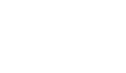
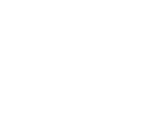
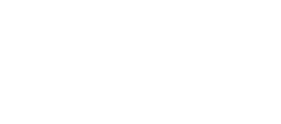
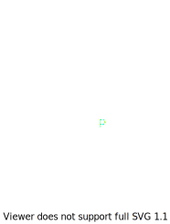
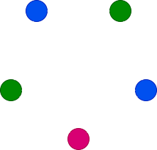
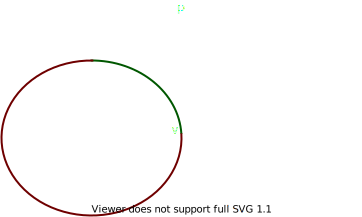

# Задания 73-87

### 73. Посчитать хроматический многочлен цикла $C_n$

$P(C_n, x) = (x-1)^n + (-1)^n(x-1)$

Докажем по индукции по $n$

#### База ($n = 3$)

$C_3 = K_3 \Rightarrow P(C_3, x) = P(K_3, x) = x(x-1)(x-2) = x^3 - 3x^2 + 2x = (x-1)^3 + (-1)^3(x-1)$

#### Переход

$\begin{aligned}
    P(C_n, x) & = P(C_n \setminus e, x) - P(C_n / e, x) \\
    & = P(T_n, x) - P(C_{n-1}, x) \\
    & = x(x-1)^{n-1} - (x-1)^{n-1} + (-1)^{n-1}(x-1)
\end{aligned}$

### 74. Посчитать хроматический многочлен колеса $C_n + K_1$.

Зафиксируем раскраску оси - один из $x$ вариантов, тогда остается $P(C_{n-1}, x-1) = (x-2)^{n-1} + (-1)^{n-1}(x-2)$. Ответ $x((x-2)^{n-1} + (-1)^{n-1}(x-2))$

### 75. Посчитать хроматический многочлен полного двудольного графа $K_{n,m}$.

Сначала найдем число способов покрасить долю $N$.

Переберем число различных цветов этой доли $r$, для каждого $r$ число способов выбрать $r$ цветов из $x$ 
это $\binom{x}{r}$. Чтобы покрасить $N$ в $r$ цветов, надо разбить $N$ на $r$ непустых непересекающихся подмножеств, это $\left\{\genfrac{}{}{0pt}{}{n}{r}\right\}r!$. Факториал, т.к. вершины помечены.

Число способов покрасить долю $M$ при покрашенной в $r$ цветов $N$ - $(x-r)^m$

Итого:

$$\sum_{r=1}^x \binom{x}{r}\left\{\genfrac{}{}{0pt}{}{n}{r}\right\}r!(x-r)^m$$

### 76. Приведите пример двух связных графов, которые не являются деревьями, не являются изоморфными и имеют одинаковые хроматические многочлены.





$x(x-1)^3(x-2)$

### 77. Докажите, что если длина максимального простого нечетного цикла в $G$ есть $k$, то $\chi(G)\le k + 1$.

Очевидно искомое неверно для графов без нечетных циклов, поэтому не будем таковые рассматривать.

Тогда мы рассматриваем только не двудольные графы.

Если доказать искомое только про связные графы, то для несвязных тоже верно,
т.к. искомое можно будет применить к каждой КС.

#### 1.

##### Формулировка

Если $G$ двусвязен и недвудолен _(есть нечет. цикл)_, в котором лежит **четный**
цикл $C$, то
$$\exists x,y\in C : \exists x\stackrel{P}\rightsquigarrow y : P \cap C = \{x,
y\}, |P|\not\equiv |(x\stackrel{C}\rightsquigarrow y)| \mod 2$$
Словами - на $C$ лежат две вершины, такие что между ними есть путь, который
вершинно не пересекается с $C$ (кроме $x, y$) и чётность длины этого пути
отлична от четности пути между $x$ и $y$ по $C$.

##### Доказательство

Рассмотрим нечетный цикл $C'$. В силу двусвязности в $G$ есть цикл, который
содержит некоторые ребра $C$ и $C'$:



Утверждается, что мы можем построить нечетный цикл $C''$, который содержит хотя
бы одно ребро $\in C$. Рассмотрим два произвольных пути $X$ и $Y$, соединяющие
$C$ и $C'$ _(пунктир)_. Они делят $C'$ на часть чётной длины и часть нечётной.
Тогда мы можем взять искомый цикл.

Пусть $C''\cap C = \{x_i\}_{i=1}^l$.

$\{x_i\}_{i=1}^l$ - путь по $C$ чётности $l$. Тогда $C''\setminus\{x_i\}$ - путь
по, непересекающийся с $C$ четности $|C''|-l$, но $|C''|\equiv1\mod2 \Rightarrow
|C''|-l\not\equiv l\mod2$. Мы нашли искомый путь.

#### 2.

##### Формулировка

Если $\delta(G) \ge 2k$ и в $G$ самый длинный нечетный цикл имеет длину $2k-1$,
то в $G$ есть _(чётный)_ цикл длины $\ge 4k$

##### Доказательство

Рассмотрим максимальный (не содержится ни в каком другом пути полностью) путь
$P=\{x_1\ldots x_l\}$ . Очевидно все соседи $x_1$ $\in P$, иначе $vP$ содержит
$P$.

Рассмотрим соседа $x_1$ - $x_r$, самого далекого в $P$. Очевидно $r\ge 2k+1$,
кроме того - $r$ четный, т.к. иначе получаем нечетный цикл длины $> 2k-1$.

Очевидно $\forall i \ge k$ $x_{2i+1}$ - не соседняя вершина.

Кроме того, $\forall i \ge k$ $x_{r-2i+1}$ - тоже не соседняя с $x_1$ вершина,
т.к. иначе путь $x_1x_{r-2i+1}x_{r-2i}\ldots x_{r}$ нечетный и слишком длинный.

Пусть первые вершины - $A$, вторые - $B$. Если $A\cap B=\emptyset$, то в $A$
вершин с индексом $\le r, \ge 2$ всего
$$\cfrac{r-2k-2}{2}+1$$
($2k+1, 2k+3 \ldots r-1$), в $B$
$$\cfrac{r-2k-2}{2}+1$$
($r-2k+1, r-2k-1 \ldots 3$).

Кроме этих вершин, еще с индексом $\le r$ все соседи $x_1$, их хотя бы $2k$.

В сумме хотя бы $r$, но вершин с индексами от $2$ до $r$ очевидно $r$ штук -
противоречие $\Rightarrow A\cap B\not=\emptyset \Rightarrow 2k+1\le r-2k+1
\Rightarrow r \ge 4k \quad \square$

#### 3.

##### Формулировка

Искомое.

##### Доказательство

По индукции по числу вершин $n$:

**База**: $n=2$ - очевидно для $k=1$

**Переход**:

Предположим противное - длина наибольшего нечетного цикла $2k-1$, но
$\chi(G)>2k$. Вырезав любую вершину, мы получаем граф, для которого выполняется
индукционное предположение, т.е. $\chi(G\setminus\{v\}) \le 2k' \le 2k$, где
$2k'-1$ - длина наибольшего нечетного цикла $G\setminus\{v\}$. Такие графы
называются критичными, и $\delta(G) \ge \chi(G) - 1 > 2k - 1 \Rightarrow
\delta(G)\ge 2k$. Тогда можем применить 2., поэтому $\exists$ четный цикл $C :
|C|\ge 4k$. По 1. в этом цикле есть $x, y$, таки что между ними есть путь $P$ вне
цикла, четность которого не равна четности пути $x\rightsquigarrow y$ по $C$.
Тогда $P\cup x\rightsquigarrow y$ - очевидно цикл, при этом нечетный. С другой
стороны, есть второй путь $x\overline \rightsquigarrow y$ по $C$, и $P\cup
x\overline \rightsquigarrow y$ тоже нечетный. Суммарная длина этих циклов хотя бы
$4k+2$, т.к. $|P|\ge1$, $P$ посчитан дважды, а также входит весь цикл $C$. Но
тогда наибольший из этих циклов имеет длину хотя бы $2k+1$ и он нечетный -
противоречие.



Двусвязность можно использовать, т.к. в не двусвязном графе в каждой компоненте
двусвязности искомое выполняется и можно переименовать цвета так, чтобы
противоречий из-за мостов не возникло.

<!-- 
#### Теорема

Если:
- $G$ двусвязен
- с $k$ нечётными циклами различной длины
- $\delta(G)\ge 2k+1$

то $G=K_{2k+2}$

Зачем?  -->

<!-- #### Лемма

В связном графе с чётным циклом $C$ для любых вершин $x, y\in C \ \exists D : x\rightsquigarrow y$, такой что $|D|\not\equiv |(x\rightsquigarrow y)_C| \mod2$ -->

### 78. Если степени вершин графа $G$ равны $d_1 \ge d_2 \ge \ldots \ge d_n$, то $\chi(G)\le \max\min\{i, d_i+1\}$. 

<!-- Будем раскрашивать жадно:

```
for v in V.sort(degree):
    used = v.adjacent().map(color)
    v.color = min(R - used)
``` -->

Будем раскрашивать по следующему алгоритму:

Пусть $v_1\ldots v_n$ - вершины $G$, тогда пусть $T_1$ - такое подмножество
$V(G)$, что:
1. $v_1\in T_1$
2. $\{v_{i_k}\}_{k=1}^m \subset T_1 \Rightarrow v_j\in T_1 \Leftrightarrow \not\exists v_jv_{i_k} \ \ \forall k$

Пояснение:

```
T = {v_1}

while T.changed():
    for u in T - V:
        if T.every(v => !u.adjacent(v)):
            T += u
            break
```

Пусть $T_2$ - подмножество $V(G) - T_1$, такое что $v$ с мин. индексом$,
невошедшее в $T_1$ $\in T_2$ и для $T_2$ тоже выполняется предикат 2.

Аналогично определяем $T_i$, пока не получим пустое множество.

Очевидно $V = \bigcup T_i$, кроме того $\forall i \ \forall v,u \in T_i
\not\exists vu$ по построению. Тогда, если все вершины $T_i$ покрасить в $i$-тый
цвет, то мы получим верную раскраску $G$.

По построению $\forall v\in V-T_1\ \exists u\in T_1\ \exists vu$, т.к. иначе $v$
вошло бы в $T_1$. Аналогичное верно для $V-\bigcup_{i=1}^m T_i$ и
$\bigcup_{i=1}^m T_{i}$.

Тогда
$$v_k\not\in \bigcup_{i=1}^m T_i \Rightarrow d_k\ge m$$
Предположим:
$$v_k\not\in \bigcup_{i=1}^{d_k+1} T_i \Rightarrow d_k+1\ge d_k$$
Противоречие.
$$v_k\in \bigcup_{i=1}^{d_k+1} T_i$$
С другой стороны:
$$v_k\in \bigcup_{i=1}^{k} T_i$$
Тогда:
$$v_k\in \bigcup_{i=1}^{\min(d_k+1, k)} T_i$$

Т.к. это верно для любой вершины, то всего не больше чем $\max_k\min(d_k+1, k)$
различных $T_i$. $\square$

### 79. Докажите или опровергните, что если граф $G$ с $n$ вершинами содержит гамильтонов цикл, причем ему принадлежат не все ребра графа, то (а) $\chi(G) \le 1 + n/2$ (б)  $\chi(G) \ge 1 + n/2$ . 



$\chi(G) \le 3$

$1 + n/2=1+2.5=3.5 > 3 \ge \chi(G) \Rightarrow$ (б) неверно

$\chi(K_5) = 5$

$3.5 < 5 = \chi(G) \Rightarrow$ (а) неверно

### 80. Конъюнкцией $G_1 \wedge G_2$ графов называется граф с $V = V_1 \times V_2$, $(u_1, u_2)-(v_1, v_2) \in E$, если $u_1v_1 \in E_1$ и $u_2v_2\in E_2$. Доказать, что хроматическое число конъюнкции $G_1\wedge G_2$ графов $G_1$ и $G_2$ двух графов не превосходит хроматических чисел этих графов.

$\chi(G_1\wedge G_2) \le \min(\chi(G_1), \chi(G_2))$

Покрасим $G_1\wedge G_2$ так же, как $G_1$. Это возможно, т.к. $(u_1, u_2)-(v_1,
v_2) \Rightarrow u_1-v_1$. Таким образом, если $v_1$ и $u_1$ соединены, то их
цвета в $G_1$ различны $\Rightarrow (u_1, u_2)$ и $(v_1, v_2)$ тоже имеют
различные цвета. Если они не соединены, то $(u_1, u_2)$ и $(v_1, v_2)$

Аналогично можно для $G_2$

### 81. Рассмотрим связный граф $G$, не являющийся простым циклом нечетной длины, все простые циклы которого нечетны. Обозначим как $\chi'(G)$ минимальное число цветов, в которое можно раскрасить ребра граф $G$, чтобы ни в какую вершину не входило ребер одного цвета. Докажите, что $\chi'(G)=\Delta(G)$.

#### 0. Нет циклов

Дерево очевидно красится в $\Delta$ цветов жадным алгоритмом.

#### 1. Один цикл

Т.к. $G\not= C_n$, $\Delta > 2$.

Покрасим единственный цикл в $3$ цвета, $3\le \Delta$. Остался лес, в
котором для некоторых ребер забанены 2 цвета (они инцидентны циклу). Это не
проблема, т.к. жадному алгоритму это не мешает красить в $\le \Delta$ цветов.

#### 2. $\ge 2$ цикла

Выберем два цикла $C_1$ и $C_2$.

##### 2.1. Есть общая вершина

Пусть такая вершина - $v$. Заметим, что между $C_1$ и $C_2$ не может быть пути,
не проходящего через $v$:



Цикл по зеленому и по красному имеют разную четность $\Rightarrow$ один из них
чётный, противоречие.

Тогда если вырезать $v$, то эти циклы перестанут быть связными _(и быть
циклами)_. Тогда $G$ распадется на 2 КС $G_1$ и $G_2$, для каждой из которых
выполняется индукционное предположение. Мы можем смержить раскраски $G_1$ и
$G_2$ переименовыванием: пусть в $G_1$ $v$ инцидентно $m$ ребер, тогда в $G_2$ -
$\le \Delta - m$ ребер, переименуем цвета этих $m$ ребер так, что они не
совпадают с цветами $\Delta - m$ ребер. 

##### 2.2. Нет общей вершины

Аналогично не может быть двух непересекающихся путей между $C_1$ и $C_2$. Тогда
все пути _(он хотя бы один есть)_ между $C_1$ и $C_2$ проходят через некоторую
вершину $v$, дальше аналогично 2.1

### 82. Докажите, что в любой раскраске реберного графа каждая вершина смежна не более чем с двумя вершинами одного цвета

Условие распарсилось как _"при любой верной раскраске ребер $G$ в $G_E$ каждая
вершина смежна не более чем с двумя вершинами одного цвета"_

Рассмотрим ребро $e$ в $G$, $e\leftrightarrow v\in G_E$. $e=uw$. Рассмотрим $U$
и $W$ - множества ребер, инцидентных $u$ и $w$ соответственно. Цвета всех
элементов $U$ и $W$ различны (внутри каждого множества). Тогда пусть $v$
смежна с двумя вершинами $a, b, c$ одного цвета и пусть $a, b, c \leftrightarrow
\mathfrak a, \mathfrak b, \mathfrak c$. Эти ребра либо $\in U,$ либо $\in V
\Rightarrow$ хотя бы два из них лежат в одном множестве, противоречие с
различными цветами множеств.

### 83. Доказать формулу Зыкова для хроматического многочлена графа $G$: $P_G(x)=\sum\limits_{i=1}^n pt(G,i)x^{\underline{i}}$, где $pt(G,i)$ — число способов разбить вершины $G$ на $i$ независимых множеств.

Нерк

### 84. Доказать формулу Уитни: пусть $G$ - обыкновенный $(n, m)$ - граф. Тогда коэффициент при $x^i$, где $1\le i\le n$ в хроматическом многочлене $P_G(x)$ равен $\sum \limits_{j=0}^{m}{(-1)^jN(i, j)}$, где $N(i, j)$ - число остовных подграфов графа $G$, имеющих $i$ компонент связности и $j$ рёбер.

Нерк

### 85. Граф называется однозначно раскрашиваемым, если любые две его раскраски в $\chi(G)$ цветов совпадают с точностью до переименования цветов. Приведите пример однозначно раскрашиваемого связного графа и связного графа, который не является однозначно раскрашиваемым

$K_2, T_3$

### 86. Какое минимальное число вершин может быть в однозначно раскрашиваемом в 3 цвета графе, отличном от полного графа?

4, см. [скрипт](86.py)

### 87. Какое минимальное число ребер может быть в однозначно раскрашиваемом в $k$ цветов графе с $n$ вершинами?

Определим операцию $A\rtimes B$ на графах:

Возьмём произвольную вершину $v\in V(B)$, такую что $B\setminus\{v\} \subset A$.
Добавим в $A$ $v$ и соединим так же, как в $B$.

Построим семейство графов $F^k_i$ следующим образом:

1. $F^k_0 = K_k$
2. $F^k_{i+1} = F^k_i\rtimes K_k$

Утверждается, что $\forall n\ge k \ F^k_{n-k}$ однозначно раскрашивается в $k$
цветов и имеет $n$ вершин.

Второе очевидно, докажем первое.

#### База

Тривиально

#### Переход

Пусть $\rtimes$ добавило вершину $v$. По построению она инцидентна $k-1$ другим
вершинам, все они имеют различные цвета, т.к. все между собой инцидентны. Тогда
для $v$ остался только один цвет.

В $F^k_i$ $i+k$ вершин и $\underbrace{k(k-1)/2}_{K_k} +
\underbrace{(k-1)}_{\text{1 итерация}}\cdot i=k(k-1)/2 + (k-1)\cdot (n-k)$ ребер

Покажем, что меньше не бывает.

Разделим вершины на множества $\{V_i\}_{i=1}^k$ по цвету. Очевидно граф,
индуцированный $V_i\cup V_j$ связен.

Условие связности:

$$\begin{aligned}
    |E(V_i\cup V_j)| \ge |V_i\cup V_j| - 1 = |V_i| + |V_j| - 1
\end{aligned}$$

$$\begin{aligned}
    |E(G)| & = \sum_{i<j} |E(V_i\cup V_j)| \\
        & \ge \sum_{i<j} |V_i\cup V_j| - 1 \\
        & = \sum_{i<j} |V_i| + |V_j| - 1 \\
        & = - \frac{k(k-1)}{2} + \sum_{i<j} |V_i| + |V_j| \\
        & = - \frac{k(k-1)}{2} + \alpha \sum_{i=2}^k (i-1) \\
        & = - \frac{k(k-1)}{2} + \alpha \frac{1}{2}(k-1)k \\
        & = - \frac{k(k-1)}{2} + \frac{2n}{k} \frac{1}{2}(k-1)k \\
        & = - \frac{k(k-1)}{2} + n(k-1) \\
        & = \frac{k(k-1)}{2} - k(k-1) + n(k-1) \\
    |E(G)| & = \frac{k(k-1)}{2} + (n-k)(k-1) \\
\end{aligned}$$

$\alpha$ - среднее число в $|V_i|+|V_j|$