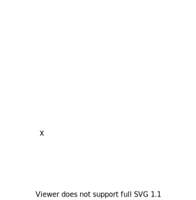
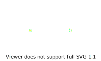
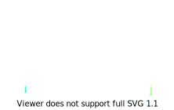
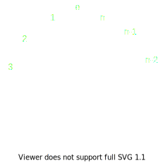

- [Задания 1-20](#задания-1-20)
  - [1. Постройте граф с $n$ вершинами, $m$ ребрами и $k$ компонентами связности. Здесь и далее "постройте граф с $n$ вершинами, ..." означает, что вы должны рассказать способ для любого $n$ построить искомый граф, либо рассказать, для каких $n$ такой граф существует и указать способ его построить, а для остальных $n$ доказать, что такого графа не существует. Аналогично следует поступить с другими параметрами, указанными в условии задачи.](#1-постройте-граф-с-n-вершинами-m-ребрами-и-k-компонентами-связности-здесь-и-далее-постройте-граф-с-n-вершинами--означает-что-вы-должны-рассказать-способ-для-любого-n-построить-искомый-граф-либо-рассказать-для-каких-n-такой-граф-существует-и-указать-способ-его-построить-а-для-остальных-n-доказать-что-такого-графа-не-существует-аналогично-следует-поступить-с-другими-параметрами-указанными-в-условии-задачи)
  - [2. Обозначим как $N(u)$ множество соседей вершины $u$. Постройте граф с $n$ вершинами, в котором множества $N(u)$ совпадают для всех вершин $u$.](#2-обозначим-как-nu-множество-соседей-вершины-u-постройте-граф-с-n-вершинами-в-котором-множества-nu-совпадают-для-всех-вершин-u)
  - [3. Обозначим как $N[u]$ множество, содержащее вершину $u$, а также соседей вершины $u$. Постройте граф с $n$ вершинами, в котором множества $N[u]$ совпадают для всех вершин $u$.](#3-обозначим-как-nu-множество-содержащее-вершину-u-а-также-соседей-вершины-u-постройте-граф-с-n-вершинами-в-котором-множества-nu-совпадают-для-всех-вершин-u)
  - [4. Постройте граф с $n$ вершинами, где каждая вершина имеет степень $d$.](#4-постройте-граф-с-n-вершинами-где-каждая-вершина-имеет-степень-d)
    - [Доказательство невозможности](#доказательство-невозможности)
    - [Построение](#построение)
  - [5. Докажите, что любой граф, содержащий хотя бы две вершины, имеет две вершины одинаковой степени.](#5-докажите-что-любой-граф-содержащий-хотя-бы-две-вершины-имеет-две-вершины-одинаковой-степени)
  - [6. Обозначим как $\delta(G)$ минимальную степень вершины в графе, как $\Delta(G)$ - максимальную степень вершины в графе. Постройте граф с $n$ вершинами, в котором $\delta(G) + \Delta(G) > n$.](#6-обозначим-как-deltag-минимальную-степень-вершины-в-графе-как-deltag---максимальную-степень-вершины-в-графе-постройте-граф-с-n-вершинами-в-котором-deltag--deltag--n)
  - [7. Докажите, что если в графе с $n$ вершинами $\delta(G) > (n - 1) / 2$, то он связен.](#7-докажите-что-если-в-графе-с-n-вершинами-deltag--n---1--2-то-он-связен)
  - [8. Докажите, что для любого графа $G$ можно записать в каждой вершине $u$ такое число $d(u)$, что числа $d(u)$ и $d(v)$ имеют общий делитель, отличный от 1, тогда и только тогда, когда в графе $G$ есть ребро $uv$.](#8-докажите-что-для-любого-графа-g-можно-записать-в-каждой-вершине-u-такое-число-du-что-числа-du-и-dv-имеют-общий-делитель-отличный-от-1-тогда-и-только-тогда-когда-в-графе-g-есть-ребро-uv)
  - [9. Граф называется кубическим, если степень всех вершин равна 3. Три вершины графа образуют треугольник, если они попарно соединены ребром. Постройте кубический граф с $n$ вершинами, не содержащий треугольников.](#9-граф-называется-кубическим-если-степень-всех-вершин-равна-3-три-вершины-графа-образуют-треугольник-если-они-попарно-соединены-ребром-постройте-кубический-граф-с-n-вершинами-не-содержащий-треугольников)
  - [10. Граф называется самодополнительным, если он изоморфен своему дополнению. Приведите примеры самодополнительных графов с 4 и 5 вершинами. Докажите, что если граф является самодополнительным, то он содержит либо $4n$ либо $4n+1$ вершину для некоторого целого положительного $n$.](#10-граф-называется-самодополнительным-если-он-изоморфен-своему-дополнению-приведите-примеры-самодополнительных-графов-с-4-и-5-вершинами-докажите-что-если-граф-является-самодополнительным-то-он-содержит-либо-4n-либо-4n1-вершину-для-некоторого-целого-положительного-n)
  - [11. Докажите, что для любого целого положительного $n$ существует самодополнительный граф, содержащий $4n$ вершин, а также самодополнительный граф, содержащий $4n+1$ вершину.](#11-докажите-что-для-любого-целого-положительного-n-существует-самодополнительный-граф-содержащий-4n-вершин-а-также-самодополнительный-граф-содержащий-4n1-вершину)
  - [12. Докажите, что граф связен тогда и только тогда когда для любого разбиения его множества вершин $V$ на два непустых непересекающихся множества $X$ и $Y$ существует ребро, соединяющее эти множества.](#12-докажите-что-граф-связен-тогда-и-только-тогда-когда-для-любого-разбиения-его-множества-вершин-v-на-два-непустых-непересекающихся-множества-x-и-y-существует-ребро-соединяющее-эти-множества)
    - [$\Rightarrow$](#rightarrow)
    - [$\Leftarrow$](#leftarrow)
  - [13. Докажите, что в связном графе любые два самых длинных простых пути имеют общую вершину.](#13-докажите-что-в-связном-графе-любые-два-самых-длинных-простых-пути-имеют-общую-вершину)
  - [14. Докажите или опровергните, что в связном графе все простые пути, имеющие максимальную возможную длину в этом графе, имеют общую вершину.](#14-докажите-или-опровергните-что-в-связном-графе-все-простые-пути-имеющие-максимальную-возможную-длину-в-этом-графе-имеют-общую-вершину)
  - [15. Докажите, что либо граф $G$, либо его дополнение $\overline{G}$ связен.](#15-докажите-что-либо-граф-g-либо-его-дополнение-overlineg-связен)
  - [16. Будем говорить, что $G$ связан короткими путями, если между любыми двумя вершинами в $G$ есть путь длины не более 3. Докажите, что либо $G$, либо $\overline G$ связан короткими путями.](#16-будем-говорить-что-g-связан-короткими-путями-если-между-любыми-двумя-вершинами-в-g-есть-путь-длины-не-более-3-докажите-что-либо-g-либо-overline-g-связан-короткими-путями)
    - [1. $\not\exist u-v$ в $G$](#1-notexist-u-v-в-g)
    - [2. $\exist uv$.](#2-exist-uv)
  - [17. Найдите максимальное число ребер в графе с $n$ вершинами, не содержащем нечётных простых циклов.](#17-найдите-максимальное-число-ребер-в-графе-с-n-вершинами-не-содержащем-нечётных-простых-циклов)
  - [18. Найдите максимальное число ребер в графе с $n$ вершинами, не содержащем чётных простых циклов.](#18-найдите-максимальное-число-ребер-в-графе-с-n-вершинами-не-содержащем-чётных-простых-циклов)
  - [19. Докажите, что граф с $n$ вершинами и $n + 4$ ребрами содержит два простых цикла, не имеющих общих ребер.](#19-докажите-что-граф-с-n-вершинами-и-n--4-ребрами-содержит-два-простых-цикла-не-имеющих-общих-ребер)
    - [Есть цикл длины $\le 4$](#есть-цикл-длины-le-4)
    - [Нет цикла длины $\le 4$](#нет-цикла-длины-le-4)
    - [В вершину цикла](#в-вершину-цикла)
  - [20. Докажите, что наименьшее число вершин в кубическом графе, в котором есть мост, равно 10.](#20-докажите-что-наименьшее-число-вершин-в-кубическом-графе-в-котором-есть-мост-равно-10)
- [Задания 21-38](#задания-21-38)
  - [21. Доказать или опровергнуть, что если ребро $uv$ - мост, то $u$ и $v$ - точки сочленения.](#21-доказать-или-опровергнуть-что-если-ребро-uv---мост-то-u-и-v---точки-сочленения)
  - [22. Доказать или опровергнуть, что если $u$ и $v$ - точки сочленения, то $uv$ - мост.](#22-доказать-или-опровергнуть-что-если-u-и-v---точки-сочленения-то-uv---мост)
  - [23. Рассмотрим отношение на рёбрах - $R$. $ab R cd$, если 1) $ab$ и $cd$ имеют общую вершину; 2) $ab$ и $cd$ лежат на цикле. Доказать, что вершинная двусвязность - это $R^*$.](#23-рассмотрим-отношение-на-рёбрах---r-ab-r-cd-если-1-ab-и-cd-имеют-общую-вершину-2-ab-и-cd-лежат-на-цикле-доказать-что-вершинная-двусвязность---это-r)
    - [$ab$ и $cd$ могут не иметь общего цикла](#ab-и-cd-могут-не-иметь-общего-цикла)
    - [$ab$ и $cd$ лежат на одном цикле, но цикл не вершинно простой](#ab-и-cd-лежат-на-одном-цикле-но-цикл-не-вершинно-простой)
    - [$ab$ и $cd$ лежат на одном простом цикле](#ab-и-cd-лежат-на-одном-простом-цикле)
  - [24. Доказать, что ребро $uv$ - мост тогда и только тогда, когда $uv$ вершинно двусвязно только с самим собой.](#24-доказать-что-ребро-uv---мост-тогда-и-только-тогда-когда-uv-вершинно-двусвязно-только-с-самим-собой)
    - [$\Rightarrow$](#rightarrow-1)
    - [$\Leftarrow$](#leftarrow-1)
  - [25. Каждое дерево является двудольным графом. А какие деревья являются полными двудольными графами?](#25-каждое-дерево-является-двудольным-графом-а-какие-деревья-являются-полными-двудольными-графами)
    - [Высота $0$ или $1$](#высота-0-или-1)
    - [Высота $2$](#высота-2)
    - [Дерево с одной вершиной на высоте $2$, с максимальной высотой $3$.](#дерево-с-одной-вершиной-на-высоте-2-с-максимальной-высотой-3)
    - [Высота $3$; на высоте $2$ больше, чем $1$ вершина](#высота-3-на-высоте-2-больше-чем-1-вершина)
    - [Высота $\ge 4$](#высота-ge-4)
  - [26. Докажите, что любой кубический граф, который содержит точку сочленения, содержит также мост.](#26-докажите-что-любой-кубический-граф-который-содержит-точку-сочленения-содержит-также-мост)
  - [27. Докажите, что если $v$ точка сочленения в $G$, то $v$ не точка сочленения в $\overline G$.](#27-докажите-что-если-v-точка-сочленения-в-g-то-v-не-точка-сочленения-в-overline-g)
  - [28. Докажите, что число помеченных неподвешенных деревьев есть $n^{n-2}$, используя теорему Кирхгофа.](#28-докажите-что-число-помеченных-неподвешенных-деревьев-есть-nn-2-используя-теорему-кирхгофа)
  - [29. Сколько остовных деревьев у полного двудольного графа $K_{n,m}$?](#29-сколько-остовных-деревьев-у-полного-двудольного-графа-k_nm)
  - [30. Какое максимальное количество попарно непересекающихся остовных деревьев может быть в графе с $n$ вершинами?](#30-какое-максимальное-количество-попарно-непересекающихся-остовных-деревьев-может-быть-в-графе-с-n-вершинами)
    - [$n$ нечетно](#n-нечетно)
    - [$n$ четно](#n-четно)
  - [31. Диаметром графа называют максимальное значение кратчайшего пу����и между двумя его вершинами. Пусть связный граф $G$ имеет диаметр $d$. Докажите или опровергните, что у $G$ есть остовное дерево с диаметром $d$.](#31-диаметром-графа-называют-максимальное-значение-кратчайшего-пуи-между-двумя-его-вершинами-пусть-связный-граф-g-имеет-диаметр-d-докажите-или-опровергните-что-у-g-есть-остовное-дерево-с-диаметром-d)
  - [32. Рассмотрим множество остовных деревьев связного графа $G$. Построим граф $S_G$, вершинами которого являются остовные деревья $G$, а две вершины $T_1$ и $T_2$ соединены ребром, если дерево $T_2$ можно получить из $T_1$ удалением одного ребра и добавлением другого. Докажите, что $S_G$ является связным.](#32-рассмотрим-множество-остовных-деревьев-связного-графа-g-построим-граф-s_g-вершинами-которого-являются-остовные-деревья-g-а-две-вершины-t_1-и-t_2-соединены-ребром-если-дерево-t_2-можно-получить-из-t_1-удалением-одного-ребра-и-добавлением-другого-докажите-что-s_g-является-связным)
  - [33. Докажите, что две вершины $T_1$ и $T_2$ в $S_G$ соединены ребром тогда и только тогда, когда их объединение содержит ровно один простой цикл.](#33-докажите-что-две-вершины-t_1-и-t_2-в-s_g-соединены-ребром-тогда-и-только-тогда-когда-их-объединение-содержит-ровно-один-простой-цикл)
    - [$\Leftarrow$](#leftarrow-2)
    - [$\Rightarrow$](#rightarrow-2)
  - [34. Пусть связный граф $G$ содержит $n$ вершин, докажите, что диаметр $S_G$ не превышает $n - 1$.](#34-пусть-связный-граф-g-содержит-n-вершин-докажите-что-диаметр-s_g-не-превышает-n---1)
  - [35. Приведите пример связного графа $G$, содержащего $n$ вершин, для которого граф $S_G$ имеет диаметр $n - 1$.](#35-приведите-пример-связного-графа-g-содержащего-n-вершин-для-которого-граф-s_g-имеет-диаметр-n---1)
  - [36. Докажите, что для любого $1 \le k \le n - 1$ существует связный граф $G$, содержащий $n$ вершин, такой что диаметр $S_G$ равен $n - k$.](#36-докажите-что-для-любого-1-le-k-le-n---1-существует-связный-граф-g-содержащий-n-вершин-такой-что-диаметр-s_g-равен-n---k)
  - [37. Докажите, что если в связном графе есть реберно простой цикл длины $k$, то у графа есть не менее $k$ остовных деревьев.](#37-докажите-что-если-в-связном-графе-есть-реберно-простой-цикл-длины-k-то-у-графа-есть-не-менее-k-остовных-деревьев)
  - [38. Обобщение формулы Кэли. Дан лес, компоненты связности которого имеют размеры $c_1, c_2, \ldots, c_k$. Докажите, что число способов добавить ребра, чтобы получилось дерево, равно $c_1c_2\ldots c_k(c_1+c_2+\ldots+c_k)^{k-2}$.](#38-обобщение-формулы-кэли-дан-лес-компоненты-связности-которого-имеют-размеры-c_1-c_2-ldots-c_k-докажите-что-число-способов-добавить-ребра-чтобы-получилось-дерево-равно-c_1c_2ldots-c_kc_1c_2ldotsc_kk-2)
- [Задания 39-56](#задания-39-56)
  - [39. Граф называется произвольно вычерчиваемым из вершины $u$, если следующая процедура всегда приводит к эйлеровому циклу: начиная с вершины $u$, переходим каждый раз по любому исходящему из текущей вершины ребру, по которому ранее не проходили. Докажите, что эйлеров граф является произвольно вычерчиваемым из $u$, если любой его простой цикл содержит $u$.](#39-граф-называется-произвольно-вычерчиваемым-из-вершины-u-если-следующая-процедура-всегда-приводит-к-эйлеровому-циклу-начиная-с-вершины-u-переходим-каждый-раз-по-любому-исходящему-из-текущей-вершины-ребру-по-которому-ранее-не-проходили-докажите-что-эйлеров-граф-является-произвольно-вычерчиваемым-из-u-если-любой-его-простой-цикл-содержит-u)
    - [1. $w \not = v$](#1-w-not--v)
    - [2. $w = v$](#2-w--v)
    - [2.1 В $\overline G$ нет рёбер](#21-в-overline-g-нет-рёбер)
    - [2.2 В $\overline G$ есть рёбра](#22-в-overline-g-есть-рёбра)
  - [40. Докажите, что если граф $G$ является произвольно вычерчиваемым из $u$, то $u$ имеет максимальную степень в $G$.](#40-докажите-что-если-граф-g-является-произвольно-вычерчиваемым-из-u-то-u-имеет-максимальную-степень-в-g)
  - [41. Докажите, что если граф $G$ является произвольно вычерчиваемым из $u$, то либо $u$ - единственная точка сочленения в $G$, либо в $G$ нет точек сочленения.](#41-докажите-что-если-граф-g-является-произвольно-вычерчиваемым-из-u-то-либо-u---единственная-точка-сочленения-в-g-либо-в-g-нет-точек-сочленения)
  - [42. Порожденным (также индуцированным) подграфом называется подграф, полученный удалением некоторого множества вершин и всех инцидентных ребер. Докажите или опровергните, что если $G$ содержит порожденный тета-подграф (две вершины, соединенные тремя путями произвольной длины), то $G$ не гамильтонов.](#42-порожденным-также-индуцированным-подграфом-называется-подграф-полученный-удалением-некоторого-множества-вершин-и-всех-инцидентных-ребер-докажите-или-опровергните-что-если-g-содержит-порожденный-тета-подграф-две-вершины-соединенные-тремя-путями-произвольной-длины-то-g-не-гамильтонов)
  - [43. Обозначим как $G^3$ граф, в котором две вершины соединены, если они соединены в $G$ путем длины не более 3. Докажите, что если $G$ связен, то $G^3$ гамильтонов.](#43-обозначим-как-g3-граф-в-котором-две-вершины-соединены-если-они-соединены-в-g-путем-длины-не-более-3-докажите-что-если-g-связен-то-g3-гамильтонов)
    - [**База**](#база)
    - [**Переход**](#переход)
  - [44. Граф называется произвольно гамильтоновым, если следующая процедура всегда приводит к гамильтонову циклу: начиная с произвольной вершины $u$, переходим каждый раз по любому исходящему из текущей вершины ребру, другой конец которого мы ранее не посещали, либо обратно в вершину $u$, если непосещенных соседей нет. Опишите все произвольно гамильтоновы графы.](#44-граф-называется-произвольно-гамильтоновым-если-следующая-процедура-всегда-приводит-к-гамильтонову-циклу-начиная-с-произвольной-вершины-u-переходим-каждый-раз-по-любому-исходящему-из-текущей-вершины-ребру-другой-конец-которого-мы-ранее-не-посещали-либо-обратно-в-вершину-u-если-непосещенных-соседей-нет-опишите-все-произвольно-гамильтоновы-графы)
    - [$\Leftarrow$](#leftarrow-3)
    - [$\Rightarrow$](#rightarrow-3)
    - [0. $l \le 2$](#0-l-le-2)
    - [1. $l=3 \Leftrightarrow \exists v_{i}v_{i+2}$](#1-l3-leftrightarrow-exists-v_iv_i2)
    - [2. $l=4$](#2-l4)
    - [2.1 $n = 2k+1$](#21-n--2k1)
    - [2.2 $n = 2k$](#22-n--2k)
    - [3. $l > 4 \Leftrightarrow \exists v_1v_l$](#3-l--4-leftrightarrow-exists-v_1v_l)
  - [45. Будем называть последовательность $(d_1, \ldots, d_n)$ степенной последовательностью, если существует граф с такими степенями вершин. Приведите критерий, проверяемый за полиномиальное время, что заданная последовательность является степенной.](#45-будем-называть-последовательность-d_1-ldots-d_n-степенной-последовательностью-если-существует-граф-с-такими-степенями-вершин-приведите-критерий-проверяемый-за-полиномиальное-время-что-заданная-последовательность-является-степенной)
  - [46. Теорема "Антихватала". Докажите, что если для степенной последовательности не выполнено условие теоремы Хватала, то найдется граф с такой степенной последовательностью, не содержащий гамильтонова цикла.](#46-теорема-антихватала-докажите-что-если-для-степенной-последовательности-не-выполнено-условие-теоремы-хватала-то-найдется-граф-с-такой-степенной-последовательностью-не-содержащий-гамильтонова-цикла)
  - [47. Докажите, что если сумма степеней любых двух несмежных вершин графа $G$ не меньше $n+1$, то любые две различные вершины $G$ можно соединить гамильтоновым путем.](#47-докажите-что-если-сумма-степеней-любых-двух-несмежных-вершин-графа-g-не-меньше-n1-то-любые-две-различные-вершины-g-можно-соединить-гамильтоновым-путем)
    - [План](#план)
    - [Теорема Бонди-Хватала](#теорема-бонди-хватала)
      - [Доказательство](#доказательство)
    - [Применение теоремы](#применение-теоремы)
  - [48. Реберным графом для графа $G$ называется граф $G_E$, множество вершин которого совпадает с множеством ребер исходного графа, два ребра $e$ и $f$ соединены ребром в реберном графе, если у них есть общая инцидентная вершина. Докажите или опровергните, что если $G$ является эйлеровым, то реберный граф является гамильтоновым.](#48-реберным-графом-для-графа-g-называется-граф-g_e-множество-вершин-которого-совпадает-с-множеством-ребер-исходного-графа-два-ребра-e-и-f-соединены-ребром-в-реберном-графе-если-у-них-есть-общая-инцидентная-вершина-докажите-или-опровергните-что-если-g-является-эйлеровым-то-реберный-граф-является-гамильтоновым)
  - [49. Докажите или опровергните, что если $G_E$ является гамильтоновым, то граф $G$ является эйлеровым.](#49-докажите-или-опровергните-что-если-g_e-является-гамильтоновым-то-граф-g-является-эйлеровым)
  - [50. В каком случае ребра реберного графа можно разбить на полные подграфы таким образом, чтобы каждая вершина принадлежала в точности двум из подграфов?](#50-в-каком-случае-ребра-реберного-графа-можно-разбить-на-полные-подграфы-таким-образом-чтобы-каждая-вершина-принадлежала-в-точности-двум-из-подграфов)
  - [51. Выразите число треугольников в реберном графе $G_E$ через число треугольников графа $G$ и набор его степеней.](#51-выразите-число-треугольников-в-реберном-графе-g_e-через-число-треугольников-графа-g-и-набор-его-степеней)
  - [52. В каком случае связный граф $G$ имеет регулярный реберный граф?](#52-в-каком-случае-связный-граф-g-имеет-регулярный-реберный-граф)
    - [**1 различная степень**](#1-различная-степень)
    - [**2 различных степени**](#2-различных-степени)
  - [53. Постройте связный граф $G$ с $n \ge 4$ вершинами, для которого граф $G_E$ не эйлеров, а граф $(G_E)_E$ эйлеров.](#53-постройте-связный-граф-g-с-n-ge-4-вершинами-для-которого-граф-g_e-не-эйлеров-а-граф-g_e_e-эйлеров)
  - [54. Докажите, что если $G$ содержит $n \ge 5$ вершин, то если $(G_E)_E$ эйлеров, то и $((G_E)_E)_E$ эйлеров.](#54-докажите-что-если-g-содержит-n-ge-5-вершин-то-если-g_e_e-эйлеров-то-и-g_e_e_e-эйлеров)
  - [55. Постройте минимальный по числу ребер граф, в реберном графе которого нет гамильтонова цикла.](#55-постройте-минимальный-по-числу-ребер-граф-в-реберном-графе-которого-нет-гамильтонова-цикла)
  - [56. Докажите, что $G_E$ гамильтонов тогда и только тогда, когда граф $G$ содержит циклический реберно простой путь, содержащий для каждого ребра графа $G$ хотя бы одну вершину, ему инцидентную.](#56-докажите-что-g_e-гамильтонов-тогда-и-только-тогда-когда-граф-g-содержит-циклический-реберно-простой-путь-содержащий-для-каждого-ребра-графа-g-хотя-бы-одну-вершину-ему-инцидентную)
    - [$\Leftarrow$](#leftarrow-4)
    - [$\Rightarrow$](#rightarrow-4)

## Задания 1-20

### 1. Постройте граф с $n$ вершинами, $m$ ребрами и $k$ компонентами связности. Здесь и далее "постройте граф с $n$ вершинами, ..." означает, что вы должны рассказать способ для любого $n$ построить искомый граф, либо рассказать, для каких $n$ такой граф существует и указать способ его построить, а для остальных $n$ доказать, что такого графа не существует. Аналогично следует поступить с другими параметрами, указанными в условии задачи.

Если $k>n$ или $k=0$, то очевидно невозможно.

Если разрешены кратные ребра, то очевидно $m$ не ограничено сверху, т.к. можно
навешивать произвольное число ребер, не меняя число компонент.

Если кратные ребра запрещены, то $m$ наибольший, когда все компоненты полные.
$$m_{max}=\sum_i \frac{a_i(a_i-1)}{2}$$
$a_i$ - число вершин в $i$-той компоненте.

Очевидно $m_{max}$ максимальна, если $a_i=\begin{cases} n-k+1 & i=1 \\
1 & \text{иначе}\end{cases}$

$$m_{max} = \frac{(n-k+1)(n-k)}{2}$$

$$m_{min} = \sum_i (a_i-1) = n - k$$

Процесс построения: Возьмём $n$ вершин, проведем $m$ ребер и будем их
переставлять, пока не получим $k$ компонент.

Более адекватный: Возьмём $k-1$ вершин, они не будут связаны ни с какими
вершинами. Остальные $n-k+1$ вершин соединим одним путём, получается $n-k$
ребер, т.е. $m_{min}$. Кроме того, мы получили $k$ компонент связности. Теперь
дополнением до полной компоненты можно добрать дополнительных ребер вплоть до
$m_{max}$.

### 2. Обозначим как $N(u)$ множество соседей вершины $u$. Постройте граф с $n$ вершинами, в котором множества $N(u)$ совпадают для всех вершин $u$.

Пустой граф.

### 3. Обозначим как $N[u]$ множество, содержащее вершину $u$, а также соседей вершины $u$. Постройте граф с $n$ вершинами, в котором множества $N[u]$ совпадают для всех вершин $u$.

Полный граф.

### 4. Постройте граф с $n$ вершинами, где каждая вершина имеет степень $d$.

Такой граф можно построить тогда и только тогда, когда $n \ge d + 1$ и
$nd\equiv0\mod 2$

#### Доказательство невозможности

1. $nd\equiv0\mod2$

Т.к. у каждой вершины степень $d$, то всего концов ребер $nd$, поэтому ребер
$nd/2 \Rightarrow nd\equiv0\mod2$

2. $n \ge d + 1$

Т.к. $\deg x=d$, вершин хотя бы $d+1$

#### Построение

1. $n\equiv0\mod2$

$m := n/2$

Поделим множество вершин $V$ на два непересекающихся множества $\{a_i\}_{i=1}^m$
и $\{b_i\}_{i=1}^m$. Соединим $a_i$ с $b_j$, если $i-j\le d\mod m$. Тогда каждый
$a_i$ соединен ровно с $d$ вершинами

2. $n\not\equiv0\mod2 \Rightarrow d\equiv0\mod2$

Занумеруем вершины и объединим ближайшие на $d/2$ в каждую сторону:

$V=\{a_i\}_{i=1}^n$

$a_i - a_j \Leftrightarrow |i-j| \le d/2 \mod n$ 

### 5. Докажите, что любой граф, содержащий хотя бы две вершины, имеет две вершины одинаковой степени.

От противного: пусть в графе с $n\ge2$ вершинами все вершины имеют различную
степень. Тогда степени образуют строго возрастающий ряд. При этом максимальная
возможная степень вершины в графе $n-1$ _(очевидно, больше не с чем
соединяться)_, поэтому этот ряд это $0 \ldots n-1$ без пропусков _(иначе
недостаточно вершин)_. Но если $\deg x=n-1$, то она соединена со всеми
вершинами, но $\exists y : \deg y=0$ - противоречие.

### 6. Обозначим как $\delta(G)$ минимальную степень вершины в графе, как $\Delta(G)$ - максимальную степень вершины в графе. Постройте граф с $n$ вершинами, в котором $\delta(G) + \Delta(G) > n$.

Полный граф, т.к. в нём $\delta(G) = \Delta(G) = n-1$.

### 7. Докажите, что если в графе с $n$ вершинами $\delta(G) > (n - 1) / 2$, то он связен.

Предположен, что граф не связен. Рассмотрим вершину $x$, которая не связана с
вершиной $y$. Пусть множество вершин, смежных $x$ называется $X$, аналогично
$Y$. $$|X| > \frac{n-1}{2} \quad |Y| > \frac{n-1}{2}$$ $$|X| + |Y| > n-1$$ $$|X|
+ |Y| = n$$

$X \cap Y = \text{\O}$, т.к. $x$ и $y$ не связаны, поэтому $X+Y=V$, но
$x,y\not\in X$ и $x, y\not\in Y$ - противоречие.

### 8. Докажите, что для любого графа $G$ можно записать в каждой вершине $u$ такое число $d(u)$, что числа $d(u)$ и $d(v)$ имеют общий делитель, отличный от 1, тогда и только тогда, когда в графе $G$ есть ребро $uv$.

Упорядочим _(произвольно)_ все вершины графа и сопоставим каждой из них простое
число: $u \leftrightarrow f(u)$. $$d(u) = f(u)\cdot\prod_{v : u-v} f(v)$$

### 9. Граф называется кубическим, если степень всех вершин равна 3. Три вершины графа образуют треугольник, если они попарно соединены ребром. Постройте кубический граф с $n$ вершинами, не содержащий треугольников.

Из задачи 4 $n \ge 4$ и $n\equiv0\mod2$

Для $n=4$ единственный кубический граф - полный, в нем есть треугольники.

$\sphericalangle n>4$


Начало построения. Степень зеленых вершин - 3, красных - 2.


Добавление новых вершин.


То же самое, но много итераций.

Таким образом, всегда поддерживается инвариант - четыре вершины степени 2,
остальные - степени 3. Осталось показать, как на любой итерации завершить
построение.


6 вершин - особый случай.


Общий случай

### 10. Граф называется самодополнительным, если он изоморфен своему дополнению. Приведите примеры самодополнительных графов с 4 и 5 вершинами. Докажите, что если граф является самодополнительным, то он содержит либо $4n$ либо $4n+1$ вершину для некоторого целого положительного $n$.

Для 4 вершин:

 &nbsp;&nbsp;&nbsp;&nbsp; 

Для 5 вершин:

 &nbsp;&nbsp;&nbsp;&nbsp; 

$$|E| + |\overline E| = \text{число ребер в полном графе} = \frac{|V|(|V| -
1)}{2}$$ $$\text{Граф самодополнителен} \Leftrightarrow (V, E) = (V, \overline
E) \Leftrightarrow E = \overline E \Rightarrow |E| = |\overline E|$$ $$4|E| =
|V|(|V|-1) \Rightarrow |V|(|V|-1) \equiv0\mod4 \Rightarrow \begin{cases} |V|
\equiv 0 \mod 4 \\
    |V| \equiv 1 \mod 4 \end{cases}$$

### 11. Докажите, что для любого целого положительного $n$ существует самодополнительный граф, содержащий $4n$ вершин, а также самодополнительный граф, содержащий $4n+1$ вершину.

Докажем по индукции. База - задание 10.

Пусть существуют самодополнительные графы размером $4n$ и $4n+1$. Докажем, что
есть самодополнительный граф размером $4n+4$ и $4n+5$. Это эквивалентно
построению из графа с $n$ вершинами граф с $n+4$ вершинами.

Добавим 4 вершины, соединенных так:


Соединим 1 и 2 со всеми вершинами исходного графа.

В дополнении графа новые вершины связаны так:


Изоморфность очевидна.

### 12. Докажите, что граф связен тогда и только тогда когда для любого разбиения его множества вершин $V$ на два непустых непересекающихся множества $X$ и $Y$ существует ребро, соединяющее эти множества.

#### $\Rightarrow$

$\sphericalangle x\in X, y\in Y$. Т.к. граф связен, $\exists\ x\rightsquigarrow
y$. На этом пути должно быть хотя бы одно ребро из вершины $\in X$ в вершину
$\in Y$, но такого не существует - противоречие.

#### $\Leftarrow$

Предположим, что $x \not\rightsquigarrow y$.

Будем поддерживать компоненту связности $X$, в которой лежит $x$.

```c
X = {x}
while y not in X:
    (a, b) = ребро между X и V-X
    X += b
```

Такое ребро всегда есть, поэтому цикл будет продолжаться, пока $y$ не окажется в
$X \Rightarrow$ $y$ связен с $x$.

### 13. Докажите, что в связном графе любые два самых длинных простых пути имеют общую вершину.

Построим по двум простым путям более длинный простой путь.

Возьмём произвольную вершину $x$ из первого пути и произвольную вершину $y$ из
второго. В силу связности $\exists\ x\rightsquigarrow y$. Какой-то участок этого
пути начинается в вершине $a$ из первого пути и кончается в вершине $b$ второго.
Тогда можно объединить большие части исходных путей этим путем:


$$\text{Итоговая длина} \ge \bigg\lceil \frac{n+1}{2} \bigg\rceil + \bigg\lceil
\frac{m+1}{2} \bigg\rceil \ge \frac{n+m}{2} + 1 > \min(n, m)$$

### 14. Докажите или опровергните, что в связном графе все простые пути, имеющие максимальную возможную длину в этом графе, имеют общую вершину.

См. 13

### 15. Докажите, что либо граф $G$, либо его дополнение $\overline{G}$ связен.

Докажем, что дополнение несвязного графа связно.

$\sphericalangle x, y\in V$

1. $x$ и $y$ лежат в одной компоненте связности. $\sphericalangle z$, лежащий в
   другой КС. ($\exists z$ в силу несвязности графа).

В $\overline G$ $x-y-z \Rightarrow x$ и $y$ связны.

2. $x$ и $y$ лежат в разных КС. Тогда в $\overline G$ $x-y$.

### 16. Будем говорить, что $G$ связан короткими путями, если между любыми двумя вершинами в $G$ есть путь длины не более 3. Докажите, что либо $G$, либо $\overline G$ связан короткими путями.

Докажем, что для не связанного короткими путями графа $G$ $\overline G$ связан
короткими путями.

$\sphericalangle u,v \in G$

#### 1. $\not\exist u-v$ в $G$

Тогда в $\overline G$ $\exists u-v \Rightarrow u,v$ связаны коротким путем.

#### 2. $\exist uv$.

Тогда $\sphericalangle a,b$, не связанные коротким путем в $G \Rightarrow
\exists a-b$ в $\overline G$. _Существование очевидно из не связности короткими
путями._

Хотя бы одна из вершин $u,v$ не связана ни с одной из них в $G$ _(иначе $a,b$
связаны короткими путями в $G$)_.


Других случаев нет _(с точностью до изоморфизма)_, в обоих случаях $\exist$
короткий путь $u\to v$

### 17. Найдите максимальное число ребер в графе с $n$ вершинами, не содержащем нечётных простых циклов.

Граф без нечетных циклов $\Leftrightarrow$ двудольный граф. Полный двудольный
  граф имеет $km$ ребер, где $k$ - размер первой группы; $m$ - второй. Для
  фиксированного $n=k+m$ число ребер максимально при $k=\lceil n/2\rceil,
  m=\lfloor n/2\rfloor \Rightarrow$ ответ $\lceil n/2\rceil\lfloor n/2\rfloor =
  \begin{cases} n^2/4 & n\equiv0\mod 2 \\
  n(n+1)/4 & n\not\equiv0\mod 2 \end{cases}$

### 18. Найдите максимальное число ребер в графе с $n$ вершинами, не содержащем чётных простых циклов.

Заметим, что нечетные циклы не могут иметь общих ребер, т.к. тогда образуется
четный цикл:


$\begin{cases} k+m \equiv1\mod2 \\
  k+n \equiv1\mod2 \\
\end{cases} \Rightarrow n+m+2k\equiv0\mod2\Rightarrow n+m\equiv0\mod2$

Очевидно образовывать цикл длины $>3$ неэффективно, т.к. его можно заменить на
несколько циклов меньшей длины:


Итого необходимо строить циклы длины 3 без общих ребер. Очевидно оптимальный
способ это сделать - иметь множество треугольников, которые имеют одну общую
вершину:


Первая вершина все стартует ($-1$), потом каждые 2 вершины добавляют один
треугольник (3 ребра). 
 
Ответ: $\lfloor 3(n-1)/2 \rfloor$

### 19. Докажите, что граф с $n$ вершинами и $n + 4$ ребрами содержит два простых цикла, не имеющих общих ребер.

#### Есть цикл длины $\le 4$

Если есть цикл длины $\le 4$, то можно удалить ребра этого цикла, останется $\ge
n$ ребер, т.е. останется еще хотя бы один цикл $\Rightarrow$ есть два простых
_(реберно)_ непересекающихся цикла.

#### Нет цикла длины $\le 4$

Т.к. ребер больше, чем вершин, у некоторых вершин степень $>1$.

Упрощения, сохраняющие число простых циклов, не имеющих общих ребер:
<!-- 1. Вершины степени 0 можно удалять. -->
1. Вершины степени 1 не участвуют в циклах, их можно удалять вместе с ребрами,
   которые в них входят.
2. Вершины степени 2 можно удалять следующим образом:


В упрощении 2 число ребер уменьшается на 1 и число вершин на 1, поэтому $|V| =
|E| + 4$ сохраняется.

Применяя эти упрощения, остаются вершины степени 3 или больше.

Очевидно $|E|\ge 3/2 n$ _(равенство достигается при $\forall x\ \ d(x)=3$)_

$n+4 \ge 3/2 n$

$n \le 8$

Найдем минимальное число вершин, где $\forall x\ \ d(x)\ge 3$ и нет цикла длины
$\le 4$:

<!-- Выберем произвольный $x\in G$ и 3 вершины $a,b,c$, с которыми он соединен _(их может быть больше)_. Кроме ребер $xa, xb, xc$ ребер между этими вершинами быть не может, т.к. иначе образуется цикл длины $<4$. Кроме того, $a,b,c$ каждая соединена хотя бы с двумя _(другими)_ вершинами, итого уже 10 - противоречие. -->

<!--  -->

Выберем цикл длины $> 4$ _(цикл очев. есть, длины $> 4$ по первому утверждению)_


$\forall x \ \ \begin{cases} d(x) = 0 \\
  d(x) \ge 3 \end{cases}$ по построению, поэтому все вершины в цикле имеют
степень $\ge 3$. Очевидно, у вершины $x$ есть хотя бы ещё одно ребро $xa$. Два
случая: оно ведет в вершину цикла или в вершину вне цикла.

#### В вершину цикла

Т.к. любой цикл имеет длину $>4$, происходит следующее:


Но тут уже 10 вершин и это минимальный случай.

Таким образом, у всех вершин ребра идут в вершины вне исходного цикла:



Тут тоже слишком много вершин, но некоторые могут совпадать:


Такое может происходить только в вершинах на реберном расстоянии (в исходном
цикле) 3 или больше.

Если такое произошло один раз, то длина исходного цикла хотя бы 6. Вершин
слишком много

Если два раза, то все еще много

3: тоже. Больше произойти очев не могло.

Для цикла длины $>6$ - все плохо.


<!-- Крайний случай. -->

### 20. Докажите, что наименьшее число вершин в кубическом графе, в котором есть мост, равно 10.

Пусть $ab$ - мост. $a$ и $b$ каждый должны быть соединены с ещё двумя вершинами,
при этом эти вершины лежат в разных КС, если убрать $ab$:



Вершины в левой "КС" должны быть соединены с ещё двумя вершинами.

1. Добавлена одна вершина:


Не работает, поэтому необходимо добавить хотя бы две вершины.


Аналогично справа.


## Задания 21-38

### 21. Доказать или опровергнуть, что если ребро $uv$ - мост, то $u$ и $v$ - точки сочленения.

Нет, контрпример: $a\leftrightarrow b$

### 22. Доказать или опровергнуть, что если $u$ и $v$ - точки сочленения, то $uv$ - мост.

Нет:


$a, b$ - точки сочленения, $a, b, c$ в одной компоненте реберной двусвязности.

### 23. Рассмотрим отношение на рёбрах - $R$. $ab R cd$, если 1) $ab$ и $cd$ имеют общую вершину; 2) $ab$ и $cd$ лежат на цикле. Доказать, что вершинная двусвязность - это $R^*$.

#### $ab$ и $cd$ могут не иметь общего цикла

Контрпример:


#### $ab$ и $cd$ лежат на одном цикле, но цикл не вершинно простой

Тот же контрпример.

#### $ab$ и $cd$ лежат на одном простом цикле

$\sphericalangle ab, cd\in R^*$. $\exists e_1\ldots e_n : e_i^2 = e_{i+1}^1,
e_1^1=a, e_n^2=c$, все ребра лежат на цикле. Они лежат на одинаковом для всех
ребер цикле (очевидно), поэтому кроме $e_1\ldots e_n$ есть последовательность
ребер $f_1\ldots f_m$, которая тоже соединяет вершины $a, c$ и при этом вершинно
не пересекается с $e_1\ldots e_n$:


### 24. Доказать, что ребро $uv$ - мост тогда и только тогда, когда $uv$ вершинно двусвязно только с самим собой.

#### $\Rightarrow$

Любое ребро вершинно двусвязно с собой. Покажем, что мост не двусвязен вершинно
ни с каким другим ребром.

Пусть $uv$ вершинно двусвязно с ребром $ab$. Тогда существуют пути
$u\rightsquigarrow a$ и $v\rightsquigarrow b$, которые вершинно не пересекаются.
По определению моста, если удалить $uv$, то граф перестанет быть связным. Но это
не так, т.к. любой путь вида $\ldots uv \ldots$ можно заменить на $\ldots
u\ldots ab\ldots v\ldots$, а другие пути не были затронуты.

#### $\Leftarrow$

Покажем, что если $uv$ вершинно двусвязно только с самим собой, то $uv$ - мост.

Удалим $uv$. Предположим, что теперь граф все ещё связен, т.е. $uv$ - не мост.
$u$ и $v$ связны, т.е. $\exists$ простой путь $u\rightsquigarrow v$, не
проходящий через $uv$. Рассмотрим ребро $ab$ из этого пути. Есть путь
$u\rightsquigarrow a$ и путь $v\rightsquigarrow b \Rightarrow$ $uv$ и $ab$
вершинно двусвязны, противоречие.

### 25. Каждое дерево является двудольным графом. А какие деревья являются полными двудольными графами?

Деревья высоты $\le 2$ или дерево с одной вершиной на высоте 2, с максимальной
высотой $3$.

#### Высота $0$ или $1$

Очевидно в силу пустоты второго множества вершин

#### Высота $2$

Корень в первом множестве связан со всеми его детьми из второго множества

#### Дерево с одной вершиной на высоте $2$, с максимальной высотой $3$.

$1\to 2, 2\to 3, 2\to 4, \ldots, 2\to n$.

#### Высота $3$; на высоте $2$ больше, чем $1$ вершина

Вершина на высоте $3$ не связана с двумя вершинами на высоте $2$.

#### Высота $\ge 4$

Вершина высоты 4 не связана с корнем, поэтому граф не полный двудольный.

### 26. Докажите, что любой кубический граф, который содержит точку сочленения, содержит также мост.

Рассмотрим точку сочленения $x$, соседи которой $a, b, c$. Если после удаления
$x$ $a, b, c$ связны, то $x$ - не точка сочленения (в любой путь через $x$ можно
обойти $x$ по $a, b, c$). Пусть $a$ и $b$ не связны. Очевидно не может быть
такого, что $\exists a\rightsquigarrow c$ и $\exists b\rightsquigarrow c$, пусть
$\not\exists a\rightsquigarrow c$.

Вернем вершину $x$, но вырежем ребро $ax$. Всё ещё $\not\exists
a\rightsquigarrow c$ и $\not\exists a\rightsquigarrow b$, поэтому получившийся
граф не связен. Таким образом, $ax$ - мост.

### 27. Докажите, что если $v$ точка сочленения в $G$, то $v$ не точка сочленения в $\overline G$.

Пусть в $G$ после удаления $v$ КС $C_1, C_2 \ldots$ Т.к. $C_1$ не связно с
$\bigcup\limits_{i=2}^n C_i$, то в $\overline G$ все вершины из $C_1$ связаны
путями длины 1 со всеми вершинами $\bigcup\limits_{i=2}^n C_i$, то есть
$\overline G$ за вычетом $v$ - полный двудольный граф, поэтому он связен
$\Rightarrow$ $v$ не точка сочленения в $\overline G$. 

### 28. Докажите, что число помеченных неподвешенных деревьев есть $n^{n-2}$, используя теорему Кирхгофа.

Заметим, что число остовных деревьев полного графа c $n$ вершинами есть искомое.
Матрица Кирхгофа для полного графа имеет вид $$a_{ij} = \begin{cases} n-1, & i=j
\\
  -1 & \text{иначе} \end{cases}$$

$$\overline A_{11} = \begin{bmatrix} n-1 & -1 & -1 & \ldots & -1 \\
  -1 & n-1 & -1 & \ldots & -1 \\
  -1 & -1 & n-1 & \ldots & -1 \\
  \vdots & \vdots & \vdots & \ddots & \vdots \\
  -1 & -1 & -1 & \ldots & n-1 \\
\end{bmatrix} = n E_{n-1} - \overbrace{\begin{bmatrix} 1 & 1 & 1 & \ldots & 1 \\
  1 & 1 & 1 & \ldots & 1 \\
  1 & 1 & 1 & \ldots & 1 \\
  \vdots & \vdots & \vdots & \ddots & \vdots \\
  1 & 1 & 1 & \ldots & 1 \\
\end{bmatrix}}^{T}$$
$$\text{rg} T = 1 \Rightarrow \exist D : D^{-1}TD =
\begin{bmatrix} n-1 & 0 & 0 & \ldots & 0 \\
  0 & 0 & 0 & \ldots & 0 \\
  0 & 0 & 0 & \ldots & 0 \\
  \vdots & \vdots & \vdots & \ddots & \vdots \\
  0 & 0 & 0 & \ldots & 0 \\
\end{bmatrix}$$
$$\begin{aligned} \det A & = \det (D^{-1}AD) \\
    & = \det (D^{-1} (n E_{n-1} - T) D) \\
    & = \det (nE_{n-1} - D^{-1}TD) \\
    & = \begin{vmatrix} 1 & 0 & 0 & \ldots & 0 \\
     0 & n & 0 & \ldots & 0 \\
     0 & 0 & n & \ldots & 0 \\
     \vdots & \vdots & \vdots & \ddots & \vdots \\
     0 & 0 & 0 & \ldots & n \\
    \end{vmatrix} \\
    & = n^{n-2} \end{aligned}$$

### 29. Сколько остовных деревьев у полного двудольного графа $K_{n,m}$?

Упорядочим вершины так, что первые $n$ лежат в первом множестве.

$$b_{ij} = \begin{cases} m, & i=j, i\le n \\
  n, & i=j, i > n \\
  0 & i\le n, j\le n \\
  0 & i > n, j > n \\
  -1 & i > n, j \ge n \\
  -1 & i \ge n, j < n \\
\end{cases}$$

$$B = \begin{bmatrix} m E_n & -1_{m \times n} \\
  -1_{n \times m} & n E_m \\
\end{bmatrix}$$ $$c_i := \begin{cases} 1, & i\le n \\
  0, & i > n \end{cases} \quad d_i := \begin{cases} 0, & i\le n \\
  1, & i > n \end{cases}$$ $$B + dc^T = \begin{bmatrix} m E_n & -1_{m \times n}
\\
  0_{n \times m} & n E_m \\
\end{bmatrix}$$ $$|B+dc^T| = m^nn^m$$
[Лемма](https://en.wikipedia.org/wiki/Matrix_determinant_lemma): $|A+uv^T|=|A| +
v^TA^*u$

По Кирхгофу $A^*_{ij}=z$, где $z$ - искомое. Тогда $A^*=z_{n+m\times n+m}=z\cdot
1_{n+m\times n+m}$ $$\begin{aligned} |B+dc^T| & = |B| + d^Tz\cdot 1_{n+m\times
n+m}c \\
    & = 0 + zd^T 1_{n+m\times n+m} c \\
    & = zd^T 1_{n+m}1_{n+m}^T c \\
    & = z(d^T 1_{n+m})(1_{n+m}^T c) \\
    & = z(\sum d_i)(\sum c_i) \\
    & = z n m \\
\end{aligned}$$ $$m^nn^m=z n m$$ $$z = n^{m-1}m^{n-1}$$

### 30. Какое максимальное количество попарно непересекающихся остовных деревьев может быть в графе с $n$ вершинами?

Очевидно можно рассматривать только полные графы. В полном графе
$\cfrac{n(n-1)}{2}$ ребер, при этом для каждого остовного дерева требуется $n-1$
ребер, поэтому максимальное возможное число - $\lfloor n/2\rfloor$.

#### $n$ нечетно

В полном графе с нечетным $n$ есть $(n-1)/2$ реберно непересекающихся
гамильтоновых циклов. Покажем это.

Расположим все вершины равномерно по кругу, кроме первой. Будем вращать
следующую фигуру:


На этой фигуре очевидно гамильтонов цикл. При вращении на $\cfrac{2\pi}{n-1}$
градусов никакие предыдущие ребра не пересекутся, очев из геометрии: $\forall
i\in[0, n/2]$ есть два ребра, которые замыкают дугу с $i$ вершинами, они
противоположны друг другу $\Rightarrow$ только при повороте на $\pi$ получится
та же фигура. Поворот на $\pi$ будет спустя $\cfrac{n-1}{2}$ итераций. $\square$

В каждом из гамильтоновых циклов можно произвольно убрать одно ребро и получить
остов.

#### $n$ четно

Рассмотрим граф с $n-1$ вершинами $v_1\ldots v_{n-1}$, построим в нем $(n-2)/2$
остовных дерева $T_1\ldots T_{(n-2)/2}$, при этом будем вырезать не произвольные
ребра, а ребра $t_i\leftrightarrow t_{i + (n-2)/2}$ (для $i$-го дерева).
Построим деревья $\overline T_i = T_i\cup v_{i}\leftrightarrow v_n$. Ребра
$v_i\leftrightarrow v_n$, где $i \ge (n-2)/2$ ещё не использованы, как и ребра
$t_i\leftrightarrow t_{i + (n-2)/2}$. Тогда построим последнее дерево с этими
ребрами. Оно содержит $(n-2)/2+1+(n-2)/2=n-1$ ребер и очевидно не имеет циклов
$\Rightarrow$ это тоже остов. Итого $(n-2)/2 + 1$ дерево, т.е. $n/2$.

### 31. Диаметром графа называют максимальное значение кратчайшего пу����и между двумя его вершинами. Пусть связный граф $G$ имеет диаметр $d$. Докажите или опровергните, что у $G$ есть остовное дерево с диаметром $d$.

Контрпример:
```
+-+
| |
+-+
```
$d=2$

Все остовные деревья изоморфны следующему:
```
+-+
|
+-+
```

$d=3$

### 32. Рассмотрим множество остовных деревьев связного графа $G$. Построим граф $S_G$, вершинами которого являются остовные деревья $G$, а две вершины $T_1$ и $T_2$ соединены ребром, если дерево $T_2$ можно получить из $T_1$ удалением одного ребра и добавлением другого. Докажите, что $S_G$ является связным.

Покажем, что $T_2$ можно получить из $T_1$ последовательностью операций
$f=$"-ребро, +ребро", и при этом каждый промежуточный результат есть остовное
дерево $G$.

Получим дерево глубины 2 следующим образом: для каждого листа $u$ с родителем
$v$ вырежем ребро $uv$ и добавим ребро $xu$, где $x$ - корень. Очевидно во время
этого процесса связность не нарушается, циклы не образуются.

Переберем вершины из $T_2$ глубины $3$ и подвесим их к родителям согласно $T_2$.
Аналогично для глубины $4$ и т.д.

### 33. Докажите, что две вершины $T_1$ и $T_2$ в $S_G$ соединены ребром тогда и только тогда, когда их объединение содержит ровно один простой цикл.

#### $\Leftarrow$

Очевидно в объединении $n$ ребер, т.к. иначе простых циклов будет больше.

$(T_1\cup T_2)\setminus T_2 = \{e_1\}, (T_1\cup T_2)\setminus T_1 = \{e_2\}$.
$e_1\in T_1, e_2\in T_2$. $(T_1\cup T_2)\setminus\{e_1\} = T_2, (T_1\cup
T_2)\setminus\{e_2\} = T_1$.

#### $\Rightarrow$

Очевидно в объединении $n$ ребер, т.к. иначе простых циклов будет больше.

Аналогичное суждение.

### 34. Пусть связный граф $G$ содержит $n$ вершин, докажите, что диаметр $S_G$ не превышает $n - 1$.

Подвесим деревья за некоторую вершину. Сделаем из произвольного остова $T_1$
произвольный остов $T_2$ за $\le n-1$ шагов. Переберем все вершины в $T_1$,
кроме корня, и подвесим каждую к соответствующему родителю в $T_2$. Очевидно
нельзя подвешиваться к вершине, которая является потомком подвешиваемой вершины,
поэтому будем перебирать эти вершины в порядке топсорта снизу вверх. Тогда
циклов не будет.

### 35. Приведите пример связного графа $G$, содержащего $n$ вершин, для которого граф $S_G$ имеет диаметр $n - 1$. 

$\sphericalangle K_4$
```
+-+
|x|
+-+
```

$T_1$ - бамбук $1234$, $T_2$ - бамбук $1324$

Аналогично можно для произвольного $n$: ответом будет полный граф, в нем можно
взять остовное дерево бамбук и тот же бамбук, но каждая вторая вершина
переставлена.

### 36. Докажите, что для любого $1 \le k \le n - 1$ существует связный граф $G$, содержащий $n$ вершин, такой что диаметр $S_G$ равен $n - k$.

Граф с $n-k$ вершинами как полный граф, присоединен бамбук на $k$ вершин.

### 37. Докажите, что если в связном графе есть реберно простой цикл длины $k$, то у графа есть не менее $k$ остовных деревьев.

Возьмём стандартный процесс построения остова, но будем считать простой цикл за
одну вершину. После построения развернем "вершину" в цикл, вырежем первое ребро
цикла. Это остовное дерево исходного графа, т.к. связность не нарушена и циклов
нет. Каждое из $k$ ребер при вырезании дает новое дерево.

### 38. Обобщение формулы Кэли. Дан лес, компоненты связности которого имеют размеры $c_1, c_2, \ldots, c_k$. Докажите, что число способов добавить ребра, чтобы получилось дерево, равно $c_1c_2\ldots c_k(c_1+c_2+\ldots+c_k)^{k-2}$.

Будем считать КС искомого леса $a_1\ldots a_k$ единичными вершинами в графе
$\tilde G$, т.к. нас не интересует внутренняя структура КС:
1. Связность графа $\tilde G$ $\Leftrightarrow$ связность $G$.
2. Т.к. внутри КС мы ребра очев. добавить не можем _(получатся циклы)_, то
   ацикличность $\tilde G$ $\Leftrightarrow$ ацикличность $G$.

Если рассмотреть полную версию графа $\tilde G_f$, то каждому остовному дереву
$T$ в этом графе будет сопоставляться $\prod\limits_{i=1}^{k} c_i^{d(a_i)}$
способов провести ребра в искомом графе. Тогда искомое есть $$\sum_T
\prod_{i=1}^{k} c_i^{d(a_i)}$$ Под суммой стоит число способов выбрать вершины
для проведения ребер (ребер $d(a_i)$, вершин $c_i$), сумма идет по всем остовным
деревьям.

$$c_1c_2\ldots c_k(c_1+c_2+\ldots+c_k)^{k-2}\stackrel{?}=\sum_T \prod_{i=1}^{k}
c_i^{d(a_i)}$$
$$(c_1+c_2+\ldots+c_k)^{k-2}\stackrel{?}=\sum_T \prod_{i=1}^{k}
c_i^{d(a_i)-1}$$
Для множества деревьев с $k$ вершинами есть биекция с
множеством последовательностей длины $k-2$ чисел $1\ldots k$ путём построения
кодов Прюфера. $a_i$ встречается в коде Прюфера $d(a_i)-1$ раз. Тогда
$$(c_1+c_2+\ldots+c_k)^{k-2}\stackrel{?}=\sum_{j} \prod_{i=1}^{k} c_i^{j_i}$$
Здесь $j_i$ означает, сколько раз встретилось число $k$, а $j$ - код Прюфера.

$j_i$ варьируется от $0$ до $k-2$, $\sum_i j_i=k-2$. Как соотносятся $j_1\ldots
j_n$ и мультииндексы $\alpha : |\alpha| = k-2$? Переставляя код Прюфера, мы
получаем другой код но с теми же $j_i$. Таких перестановок
$\cfrac{(k-2)!}{j_1!j_2!\ldots j_k!}$. При этом каждому $j_1\ldots j_n$
соответствует мультииндекс $\alpha : |\alpha| = k-2$ и $\alpha_i=j_i$. Итого
$$\sum_{j} \prod_{i=1}^{k} c_i^{j_i} =\sum_{\text{уникальные} j_1\ldots j_n}
\cfrac{(k-2)!}{j_1!j_2!\ldots j_k!} \prod_{i=1}^{k} c_i^{j_i} = \sum_{\alpha :
|\alpha| = k - 2} \cfrac{(k-2)!}{\alpha_1!\alpha_2!\ldots \alpha_k!} с^\alpha =
\sum_{\alpha : |\alpha| = k - 2} \frac{(k-2)!}{\alpha!} c^\alpha$$
Из матанализа:
$$(c_1+c_2+\ldots+c_k)^{k-2} = \sum_{\alpha : |\alpha| = k - 2}
\frac{(k-2)!}{\alpha!} c^\alpha \quad \square$$

## Задания 39-56

### 39. Граф называется произвольно вычерчиваемым из вершины $u$, если следующая процедура всегда приводит к эйлеровому циклу: начиная с вершины $u$, переходим каждый раз по любому исходящему из текущей вершины ребру, по которому ранее не проходили. Докажите, что эйлеров граф является произвольно вычерчиваемым из $u$, если любой его простой цикл содержит $u$.


Предположим, что это не так. Тогда пусть существует вычерчивание $G$ из $v$,
окончившееся в $w$ и не прошедшее по всем ребрам $G$.

#### 1. $w \not = v$

Т.к. граф Эйлеров, $\deg w\equiv 0\mod 2$. Но мы перешли по всем ребрам вида
$wx$ и вернулись в $w$, что очевидно невозможно.

#### 2. $w = v$

Вырежем все ребра, которые участвовали в этом вычерчивании. Очевидно мы
изолировали вершину $v$ и не поменяли четность степеней обойденных вершин. Т.к.
$G$ эйлеров, все вершины имели четную степень. В $\overline G$ у всех вершин
также четная степень.

#### 2.1 В $\overline G$ нет рёбер

Тогда мы вырезали все ребра, т.е. исходное вычерчивание обошло все ребра.

#### 2.2 В $\overline G$ есть рёбра

Тогда $\overline G$ эйлеров $\Rightarrow$ в нём есть цикл $\Rightarrow$ $v$ не
принадлежит всем простым циклам в $G$ - противоречие.

### 40. Докажите, что если граф $G$ является произвольно вычерчиваемым из $u$, то $u$ имеет максимальную степень в $G$.

$u$ содержится во всех простых циклах, каждое ребро в $G$ принадлежит некоторому
циклу.

### 41. Докажите, что если граф $G$ является произвольно вычерчиваемым из $u$, то либо $u$ - единственная точка сочленения в $G$, либо в $G$ нет точек сочленения.

Из 39 следует, что произвольно вычерчиваемый из $u$ граф есть объединение
реберно непересекающихся простых циклов, в каждом из которых лежит $v$, и
множества изолированных точек.

Из этого следует, что для каждого $v\not=u$ $\exists$ хотя бы два вершинно
непересекающихся пути $v\rightsquigarrow u$ (в разные стороны по циклу), поэтому
вырезание любой вершины кроме $v$ оставит хотя бы один из этих путей.

### 42. Порожденным (также индуцированным) подграфом называется подграф, полученный удалением некоторого множества вершин и всех инцидентных ребер. Докажите или опровергните, что если $G$ содержит порожденный тета-подграф (две вершины, соединенные тремя путями произвольной длины), то $G$ не гамильтонов.

Следующий граф гамильтонов:


Вырежем вершину 4 и инцидентные ей ребра.


Это $\Theta$-граф, который был индуцирован из гамильтонова графа.

### 43. Обозначим как $G^3$ граф, в котором две вершины соединены, если они соединены в $G$ путем длины не более 3. Докажите, что если $G$ связен, то $G^3$ гамильтонов.

<!-- Граф `1-2` - контрпример. -->

Докажем, что куб любого дерева гамильтонов. Искомое тривиально следует из этого
факта _(рассмотрение не деревьев только добавляет ребра и не может нарушить
гамильтоновость)_.

Докажем по индукции по числу вершин $n$. Для $n=2$ искомое неверно, спасибо
составителям задачи, поэтому доказываем для $n\ge 3$.

#### **База**

$n = 3$

Есть два варианта:


Оба куба гамильтоновы.

#### **Переход**

Рассмотрим дерево $T_{n+1}$. Выберем произвольную вершину $u$ и подвесим
$T_{n+1}$ и $T_n$ за вершину $u\not=v$. Тогда у $v$ есть родитель $w$. Вырежем
ребро $vw$, получим два дерева, каждое с $\le n$ вершин. По индукционному
предположению в кубах обоих деревьев есть гамильтонов цикл:


Вершины $x$ и $y$ находятся на расстоянии $\le 3$ друг от друга $\Rightarrow$
они соединены в кубе $\Rightarrow$ $wv\ldots yx\ldots w$ - гамильтонов цикл.

Случай, когда $\not\exists y$ тривиален - $\exists vx \Rightarrow wvx\ldots w$ -
искомый цикл.

### 44. Граф называется произвольно гамильтоновым, если следующая процедура всегда приводит к гамильтонову циклу: начиная с произвольной вершины $u$, переходим каждый раз по любому исходящему из текущей вершины ребру, другой конец которого мы ранее не посещали, либо обратно в вершину $u$, если непосещенных соседей нет. Опишите все произвольно гамильтоновы графы.

<!-- Переформулируем задачу: мы ищем графы, все dfs-деревья которых - бамбуки и при
этом деревья обходят . -->

$C_n, K_n, K_{n/2, n/2}$.

#### $\Leftarrow$

Очевидно

#### $\Rightarrow$

Пусть $G$ произвольно гамильтонов, но не $\in \{C_n, K_n, K_{n/2, n/2}\}$.

Т.к. $G$ произвольно гамильтонов, он гамильтонов, т.е. существует упорядочивание
его вершин $v_1\ldots v_n$, такое что $\forall i\in[1, n-1]\ \exists v_iv_{i+1}$.
Будем называть такие ребра цикловыми, а все прочие - диагоналями.

Случай, когда диагоналей нет - тривиален, т.к. тогда $G = C_n$.

Пусть $\exists$ диагональ $v_iv_j, i<j$. Обойдем $G$ из $v_{i+1}$ следующим
образом:
$v_{i+1}v_{i+2}\ldots v_jv_iv_{i-1}\ldots v_1v_n\ldots v_{j+1}$



Края обхода - $v_{i+1}$ и $v_{j+1}$, но в результате должен получиться цикл
$\Rightarrow \exists v_{i+1}v_{j+1}$. Применяя это утверждение много раз,
получаем, что $\forall k<n$ $\exists v_{i+k}v_{j+k}$

Пусть $l$ - длина наименьшего цикла в $G$, в котором только одна диагональ.

#### 0. $l \le 2$

Невозможно

#### 1. $l=3 \Leftrightarrow \exists v_{i}v_{i+2}$

Пойдем из $v_j$. $v_jv_{j+1}\ldots v_iv_{i+2}v_{i+3}\ldots v_{j-1}$.

Границы пути $v_j$ и $v_{j-1}$, единственная невошедшая вершина
$v_{i+1}\Rightarrow \exists v_jv_{i+1}$. Это утверждение выполняется
$\forall i,j \Rightarrow$ граф полный $\Rightarrow G=K_n$.

#### 2. $l=4$


Есть два случая:

#### 2.1 $n = 2k+1$

Пойдем $v_5v_4v_7v_6v_9\ldots v_{2k-1}v_{2k-2}v_{2k+1}v_{2k}v_2v_1$.

Края пути $v_5$ и $v_1$, единственная не обойденная вершина - $v_3$. Тогда есть
ребра $v_1v_3$ и $v_3v_1 \Rightarrow l = 3$. Противоречие.

#### 2.2 $n = 2k$

Покажем, что такой граф полный двудольный. Для этого достаточно показать, что
$$\forall i, j : i\not\equiv j\mod 2 \quad \exists v_iv_j \quad (1)$$
$$\forall i, j : i\equiv j\mod 2 \quad \not\exists v_iv_j \quad (2)$$

Для $(1)$ достаточно показать, что $\forall j\equiv0\mod 2 \ \ \exists v_1v_j$.
Пропустим в обходе $v_j$:

$$\underbrace{v_2v_5v_4\ldots v_{j-3}v_{j-4}v_{j-1}v_{j-2}v_{j+1}}_{\text{упоролись аналогично 2.1}} \underbrace{v_{j+2}\ldots v_n v_1}_{\text{адекватно}}$$

В пути нет только $v_j \Rightarrow \exists v_1v_j$.

Для $(2)$ аналогично достаточно показать, что $\forall j\equiv1\mod 2 \ \ \not\exists v_1v_j$.

Пусть $\exists j\equiv 1\mod2 : \exists v_1v_j$. Обойдем $G$ так, что получится
ребро $v_2v_n$:

$v_{j+2}v_{j+1}v_{j+4}v_{j+3}v_{j+6}\ldots v_{n-1}v_{n-2}v_1v_{j}v_{j-1}v_{j-2}v_{j-3}\ldots v_2$.
Искомое ребро образовалось $\Rightarrow l=3$ - противоречие.

Итого при $l=3$ граф $=K_{n/2, n/2}$

#### 3. $l > 4 \Leftrightarrow \exists v_1v_l$

$$v_3\ldots v_lv_1v_2v_{l+1}v_{l+2}\ldots v_n$$

Все вершины вошли в граф $\Rightarrow \exists v_nv_3$. Но тогда $v_nv_1v_2v_3$ -
цикл длины 4 с одной внешней диагональю $\Rightarrow l \le 4$ - противоречие.

### 45. Будем называть последовательность $(d_1, \ldots, d_n)$ степенной последовательностью, если существует граф с такими степенями вершин. Приведите критерий, проверяемый за полиномиальное время, что заданная последовательность является степенной.

Из теоремы о рукопожатиях вытекает очевидное требование $\sum_i d_i
\equiv0\mod2$

### 46. Теорема "Антихватала". Докажите, что если для степенной последовательности не выполнено условие теоремы Хватала, то найдется граф с такой степенной последовательностью, не содержащий гамильтонова цикла.

Пусть $(d_i)$ не удовлетворяет теореме, т.е.
$$\exists k < \frac{n}{2} : d_k \le k, d_{n-k} < n-k$$
Тогда следующая последовательность мажорирует $(d_i)$:
$$\underbrace{k \dots k}_{k}, \underbrace{n-k-1 \dots n-k-1}_{\text{остальные}}, \underbrace{n-1 \dots n-1}_{k}$$

Это верно, т.к.:
1. $\forall i \le k \ \ d_i\le k$ в силу того, что $d_k\le k$ и последовательность сортированная.
2. $d_{n-k} < n-k \Rightarrow d_{n-k} \le n-k-1$ и $n-k$ есть граница "области" $n-k-1$.
3. Очевидно $d_i \le n-1$

Граф с такой последовательностью существует - это граф с "долями" размера $k, n-2k, k$ следующего вида:

- Из первой доли ребра идут только в третью
- Из второй доли ребра идут во все вершины, кроме первой доли
- Из третьей доли ребра идут во все вершины

Таким образом:
- У вершины первой доли степень равна $|K_3| = k$
- У вершины второй доли степень равна $|K_3| + |K_2| - 1 = n-2k + k - 1 = n - k - 1$
- У вершины второй доли степень равна $|K_3| + |K_2| + |K_1| - 1 = n-2k + k + k - 1 = n - 1$

Этот граф не гамильтонов.

Рассмотрим первую и третью доли. Они образуют двудольный полный граф $K(k, k)$:


Рассмотрим произвольную вершину из первой доли. Мы должны зайти и выйти из неё дважды. Т.к. все ребра из этой вершины ведут в вершины третьей доли, то вход и выход приводят в какую-то вершину третьей доли. Таким образом, все входы и выходы из вершин третьей доли приведут в вершины первой доли, т.е. никакой цикл, претендующий на гамильтоновость, не покроет вершины второй доли.

Таким образом, исходная последовательность мажорируется последовательностью, для которой есть граф, не содержащий гамильтонова цикла. Удаление ребер этот цикл не добавит, поэтому для исходной последовательности также есть граф, не содержащий такого цикла

### 47. Докажите, что если сумма степеней любых двух несмежных вершин графа $G$ не меньше $n+1$, то любые две различные вершины $G$ можно соединить гамильтоновым путем.

#### План

1. Докажем теорему Бонди-Хватала
2. Для каждой пары $v, u$ добавим вершину $w$, соседнюю с $v$ и $u$. Покажем,
   что в такой граф гамильтонов по Бонди-Хваталу, и $vwu$ есть часть
   гамильтонова цикла в таком графе.

#### Теорема Бонди-Хватала

Если хваталово замыкание графа $c(G)$ гамильтоново, то $G$
тоже гамильтонов. _(в обратную сторону тоже верно)_

Определим $c(G)$. Для всех несмежных вершин $u, v$, если $d(u) + d(v) \ge n$,
добавим ребро $uv$. Будем продолжать, пока не станет нечего добавлять.

##### Доказательство

Докажем от противного. Пусть есть не гамильтонов граф $G$ с итерациями $h(G)$,
обозначенными $G_0G_1\ldots G_m$, где $G_m$ гамильтонов. Если на некоторой
итерации $G_i$ гамильтонов, то на всех последующих итерациях он тоже
гамильтонов, т.к. на последующих итерациях только добавлены ребра. Т.к. $G_0$ не
гамильтонов, то есть "переломная точка" $G_i$, такая что $G_i$ не гамильтонов, а
$G_{i+1}$ гамильтонов.

Пусть в $G_{i+1}$ гамильтонов цикл $v_1\ldots v_n$. Т.к. в $G_{i+1}$ добавлено
только одно ребро $e$ по сравнению $G_i$, $e$ очевидно принадлежит искомому
циклу. Перенумеруем $v$ так, что $e$ соединяет $v_1$ и $v_n$:



Рассмотрим в $G_i$ два множества $A$ и $B$, где в множестве $A$ лежат вершины,
соединенные через предыдущую в цикле вершину с $v_n$, а в множестве $B$ вершины,
соединенные с $v_1$, при этом исключим вершины $v_1, v_2, v_n$ из этого
множества:

$$\begin{aligned}
  A & := \{v_i\ |\ \exists v_{i-1}v_n, i\in(2, n)\} \\
  B & := \{v_i\ |\ \exists v_iv_1, i\in(2, n)\}
\end{aligned}$$

$|A|=d(v_n)-1$, т.к. $v_{n-1}\not\in A$

$|B|=d(v_1)-1$ аналогично.

Кроме того, $d(v_1)+d(v_n) \ge n$ в $G_j$, т.к. на следующей итерации добавится
ребро $v_1v_n$.

$$\begin{aligned}
  |A| + |B| & = d(v_n) + d(v_1) - 2 \\
            & \ge n - 2
\end{aligned}$$

$|A| \le n - 3, |B| \le n - 3$ по построению $\Rightarrow$ $A\cap
B\not=\text{\O} \Rightarrow \exists j : \exists v_{j-1}v_n, v_jv_1$. Это
очевидно бан:


#### Применение теоремы

Есть граф $G$, такой что для всех несмежных вершин $u, v$ $d(u)+d(v)\ge n+1$.
Покажем, что для произвольных вершин $x, y$ есть гамильтонов путь
$x\rightsquigarrow y$.

Добавим в $G$ вершину $w$, которая смежна только с $x$ и $y$, образуется граф
$\overline G$. Построим $c(\overline G)$. В $c(\overline G)$ все вершины $G$
очевидно смежны, т.к. либо они и так смежны, либо $d(u)+d(v)\ge n+1$. Тогда в
$c(\overline G)$ индуцированный $G$ подграф связен $\Rightarrow \forall u\in G
\quad d(u) = n - 1$ в $c(\overline G)$. Тогда $d(u) + d(w) = n - 1 + 2 = n+1
\Rightarrow$ $w$ и произвольная вершина $G$ смежны в $c(\overline G)$.

Итого $c(\overline G)$ полный $\Rightarrow c(\overline G)$ гамильтонов
$\Rightarrow \overline G$ гамильтонов. Рассмотрим гамильтонов цикл $C$ в
$\overline G$. Т.к. $w$ смежен только с $u$ и $v$, $uwv$ есть часть этого цикла.
Тогда если вырезать $w$, получится искомый путь.

### 48. Реберным графом для графа $G$ называется граф $G_E$, множество вершин которого совпадает с множеством ребер исходного графа, два ребра $e$ и $f$ соединены ребром в реберном графе, если у них есть общая инцидентная вершина. Докажите или опровергните, что если $G$ является эйлеровым, то реберный граф является гамильтоновым.

Да, возьмём эйлеров цикл $C=e_1\ldots e_m$ в $G$. 
$$\forall i\in[1, m]\quad e_i^2 = e_{i+1}^1$$
$$\forall i, j : i\not=j \quad e_i \not= e_j$$

по определению эйлерова цикла. Тогда этот цикл формирует гамильтонов цикл в
$G_E$, т.к. $e_i$ и $e_{i+1}$ смежны в $G_E$, все $e_i$ различны и все вершины
посещены.

### 49. Докажите или опровергните, что если $G_E$ является гамильтоновым, то граф $G$ является эйлеровым.

Контрпример - мохнатый $K_3$

### 50. В каком случае ребра реберного графа можно разбить на полные подграфы таким образом, чтобы каждая вершина принадлежала в точности двум из подграфов?

В любом.

Рассмотрим произвольную вершину $v\in G$. Ей инцидентны некоторые ребра
$e_1\ldots e_m$. Очевидно они все соседи и образуют полный подграф
$V$. Тогда каждая вершина $e\in G_E : e=uw$ лежит в двух подграфах $U$ и $W$
очевидно.


### 51. Выразите число треугольников в реберном графе $G_E$ через число треугольников графа $G$ и набор его степеней.

Рассмотрим треугольник в $G_E$:

```
a-b
|/
c
```

Построим эти ребра в $G$. Сначала есть ребро $a=uv$, при этом $b$ и $c$ имеют
общую вершину с $a$. Либо это разные вершины, либо одинаковые:

```
u-w  u-w
|\   |/
v x  v
```

Таким образом, каждый треугольник в $G_E$ либо треугольник в $G$, либо множество
из 3 ребер с одной общей вершиной. Число таких множеств это
$$\sum_{i : d(i)\ge 3} \binom{d(i)}{3}$$

К этому еще прибавляется число треугольников в $G$.

### 52. В каком случае связный граф $G$ имеет регулярный реберный граф?

Очев $\forall e=uv\in E\ d(u)+d(v)=c-2$, где $c$ - степень любой вершины $G_E$.

Кроме того, можно доказать, что в каждой КС $G$ есть $\le 2$ вершины с различными
степенями:

По индукции докажем, что искомое выполняется для всех вершин на путях длины $l$:

База - $l=2$ очев, не может быть $>2$ различных величин, если их всего 2.

Переход, пусть на пути $v_1\ldots v_l$ $\le 2$ вершины с различными степенями

#### **1 различная степень**

$d(u)=d(v)=(c-2)/2$. При добавлении новой вершины $w$ в путь получается
$(c-2)/2+d(w)=c-2 \Rightarrow d(w)=c-2$

#### **2 различных степени**

Пусть эти степени $a$ и $b$. Тогда при добавлении новой вершины $w$ ее степень
будет очевидно $a$ или $b$ в зависимости от того, к какой вершине добавились
(если $a$, то $b$ и наоборот)

Итого мы получили, что любой путь в $G$ состоит либо из вершин с равными
степенями, либо из вершин с чередующимися степенями.

Рассмотрим каждую КС $G$. Если в этой КС есть путь из вершин с одной степенью,
то очевидно все вершины в этой КС имеют ту же степень, т.е. граф
$\frac{c-2}2$-регулярный. Если же такого пути нет, то эта КС двудольная, где
вершины одной группы имеют степень $a$, в другой группе - $b$.

### 53. Постройте связный граф $G$ с $n \ge 4$ вершинами, для которого граф $G_E$ не эйлеров, а граф $(G_E)_E$ эйлеров.

Возьмём бамбук длины $2$ и $n-2$ свободных вершин. Тогда $G_E$ - бамбук длины
$1$, $(G_E)_E$ - одна вершина.

### 54. Докажите, что если $G$ содержит $n \ge 5$ вершин, то если $(G_E)_E$ эйлеров, то и $((G_E)_E)_E$ эйлеров.

Это очевидно следует из того, что $G$ эйлеров $\Rightarrow G_E$ эйлеров.

Степень вершины $uv$ в $G_E$ есть очевидно $d(u) + d(v) - 2$ в $G$, тогда если
$\forall x \in G \quad d(x)\equiv0\mod2$, то аналогичное верно в $G_E$. Кроме
того, условие связности выполняется.

### 55. Постройте минимальный по числу ребер граф, в реберном графе которого нет гамильтонова цикла.

```
a-b-c => e-f
```

Если считать, что в пустом графе нет гамильтонова цикла, то `a` - ответ

Если считать, что в графе с вершиной нет гамильтонова цикла, то `a-b` - ответ

Если надо $\forall n$, то `a-b-c` и $n-2$ вершин 

### 56. Докажите, что $G_E$ гамильтонов тогда и только тогда, когда граф $G$ содержит циклический реберно простой путь, содержащий для каждого ребра графа $G$ хотя бы одну вершину, ему инцидентную.

#### $\Leftarrow$

Пусть в этом пути ребра $c_1\ldots c_m$, вершины $v_1\ldots v_mv_1$. Возьмём все
ребра $E\setminus C$ и поделим на множества $S_1\ldots S_m$, где в $S_i$ лежат
ребра, инцидентные $v_i$. Заметим, что эти множества могут непусто пересекаться,
если в цикле не лежит ребро $v_iv_j$. Будем класть ребра в множества жадно,
теперь множества не пересекаются.

Очевидно в $S_i$ все ребра соседи друг другу и ребрам $c_i, c_{i+1}$, т.к. все
перечисленные ребра инцидентны $v_i$. Поэтому $c_i*S_ic_{i+1}$ есть непрерывный
путь в $G_E$, где $*S_i$ обозначает выписывание всех элементов $S_i$ в
произвольном порядке.

Тогда $c_1S_1c_2\ldots S_mc_mc_1$ - гамильтонов цикл в $S_E$ $\square$.

#### $\Rightarrow$

Рассмотрим гамильтонов цикл $c_1\ldots c_mc_1$ в $G_E$, где $c_i$ и $c_{i+1}$
инцидентны по вершине $v_i$ графа $G$.

Случай, когда $v_i=v_j \ \ \forall i,j$ тривиален, т.к. тогда $G$ - цикл с одной
вершиной в середине, связанной со всеми вершинами.

Возьмём подпоследовательность $\overline v_1\ldots \overline v_l$, удалив все
последовательные равные величины. Тогда $\overline v_1\ldots \overline
v_l\overline v_1$ есть искомый реберно простой цикл. Цикличность очевидна, все
остальные вершины соединены путями длины 1 с этим циклом по построению.

<!-- #### $\Leftarrow$

Пусть в этом пути ребра $c_1\ldots c_m$. Очевидно они образуют цикл. Пусть в $G$
есть ребро $e\not \in C$, тогда $e=uv$, где $v\in C \Rightarrow \exists i : c_i,
c_{i+1}\ni v$, тогда $c_i$ и $c_{i+1}$ соединены с $e$ в $G_E$.

```
  e
 / \
i-(i+1)
```

Тогда мы можем воткнуть $e$ в этот цикл. Таким образом все вершины в $G_E$
окажутся в цикле.

#### $\Rightarrow$

Рассмотрим 3 вершины в $G_E$, которые последовательно стоят в цикле. Есть три
варианта (см. тетрадь). Сожмем каждую такую последовательность в одну вершину
$f_i$. Эти вершины очевидно образуют цикл. Заметим, что в итоге мы получаем цикл
с отростками. Это то, что мы искали. -->
