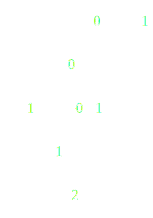
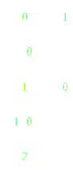

## Задания 16-33

### 16. Производящая функция называется рациональной, если она представима в виде отношения двух многочленов. Для производящих функций каждой из следующих последовательностей выясните, является ли она рациональной, если да, приведите ее представление в таком виде. Восстановите рекуррентное соотношение для этих последовательностей. Последовательность $1, -2, 3, -4, 5, \ldots$.

$$a_n = 2a_{n-2} - a_{n-4}$$

$$A(t) = \frac{P(t)}{1 - 2t^2 + t^4}$$
$$P(t) = A(t) \cdot \underbrace{(1 - 2t^2 + t^4)}_{B}$$
$$\begin{aligned}
    p_0 & = a_0 b_0 = 1 \\
    p_1 & = a_1 b_0 = -2 \\
    p_2 & = a_2 b_0 + a_0 b_2 = 3 + 1 \cdot (-2) = 1 \\
    p_3 & = a_3 b_0 + a_1 b_2 = -4 + (-2) \cdot (-2) = 0
\end{aligned}$$

$$P(t) = 1 - 2t + t^2$$
$$A(t) = \frac{1 - 2t + t^2}{1 - 2t^2 + t^4}$$

### 17. Последовательность $0, 1, 8, 27, 64, 125, \ldots, k^3,\ldots$

$$a_n = p_1(n) \cdot r_1^n \quad r_1 = 1 \quad p_1 = n^3$$
Таким образом корень $Q$ один, равен $1$ и его кратность $4$.
$$Q(t) = (1 - t)^4 = t^4 - 4t^3 + 6t^2 - 4t + 1$$
$$\begin{aligned}
    p_0 & = a_0 q_0 = 0 \\
    p_1 & = a_1 q_0 = 1 \\
    p_2 & = a_2 q_0 + a_1 q_1 = 8 - 4 = 4 \\
    p_3 & = a_3 q_0 + a_2 q_1 + a_1 q_2 = 27 - 4\cdot 8 + 6 = 1
\end{aligned}$$
$$A(t) = \frac{t^3 + 4t^2 + t}{t^4 - 4t^3 + 6t^2 - 4t + 1}$$
$$a_n = 4a_{n-1} - 6 a_{n-2} + 4 a_{n-3} - a_{n-4}$$

### 18. Последовательность $1\cdot 2^0, 2\cdot 2^1, 3\cdot 2^2, \ldots (n + 1)\cdot 2^n, \ldots$

$$k = 1 \quad p_1(n) = n+1 \quad r_1 = 2$$
$1/2$ - корень $Q$ кратности 2.
$$Q(t) = (t - 1/2)^2 = t^2 - t + \frac{1}{4}$$
$$\begin{aligned}
    p_0 & = a_0 q_0 = \frac{1}{4} \\
    p_1 & = a_0 q_1 + a_1 q_0 = -1 + \frac{1}{4}\cdot 4 = 0 
\end{aligned}$$
$$A(t) = \frac{\frac{1}{4}}{t^2 - t + \frac{1}{4}} = \frac{1}{4t^2 - t + 1}$$
$$a_{n} = 4a_{n-1} - 4a_{n-2}$$

### 19. Последовательность $1+1, 2+3, 4+9, \ldots, 2^n + 3^n, \ldots$

$$a_n = 2^n + 3^n \quad r_1 = 2 \quad r_2 = 3$$

У $Q$ два корня $1/2$ и $1/3$, кратности 1.

$$Q(t) = (t - 1/2) \cdot (t - 1/3) = t^2 + \frac{1}{6} - \frac{5}{6} t \sim 6t^2 - 5t + 1$$
$$\begin{aligned}
    p_0 & = a_0 q_0 = 2 \\
    p_1 & = a_0 q_1 + a_1 q_0 = 2 \cdot (-5) + 5 = -5
\end{aligned}$$

$$A(t) = \frac{-5t + 2}{6t^2 - 5t + 1}$$
$$a_n = 5 a_{n-1} - 6 a_{n-2}$$

### 20. Последовательность $1, 1, 4, 9, 25, \ldots, f_k^2,\ldots$ ($f_i$ --- числа Фибоначчи).

$$\begin{cases}
    f_{n+2} = f_{n+1} + f_{n} \\
    f_{n+1} = f_{n} + f_{n-1} \\
\end{cases}$$
$$\begin{cases}
    f_{n+2} = f_{n+1} + f_{n} \\
    f_{n-1} = f_{n+1} - f_{n} \\
\end{cases}$$
$$\begin{cases}
    f_{n+2}^2 = f_{n+1}^2 + f_{n}^2 + 2f_{n+1}f_n \\
    f_{n-1}^2 = f_{n+1}^2 + f_{n}^2 - 2f_{n+1}f_n \\
\end{cases}$$
$$f_{n+2}^2 + f_{n-1}^2 = 2f_{n+1}^2 + 2f_{n}^2$$
$$f_{n+2}^2 = 2f_{n+1}^2 + 2f_{n}^2 - f_{n-1}^2$$
$$f_{n}^2 = 2f_{n-1}^2 + 2f_{n-2}^2 - f_{n-3}^2$$

$$Q(t) = 1 - 2t - 2t^2 + t^3$$
$$\begin{aligned}
    p_0 & = a_0 q_0 = 1 \\
    p_1 & = a_0 q_1 + a_1 q_0 = -2 + 1 = -1 \\
    p_2 & = a_0 q_2 + a_1 q_1 + a_2 q_0 = -2 -2 + 4 = 0 \\
    p_3 & = a_0 q_3 + a_1 q_2 + a_2 q_1 + a_3 q_0 = 1 - 2 - 4 \cdot 2 + 9 = 0 \\
\end{aligned}$$
$$A(t) = \frac{1 - t}{1 - 2t - 2t^2 + t^3}$$

### 21. Найдите производящую функцию для чисел "трибоначчи" $f_0=f_1=f_2=1$, $f_n = f_{n-1}+f_{n-2}+f_{n-3}$.

$$Q(t) = 1 - t - t^2 - t^3$$
$$\begin{aligned}
    p_0 & = a_0 q_0 = 1 \\
    p_1 & = a_0 q_1 + a_1 q_0 = -1 + 1 = 0 \\
    p_2 & = a_0 q_2 + a_1 q_1 + a_2 q_0 = -1 -1 + 1 = -1 \\
    p_3 & = a_0 q_3 + a_1 q_2 + a_2 q_1 + a_3 q_0 = -1 -1 -1 + 3 = 0 \\
\end{aligned}$$
$$A(t) = \frac{1 - t^2}{1-t-t^2-t^3}$$

### 22. Найдите производящую функцию для последовательности, заданной рекуррентностью $f_0=f_1=f_2=1$, $f_n = f_{n-1}-2f_{n-3}$.

$$Q(t) = 1 - t + 2t^3$$
$$\begin{aligned}
    p_0 & = a_0 q_0 = 1 \\
    p_1 & = a_0 q_1 + a_1 q_0 = -1 + 1 = 0 \\
    p_2 & = a_0 q_2 + a_1 q_1 + a_2 q_0 = 0 -1 + 1 = 0 \\
    p_3 & = a_0 q_3 + a_1 q_2 + a_2 q_1 + a_3 q_0 = 2 + 0 - 1 - 1 = 0 \\
\end{aligned}$$
$$A(t) = \frac{1}{1 - t + 2t^3}$$

### 23. Пользуясь производящей функцией для чисел Фибоначчи, докажите утверждение, что $f_0+f_1+\ldots+f_n=f_{n+2}-1$.

$$F(t) = \frac{1}{1 - t - t^2}$$
$$\sum f_i \leftrightarrow \frac{F(t)}{1-t} = \frac{1}{1 - 2t + t^3} \leftrightarrow a_n = 2a_{n-1} - a_{n-3}$$

Докажем по индукции:

**База**: тривиально

**Переход**:
$$\begin{aligned}
    a_n & = 2 a_{n-1} - a_{n-3} \\
     & = 2 (f_{n+1} - 1) - (f_{n-1} - 1) \\
     & = 2 f_{n+1} - 1 - f_{n-1} \\
     & = f_{n+2} - 1 + f_{n+1} - f_n - f_{n-1} \\
     & = f_{n+2} - 1
\end{aligned}$$

### 24. Пользуясь производящей функцией для чисел Фибоначчи, докажите утверждение, что $f_0+f_2+\ldots+f_{2n}=f_{2n+1}$.

$$F(t) = \frac{1}{1 - t - t^2}$$
$$\begin{aligned}
    f_{2i} \leftrightarrow \frac{F(\sqrt t) + F(-\sqrt t)}{2}
        & = \frac{\frac{1}{1-\sqrt t - t} + \frac{1}{1 + \sqrt t - t}}{2} \\
        & = \frac{1 - t + 1 - t}{2(1-\sqrt t - t)(1 + \sqrt t - t)} \\
        & = \frac{1 - t}{1 - t + t^2 + \sqrt t - t - \sqrt t + t\sqrt t - t - t\sqrt t} \\
        & = \frac{1 - t}{1 - 3t + t^2} \\
\end{aligned}$$
$$\begin{aligned}
    \sum f_{2i} \leftrightarrow \frac{F(\sqrt t) + F(-\sqrt t)}{2(1-t)} & = \frac{1}{1 - 3t + t^2} \leftrightarrow a_n = 3a_{n-1} - a_{n-2}
\end{aligned}$$

Докажем по индукции:

**База**: тривиально

**Переход**:
$$\begin{aligned}
    a_n
     & = 3 a_{n-1} - a_{n - 2} \\
     & = 3 f_{2n - 2 + 1} - f_{2n - 4 + 1} \\
     & = 3 f_{2n - 1} - f_{2n - 3} \\
     & = 2 f_{2n - 1} + f_{2n - 2} \\
     & = f_{2n - 1} + f_{2n} \\
     & = f_{2n + 1}
\end{aligned}$$

### 25. Пользуясь производящей функцией для чисел Фибоначчи, докажите утверждение, что $f_1+f_3+\ldots+f_{2n-1}=f_{2n}-1$.

$$f_{i + 1} \leftrightarrow F(t) \cdot t = \frac{t}{1 - t - t^2}$$
$$f_{2i + 1} \leftrightarrow \frac{1}{2}\left(\frac{\sqrt t}{1 - \sqrt t - t} + \frac{- \sqrt t}{1 + \sqrt t - t}\right) = \frac{\sqrt t}{2} \frac{2 \sqrt t}{(1 - \sqrt t - t)(1 + \sqrt t - t)} = \frac{t}{1 - 3t + t^2}$$
$$\sum f_{2i+1} \leftrightarrow \frac{t}{(1 - 3t + t^2)(1-t)} = \frac{t}{1 - 4t + 4t^2 - t^3} \leftrightarrow a_n = 4 a_{n - 1} - 4 a_{n - 2} + a_{n - 3}$$

Докажем по индукции:

**База**: тривиально

**Переход**:
$$\begin{aligned}
    a_n
     & = 4 a_{n - 1} - 4 a_{n - 2} + a_{n - 3} \\
     & = 4 f_{2n - 2} - 4 - 4 f_{2n - 4} + 4 + a_{2n - 6} - 1 \\
     & = 4 f_{2n - 2} - 3 f_{2n - 4} - f_{2n - 5} - 1 \\
     & = 4 f_{2n - 2} - 2 f_{2n - 4} - f_{2n - 3} - 1 \\
     & = 3 f_{2n - 2} - f_{2n - 4} - 1 \\
     & = 2 f_{2n - 2} + f_{2n - 3} - 1 \\
     & = f_{2n - 2} + f_{2n - 1} - 1 \\
     & = f_{2n} - 1 \\
\end{aligned}$$

### 26. Пользуясь производящей функцией для чисел Фибоначчи, докажите утверждение, что $f_0^2+f_1^2+f_2^2+\ldots+f_n^2=f_nf_{n+1}$.

$$f_i^2 \leftrightarrow \frac{1 - t}{1 - 2t - 2t^2 + t^3}$$
$$\sum f_i^2 \leftrightarrow \frac{1}{1 - 2t - 2t^2 + t^3} \leftrightarrow a_n = 2a_{n-1} + 2a_{n-2} - a_{n-3}$$

Докажем по индукции:

**База**: тривиально

**Переход**:
$$\begin{aligned}
    a_n
     & = 2a_{n-1} + 2a_{n-2} - a_{n-3} \\
     & = 2f_{n-1}f_{n} + 2f_{n-2}f_{n-1} - f_{n-3}f_{n-2} \\
\end{aligned}$$
$$\begin{aligned}
    f_n f_{n+1}
     & = f_n f_n + f_n f_{n-1} \\
     & = 2f_n f_{n-1} + f_n f_{n-2} \\
     & = 2f_n f_{n-1} + f_{n-1} f_{n-2} + f_{n-2}f_{n-2} \\
     & = 2f_n f_{n-1} + f_{n-1} f_{n-2} + (f_{n-2} + f_{n-1} - f_{n-1})f_{n-2} \\
     & = 2f_n f_{n-1} + 2f_{n-1} f_{n-2} + (f_{n-2} + f_{n-3} - f_{n-3} - f_{n-1})f_{n-2} \\
     & = 2f_n f_{n-1} + 2f_{n-1} f_{n-2}- f_{n-3}f_{n-2}
\end{aligned}$$

### 27. Найдите производящую функцию для количества строк длины $n$ над алфавитом $\{0, 1\}$, не содержащих три нуля подряд.

Рассмотрим суффикс вплоть до первой $1$. Три варианта: $1$, $10$, $100$. Тогда $a_n = a_{n - 1} + a_{n - 2} + a_{n - 3}$
$$a_0 = 1 \quad a_1 = 2 \quad a_2 = 4 \quad a_3 = 7$$
$$Q(t) = 1 - t - t^2 - t^3$$
$$\begin{aligned}
    p_0 & = a_0 q_0 = 1 \\
    p_1 & = a_1 q_0 + a_0 q_1 = 2 - 1 = 1 \\
    p_2 & = a_2 q_0 + a_1 q_1 + a_0 q_2 = 4 - 2 - 1 = 1 \\
    p_3 & = a_3 q_0 + a_2 q_1 + a_1 q_2 + a_0 q_3 = 7 - 4 - 2 - 1 = 0 \\
\end{aligned}$$

$$A(t) = \frac{1 + t + t^2}{1 - t - t^2 - t^3}$$

### 28. Найдите производящую функцию для количества строк длины $n$ над алфавитом $\{0, 1\}$, не содержащих подстроки 010.

Построим ДКА:

Матрица переходов $M = \begin{pmatrix}
    1 & 1 & 0 \\
    0 & 1 & 1 \\
    1 & 0 & 0
\end{pmatrix}$ с характеристическим полиномом $-t^3 + 2t^2 - t + 1$. Нам нужно количество путей пройти по графу в $n$ шагов. Это $M^m$ и рекуррентно задается таким же полиномом, т.е. $-a_{n+3}+2a_{n+2}-a_{n+1}+a_{n} = 0$ или $a_{n} = 2a_{n-1}-a_{n-2}+a_{n-3}$.

$$Q(t) = 1 - 2t + t^2 - t^3$$
$$\begin{aligned}
    p_0 & = a_0 q_0 = 1 \\
    p_1 & = a_1 q_0 + a_0 q_1 = 2 - 2 = 0 \\
    p_2 & = a_2 q_0 + a_1 q_1 + a_0 q_2 = 4 - 4 + 1 = 1 \\
    p_3 & = a_3 q_0 + a_2 q_1 + a_1 q_2 + a_0 q_3 = 7 - 8 + 2 - 1 = 0
\end{aligned}$$
$$A(t) = \frac{t^2 + 1}{1 - 2t + t^2 - t^3}$$

### 29. Найдите производящую функцию для количества строк длины $n$ над алфавитом $\{0, 1\}$, не содержащих подстроки 011.

Можно применить символьный метод - $\varepsilon \cup L(0 | 1) = L \cup L 011$ дает $A(t) = \frac{1}{t^3 - 2t + 1}$, но это не очень обосновано.

Построим ДКА:

Матрица переходов $M = \begin{pmatrix}
    1 & 1 & 0 \\
    0 & 1 & 1 \\
    0 & 1 & 0
\end{pmatrix}$ с характеристическим полиномом $-t^3 + 2t^2 - 1$. Нам нужно количество путей пройти по графу в $n$ шагов. Это $M^m$ и рекуррентно задается таким же полиномом, т.е. $-a_{n+3}+2a_{n+2}-a_{n} = 0$ или $a_{n} = 2a_{n-1}-a_{n-3}$.

$$Q(t) = 1 - 2t + t^3$$
$$\begin{aligned}
    p_0 & = a_0 q_0 = 1
\end{aligned}$$
$$A(t) = \frac{1}{1 - 2t + t^3}$$

### 30. Обозначим за $a_n$ количество способов разменять $n$ рублей монетами по $1$, $2$ и $5$ рублей (порядок монет важен). Постройте производящую функцию для $a_n$.

$$a_n = a_{n-1} + a_{n-2} + a_{n-5}$$
$$a_0 = 1 \quad a_1 = 1 \quad a_2 = 2 \quad a_3 = 3 \quad a_4 = 5$$
$$Q(x) = 1 - t - t^2 - t^5$$
$$\begin{aligned}
    p_0 & = a_0 q_0 = 1 \\
    p_1 & = a_0 q_1 + a_1 q_0 = -1 + 1 = 0 \\
    p_2 & = a_0 q_2 + a_1 q_1 + a_2 q_0 = -1 -1 + 2 = 0 \\
    p_3 & = a_0 q_3 + a_1 q_2 + a_2 q_1 + a_3 q_0 = - 1 - 2 + 3 = 0 \\
    p_4 & = a_0 q_4 + a_1 q_3 + a_2 q_2 + a_3 q_1 + a_4 q_0 = 0 + 0 - 2 - 3 + 5 = 0
\end{aligned}$$
$$A(x) = \frac{1}{1 - t - t^2 - t^5}$$

### 31. То же самое, что в предыдущем задании, но порядок монет не важен.

**Лемма**: если есть множества $\mathcal A_1 \dots \mathcal A_k \subset \Z^+$, то производящая функция для $a_n=$ количества решений уравнения $x_1 + \dots + x_k = n$, где $x_i \in \mathcal A_i$, есть
$$\prod_i \left(\sum_{\xi_i \in \mathcal A_i} x_i^{\xi_i}\right)$$

**Доказательство** тривиально:
$$a_n = \sum_{\{\xi_i\} : \sum_i \xi_i = n} 1$$

Из леммы тривиально искомое, т.к. нам нужно количество решений уравнения $x_1 + x_2 + x_5 = n$, где $x_i \in \{0, i, 2\cdot i, \dots\}$ _(число монет номинала $i$)_

$$A(t) = \left(\sum x^i\right)\left(\sum x^{2i}\right)\left(\sum x^{5i}\right)$$
$$A(t) = \frac{1}{1-x}\frac{1}{1-x^2}\frac{1}{1-x^5}$$

### 32. Можно заметить, что производящая функция последовательности $a_n = n^m$ будет иметь вид $\frac {P_m(s)}{(1-s)^{m+1}}$. Выведите рекуррентное соотношение для коэффициентов многочленов $P_{m, k}$.

$$a_n = p_1(n) \cdot r_1^n \quad p_1 = n^m \quad r_1 = 1$$
$$Q(t) = (1 - t)^{m + 1} = \sum_k (-1)^k \binom{m+1}{k} x^k$$
$$p_n = \sum_{i=0}^n a_{n-i} q_i = \sum_{i=0}^n (n-i)^m (-1)^i \binom{m+1}{i}$$

Это число Эйлера I рода $\left\langle{m \atop n-1}\right\rangle$. Мы знаем, что для него выполняется:
$$\left\langle{n\atop m}\right\rangle = (m + 1) \left\langle{n - 1\atop m}\right\rangle + (n - m) \left\langle{n - 1\atop m - 1}\right\rangle$$

### 33. Оказывается, что коэффициенты $P_{m,k}$ также являются количеством некоторых комбинаторных объектов. Вскройте архивы домашних заданий по комбинаторике за первый семестр и вспомните, каких.

Количество перестановок чисел от $1$ до $n$ таких, что в каждой из них существует ровно $m$ подъемов.
